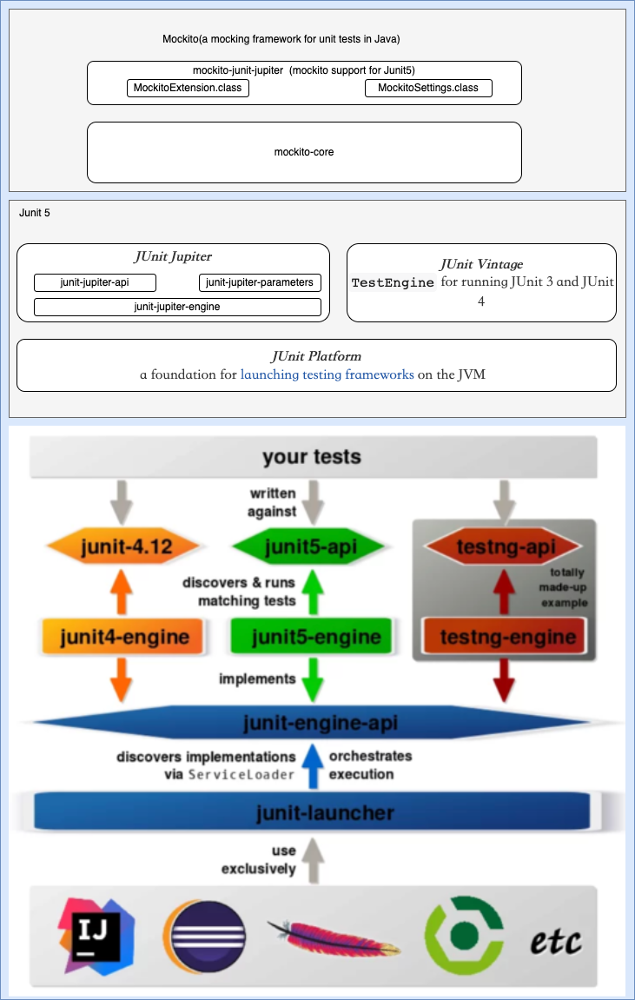

## 1. Architect view



## 2. Import the related package

```
<!-- spring boot testing package -->
<dependency>
    <groupId>org.springframework.boot</groupId>
    <artifactId>spring-boot-starter-test</artifactId>
		<scope>test</scope>
</dependency>

<!-- junit 5 tesing interface package -->
<dependency>
    <groupId>org.junit.jupiter</groupId>
    <artifactId>junit-jupiter-api</artifactId>
		<scope>test</scope>
</dependency>

<!-- parameterized testing package -->
<dependency>
    <groupId>org.junit.jupiter</groupId>
    <artifactId>junit-jupiter-params</artifactId>
    <scope>test</scope>
</dependency>

<!-- mocking package -->
<dependency>
    <groupId>org.mockito</groupId>
    <artifactId>mockito-junit-jupiter</artifactId>
    <scope>test</scope>
</dependency>
```

**Dependency Issue：**

* The mockito is dependent on byte-buddy and byte-buddy-agent，if the version is not under the lowest required version, we may get an exception as below : 

  ```
  Underlying exception : java.lang.IllegalArgumentException: Could not create type
  
  	at org.mockito.junit.jupiter.MockitoExtension.beforeEach(MockitoExtension.java:153)
  	at java.util.ArrayList.forEach(ArrayList.java:1259)
  	at java.util.ArrayList.forEach(ArrayList.java:1259)
  	Suppressed: java.lang.NullPointerException
  		at org.mockito.junit.jupiter.MockitoExtension.afterEach(MockitoExtension.java:184)
  	......
  ```

  

**mockitio-core 4.2.0  -> lowest verion of byte-buddy and byte-buddy-agent is 1.12.4**

## 3. Annotation of Mockitio 4.2.0

* **@ExtendWith(MockitoExtension.class)**
  
  * use **@org.junit.jupiter.api.Test** to dedicate a test method instead of  **@org.junit.Test**
  * mock is not support under **@BeforeAll** method. **Reason for this** :`MockitoExtension` class implements the `BeforeEachCallback` but not the `BeforeAllCallback` from JUnit-Jupiter-API. It does therefore not provide any additional behaviour for `@BeforeAll` annotated methods. So  you can use **@BeforeEach** as a replacement.
  
* **@MockitoSettings**

  * this annotation is used for set some strictness strategy for Mockito. Supported strategy :

    * LENIENT

      When you setup a mock which is not used, you will get an error as below :

      > org.mockito.exceptions.misusing.UnnecessaryStubbingException:

      Solution for this is set the strategy to LENIENT like this :

      > @MockitoSettings(strictness = Strictness.LENIENT)

    * WARN

    * STRICT_STUBS (as default)

  * if you use this **@MockitoSettings** then you don't need to add the annotation **@ExtendWith(MockitoExtension.class)**, 

    because it has extended the capability from MockitoExtension (Class MockitoSettings has the annotation @ExtendWith(MockitoExtension.class) on it's class.

* **@RunWith(MockitoJUnitRunner.class)**
  
  * use **@org.junit.Test** to dedicate a test method instead of  **@org.junit.jupiter.api.Test**
  * support mock for static method with **@BeforeAll**，if the method is non-static then you need add  **@TestInstance(TestInstance.Lifecycle.PER_CLASS)** on the test class
  
* **@Mock**

* **@Spy**

* **@Captor**

* **@InjectMocks**

## 4. Demo

click [Junit 5 Demo](https://github.com/leon-fly/junit5-demo) to watch the demo

## 5. Reference

[mockito官方文档](https://github.com/mockito/mockito/wiki)


