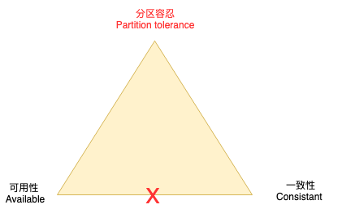

# 一、 CAP
CAP理论是分布式系统中的一个重要理论，CAP分别表示如下含义：
* 一致性 Consistency.在分布式系统中，数据在各个副本节点是否相同。如果数据被操作后，无论用户读取到哪个节点都是最新的数据那么这就是一致的。
* 可用性 Available. 可用性是指服务一直处于可用状态。对于可用状态一般包含数据是否正常返回，响应时间是否在相应时间内。
* 分区容错性 Partition tolerance. 原本相互联通的网络出现部分不能联通的情况即出现分区，分区容忍即因网络故障是否可被接受。容忍性越低那么即对网络稳定越高。

网络的稳定性属于物理要求，无法100%保证，即在分布式系统中分区容错性是必须保证的，这就要求数据节点需要有复制节点，复制节点的出现也就带来一致性和可用性的思考。如果要求强一致性那么将造成未达一致下的不可用（比如写入操作）。如果要求服务可用，一致性将延后满足，即强一致性不能满足。
在CAP理论中说明三项只能选两项满足，实践中，P是必选，只能在CP和AP中选择。

# 二、 BASE
BASE理论是对CAP理论的延伸，思想是即使无法做到强一致性（CAP的一致性就是强一致性），但可以适当的采取弱一致性，即最终一致性。
BASE是指基本可用（Basically Available）、软状态（ Soft State）、最终一致性（ Eventual Consistency）。

软状态是指允许系统存在中间状态，而该中间状态不会影响系统整体可用性。分布式存储中一般一份数据会有多个副本，允许不同副本同步的延时就是软状态的体现。mysql replication的异步复制也是一种体现。

[云栖社区参考](https://yq.aliyun.com/articles/692238)
[维基百科CAP](https://zh.wikipedia.org/wiki/CAP%E5%AE%9A%E7%90%86)