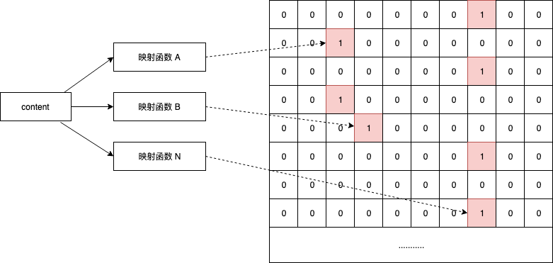

# 布隆过滤器

## 1. 布隆过滤器简介
布隆过滤器（Bloom Filter）是1970年由布隆提出的。布隆过滤器可以用于检索一个元素是否在一个集合中。其基本原理是通过映射函数（哈希函数）将元素映射到一个阵列点位上，当元素存在时，该点位标为1，否则标为0。

* 多映射函数

  由于用于映射到哈希函数存在碰撞，也就会造成错误数据误判。一般通过多个哈希函数来分别映射设置其点位为1，这样只要有一个函数映射点位位置不为1则该值肯定不存在，降低了误判率。

* 布隆过滤器的的优缺

  优点是空间效率和查询时间都比一般的算法要好的多缺点是有一定的误识别率和删除困难。

## 2. 使用场景

