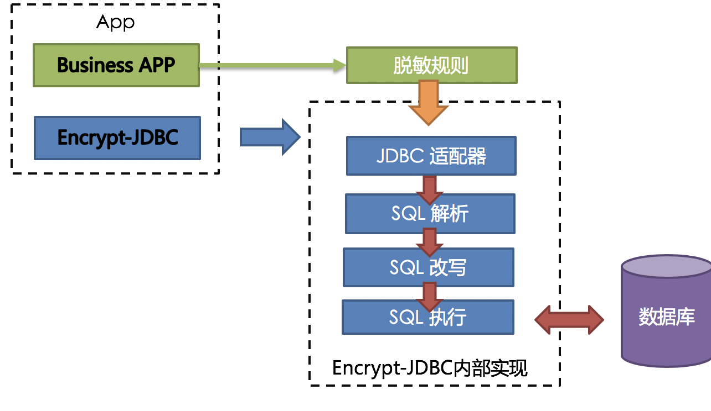
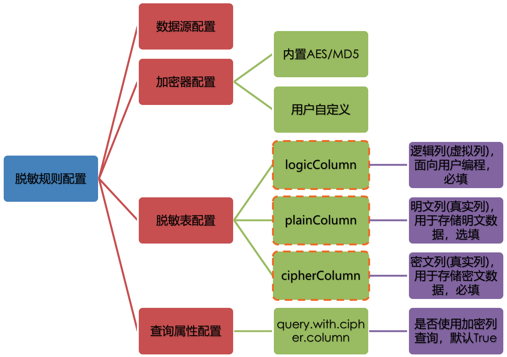

## 1. 关于sharding sphere

[sharding sphere](https://shardingsphere.apache.org/document/legacy/4.x/document/cn/overview/)是一套开源的分布式数据库中间件解决方案组成的生态圈，它由 JDBC、Proxy 和 Sidecar（规划中）这 3 款相互独立，却又能够混合部署配合使用的产品组成。 它们均提供标准化的数据分片、分布式事务和数据库治理功能，可适用于如 Java 同构、异构语言、云原生等各种多样化的应用场景。JDBC其主要包含数据分片，读写分离，强制路由，编排治理，分布式事务，数据脱敏六大功能。具体的使用场景，操作步骤在官网已经非常清晰，本片主要介绍数据脱敏关键逻辑。

## 2. 数据库脱敏

[官方数据脱敏](https://shardingsphere.apache.org/document/current/cn/features/orchestration/encrypt/)提供了非常详尽易懂的脱敏场景及解决方案，这里主要进行一个核心点总结。

1. sharding sphere加密处理流程

   

2. 进行数据库脱敏需要做的几件事

3. 数据库脱敏须知
   * 用户需要自行处理数据库中原始的存量数据、洗数。
   * 使用脱敏功能+分库分表功能，部分特殊SQL不支持，请参考[SQL使用规范](https://shardingsphere.apache.org/document/current/cn/features/sharding/use-norms/sql/)。
   * 脱敏字段无法支持比较操作，如：大于小于、ORDER BY、BETWEEN、LIKE等。
   * 脱敏字段无法支持计算操作，如：AVG、SUM以及计算表达式 。

