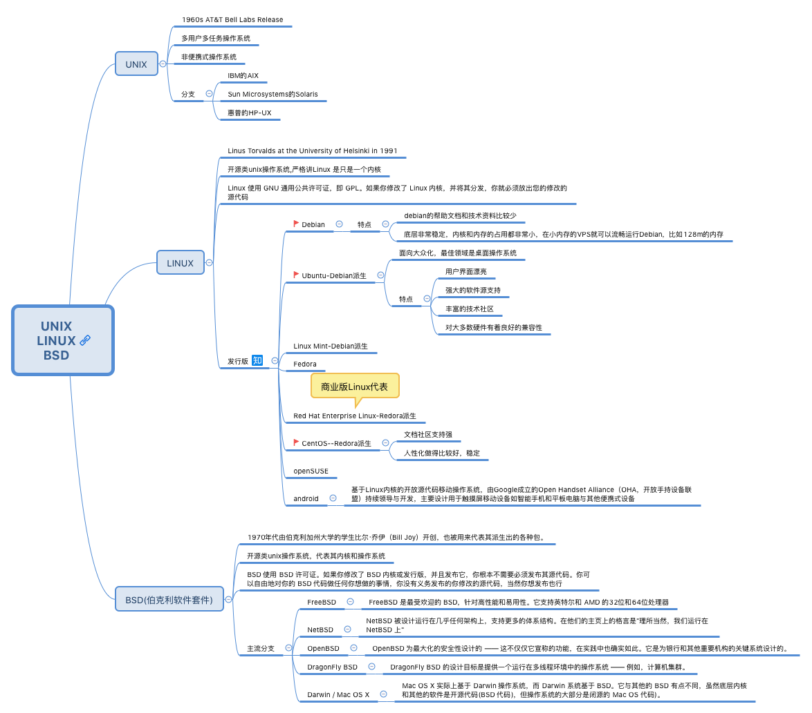

## 1. 关于unix与linux

[参考文档-wiki UNIX](https://zh.wikipedia.org/wiki/UNIX)
[参考文档-wiki LINUX](https://zh.wikipedia.org/wiki/LINUX)
[参考文档-UNIX与LINUX区别](https://www.guru99.com/difference-unix-vs-linux.html)
[参考文档-CentOS、Ubuntu、Debian比较](https://zhuanlan.zhihu.com/p/32274264)

## 2. 开源主流主流Linux版centos、ubuntu、debian选择

* 偏向于桌面如个人开发可以选择ubuntu
* 偏向于服务器考虑社区支持强度选centos，考虑资源（如内存节省）使用可选debian。

## 3.软件安装工具
ubuntu主流软件安装工具apt-get，centos主流软件安装工具yum，mac下主流安装工具brew
