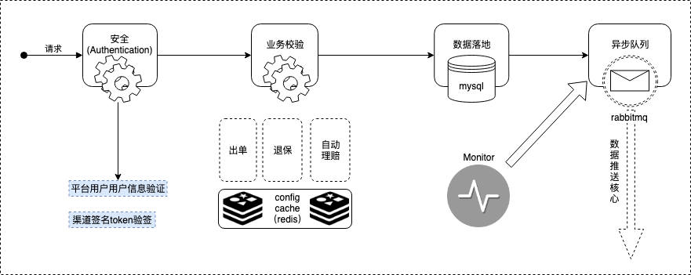

## 1. 平台相关内容
非车平台项目说明：
### 1.1. 管理平台
* 用户管理
    * 用户分类
        * 管理平台用户
        * 渠道用户
        * c端用户
    * 用户角色
        * 超级管理员
        * 业务人员
        * 渠道人员
* 渠道管理
    * 渠道信息、见费/非见费、销管数据
    * 渠道产品及方案管理
    * 渠道权限管理
* 产品管理
    * 产品级别管理
    * 方案级别管理（方案同步）手动+自动
    * 非定额方案管理
* 保单管理
    * 保单查询
* 报表管理
    * 时间维度
    * 产品维度
    * 交易维度
* 监控管理
    * 交易接口监控
    * rabbitmq监控

### 1.2. 服务接口
* 接口处理流程
    * 用户身份认证
    * 用户接口权限校验
    * 用户交易类型及产品权限
    * 统一异常返回封装
* 接口清单
    * 出单
    * 退保
    * 支付
    * 电子保单下载
    * 电子发票下载
    * 保单查询

## 2. 关键技术架构
