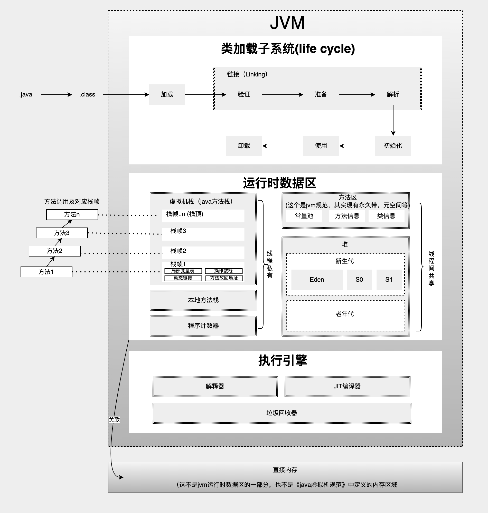
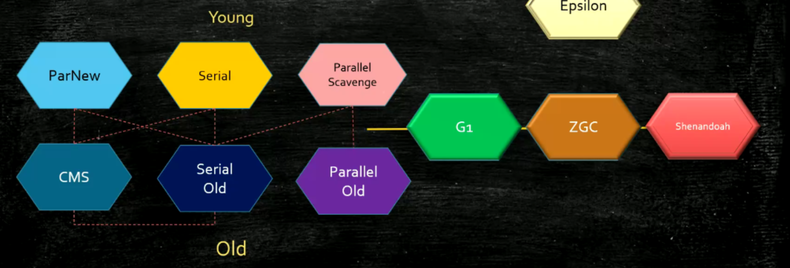
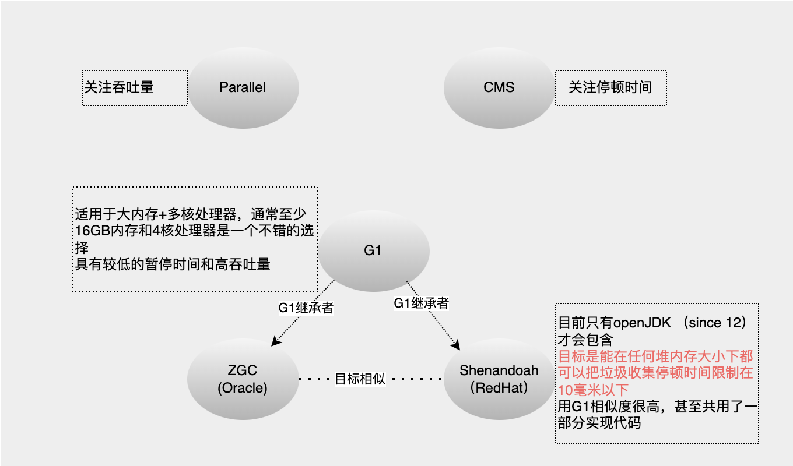

## 1. 关于 JVM

JVM即java虚拟机，是java程序运行的核心依赖抽象。一张图展示JVM核心内部：



### 1.1. 运行时数据区

**程序计数器（PC寄存器）**

* 一块较小的内存空间，存放当前线程所执行的字节码的行号指示器
* 每个线程有自己独立的一个程序计数器，生命周期同属主线程
* 如果正在执行的是一个本地方法，这个计数器值则应为空

**虚拟机栈**

* 线程私有，生命周期同属主线程相同。
* 其描述的是java方法执行的线程内存模型。每个方法被执行的时候，Java 虚拟机都会同步创建一个栈帧用于存储局部变量表、操作数栈、动态连接、方法出口等信息。每一个方法被调用直至执行完毕的过程，就对应着一个栈帧在虚拟机栈中从入栈到出栈的过程。
* 一个虚拟机栈可以有多个栈帧
* 对于栈来说不存在GC问题，但存在内存溢出问题（OOM）

**本地方法栈**

存放本地方法调用过程中的栈帧。用于管理本地方法的调用，本地方法是C语言写的。不是所有虚拟机都支持本地方法栈，例如Hotspot虚拟机就是将本地方法栈和虚拟机栈合二为一。栈解决程序的运行问题，即程序如何执行、如何处理数据。

**方法区**

方法区可以看作是一块独立于Java堆的内存空间，方法区是各线程共享的内存区域。方法区是一个抽象概念，永久代和元空间是方法区的实现方式。

* 永久代

属于JVM方法区的内存，用来存储类的元数据，如类名、方法信息、字段信息等一些静态的数据。JDK7及之前方法区也叫永久代。缺点是内存大小固定，容易出现oom问题。可以通过-XX:PermSize设置永久代大小。永久代对象只能通过Major GC（又称Full GC）进行垃圾回收。

* 元空间

元空间是Hotspot在JDK8引入的，用于取代永久代。元空间属于本地内存，由操作系统直接管理，不再受JVM管理。同时内存空间可以自动扩容，避免内存溢出。默认情况下元空间可以无限使用本地内存，也可以通过-XX:MetaspaceSize限制内存大小。

* 常量池

常量池就是一张表，JVM根据这张常量表找到要执行的类信息和方法信息

**类常量池**：是.class字节码文件中的资源仓库，主要存放字面量（表示字符串值和数值，例如字符串值"abc"、final常量、静态变量）和符号引用（类和接口的全限定名、字段名、方法名）。

**运行时常量池**：类加载的“加载”阶段会创建运行时常量池，统一存放各个类常量池去重后的符号引用。在类加载的“解析”阶段JVM会把运行时常量池的这些符号引用转为直接引用。类常量池。类常量池在字节码文件中的，运行时常量池在内存中。

**字符串常量池**：专门针对String类型设计的常量池。是当前应用程序里所有线程共享的，每个jvm只有一个字符串常量池。存储字符串对象的引用。在创建String对象时，JVM会先在字符串常量池寻找是否已存在相同字符串的引用，如果有的话就直接返回引用，没的话就在堆中创建一个对象，然后常量池保存这个引用并返回引用。

**堆**

存放对象实例、实例变量、数组，包括新生代（伊甸园区、幸存区S0和S1）和老年代。堆是垃圾收集器管理的内存区域。堆解决的是数据存储的问题，即数据怎么放、放在哪儿。堆实际内存空间可以不连续，大小可以选择固定大小或可扩展，堆是各线程共享的内存区域。

### 1.2. 执行引擎

将字节码指令解释/编译为对应平台上的本地机器指令。充当了将高级语言翻译为机器语言的译者。执行引擎在执行过程中需要执行什么样的字节码指令依赖于PC寄存器。每当执行完一项指令操作后，PC寄存器就会更新下一条需要被执行的指令地址。

字节码指令（JVM指令）：字节码文件中的指令，内部只包含一些能够被JVM所识别的字节码指令、符号表，以及其他辅助信息，不能够直接运行在操作系统之上。

本地机器指令：可以直接运行在操作系统之上。

## 2. JVM常用命令及参数

### 2.1. 查看当前java参数
> java -XshowSettings:all

### 2.2. 查看java配置属性
java -XX:+PrintFlagsFinal -version

示例
```
VM settings:
    Max. Heap Size (Estimated): 1.78G
    Ergonomics Machine Class: server
    Using VM: Java HotSpot(TM) 64-Bit Server VM

Property settings:
    awt.toolkit = sun.lwawt.macosx.LWCToolkit
    file.encoding = UTF-8
    file.encoding.pkg = sun.io
    file.separator = /
    ...
```

### 2.3. 打印GC相关日志
* 打印GC普通信息
    > -XX:+PrintGC

    GC示例
    ```
    [GC (Allocation Failure)  311109K->311878K(454144K), 0.1617940 secs]
    [Full GC (Ergonomics)  311878K->310823K(622592K), 0.0647834 secs]
    ```

    第一行为普通GC第一个数据[311109k]为回收前堆空间使用量，第二个数据[311878K]为回收后堆内存使用量，第三个数据[454144K]为当前申请的总堆空间大小（注意并非未使用的空间），当堆内存大小未达到最大时可以持续申请。第四个数据[0.1617940 secs]为当前GC耗时。
    第二行为FullGC,并非每次GC都会伴随FullGC


* 打印GC详细信息
    > -XX:+PrintGCDetails

    示例
    ```
    [GC (Allocation Failure) [PSYoungGen: 37134K->4752K(71680K)] 61719K->61080K(159232K), 0.0220931 secs] [Times: user=0.02 sys=0.04, real=0.02 secs] 
    [Full GC (Ergonomics) [PSYoungGen: 4752K->0K(71680K)] [ParOldGen: 56328K->60962K(133120K)] 61080K->60962K(204800K), [Metaspace: 3203K->3203K(1056768K)], 0.0123164 secs] [Times: user=0.02 sys=0.00, real=0.01 secs] 
    ```
    说明：
    **PSYoungGen** 年轻代，同DefNew
    **ParOldGen** 年老代，同Tenured
    **Metaspace** 永久代（类方法存储区）,同Perm

* 在GC时打印堆信息
    > -XX:+PrintHeapAtGC
    加入该参数后，jvm会在每次GC前后分别打印堆信息
    堆信息示例：
    ```
    PSYoungGen      total 208384K, used 4128K [0x0000000795580000, 0x00000007ab980000, 0x00000007c0000000)
    eden space 203264K, 0% used [0x0000000795580000,0x0000000795580000,0x00000007a1c00000)
    from space 5120K, 80% used [0x00000007a1c00000,0x00000007a2008040,0x00000007a2100000)
    to   space 5120K, 0% used [0x00000007ab480000,0x00000007ab480000,0x00000007ab980000)
    ParOldGen       total 652800K, used 646703K [0x0000000740000000, 0x0000000767d80000, 0x0000000795580000)
    object space 652800K, 99% used [0x0000000740000000,0x000000076778bca0,0x0000000767d80000)
    Metaspace       used 3238K, capacity 4496K, committed 4864K, reserved 1056768K
    class space    used 350K, capacity 388K, committed 512K, reserved 1048576K
    ```

    说明：

    **used数据**[0x0000000795580000,0x0000000795580000,0x00000007a1c00000)分别表示下界、当前上界、上界，可以通过这三个数据计算出当前已使用和当前可使用空间以及当前总申请空间。

* 额外打印GC发生的时间，以JVM启动偏移时间
  
  > -XX:+PrintGCTimeStamps
* 打印应用时间执行时间和停顿时间
    > -XX:+PrintGCApplicationConcurrentTime

    > -XX:+PrintGCApplicationStoppedTime

* 跟踪系统内软引用、弱引用、虚幻引用和finallize队列

    > -XX:+PrintReferenceGC
* GC日志输出指定
  
    > -Xloggc:path

### 2.4. 类加载及卸载跟踪

* 跟踪加载及卸载
  
  > -verbose:class
* 跟踪加载
  
  > -XX:+TraceClassLoading
* 跟踪卸载
  
    > -XX:+TraceClassUnloading

### 2.5. 打印系统运行相关参数
* 打印系统运行的参数
  
  > -XX:+PrintVMOptions
* 打印传递给虚拟机的显式或隐式参数

  > -XX:+PrintCommandLineFlags
* 打印所有系统参数
  
    > -XX:+PrintFlagsFinal

### 2.6. 堆的设置

* 初始堆空间

  > -Xms 
  
* 最大堆空间

  > -Xmx
  
* 新生代空间
    > -Xmn

    说明:
    新生代增大会减小老年代的大小，对GC影响较大，新生代大小一般设置整个堆空间的1/3到1/4。

* 设置新生代eden与from/to的空间比例
    > -XX:SurvivorRatio=

    说明:
    
    正常设置2，即eden:from:to = 2:1:1。特殊情况需要特别考虑。

* 设置新生代和老年代的比例,该比例=老年代/新生代
  
  > -XX:NewRatio=
* **堆溢出处理**

    堆溢出导出整个堆信息
    
    > -XX:+HeapDumpOnOutOfMemoryError

    指定到处路径
    > -XX:HeapDumpPath=

    堆溢出时执行一个脚本文件
    
    > -XX:OnOutOfMemoryError=

### 2.7. 方法区配置

**jdk 1.7及之前 **

> -XX:PermSize

> -XX:MaxPermSize

**jdk 1.8**

> -XX:MaxMetaspaceSize=

​		设置元空间最大值，默认是-1，即不限制，或者说只受限于本地内存大小。

> -XX：MetaspaceSize

​		-XX：MetaspaceSize：指定元空间的初始空间大小，以字节为单位，达到该值就会触发垃圾收集进行类型卸载，同时收集器会对该值进行调整：如果释放了大量的空间，就适当降低该值；如果释放了很少的空间，那么在不超过-XX：MaxMetaspaceSize（如果设置了的话）的情况下，适当提高该值。

> -XX：MinMetaspaceFreeRatio

​		在垃圾收集之后控制最小的元空间剩余容量的百分比，可减少因为元空间不足导致的垃圾收集的频率。

>-XX：MaxMetaspaceFreeRatio

​		用于控制最大的元空间剩余容量的百分比


说明：1.8默认情况下永久区最大只受系统可用内存限制。

### 2.8. 栈配置

栈空间是每个线程的私有空间，参数配置：
> -Xss

### 2.9. 直接内存配置

被NIO广泛使用，直接内存跳过了java堆，使java程序可以直接访问堆空间，一定成程度上加快了内存空间访问速度。
> -XX:MaxDirectMemorySize

直接内存适合申请次数较少，访问较频繁堆场合。


## 3. 垃圾回收算法

### 3.1. 引用计数法
* 原理：每个对象创建一个计数器，当有一个对象引用它时计数加1，当引用失效时计数减1，当计数为0时不可再引用。
* 存在如下问题，jvm垃圾回收未使用该算法
    * 循环引用导致内存泄漏（如A、B互相引用，无第三个对象对A或B引用，但是A、B的计数都不为0无法回收）
    * 引用计算器在引用和失效时需要对计数器进行操作，对系统性能有影响。

### 3.2. 标记清除法
* 原理：从根结点开始遍历可达对象并标记，清理阶段对未标记的对象进行清理
* 缺点：回收的空间不连续，在对象的堆空间分配过程中，工作效率低下。

**关联：可达性分析算法**

这个算法的基本思路就是通过一系列称为“GC Roots”的根对象作为起始节点集，从这些节点开始，根据引用关系向下搜索，搜索过程所走过的路径称为“引用链”（Reference Chain），如果某个对象到 GC Roots 间没有任何引用链相连，或者用图论的话来说就是从 GC Roots 到这个对象不可达时，则证明此对象是不可能再被使用的。

在 Java 技术体系里面，固定可作为 GC Roots 的对象包括以下几种：

* 在虚拟机栈（栈帧中的本地变量表）中引用的对象，譬如各个线程被调用的方法堆栈中使用到的参数、局部变量、临时变量等。
* 在方法区中类静态属性引用的对象，譬如 Java 类的引用类型静态变量。
* 在方法区中常量引用的对象，譬如字符串常量池（String Table）里的引用。
* 在本地方法栈中 JNI（即通常所说的 Native 方法）引用的对象。
* Java 虚拟机内部的引用，如基本数据类型对应的 Class 对象，一些常驻的异常对象（比如 NullPointExcepiton、OutOfMemoryError）等，还有系统类加载器。
* 所有被同步锁（synchronized 关键字）持有的对象。
* 反映 Java 虚拟机内部情况的 JMXBean、JVMTI 中注册的回调、本地代码缓存等。

###  3.3. 复制算法
* 原理：将原有空间分成两块，每次使用一块，在垃圾回收时把正在使用中的内存中的存活对象复制到未使用的内存中，之后清理正在使用的内存中的所有对象，交换两个内存角色。
* 优点：无内存碎片,存活对象较少的情况下，复制算法效率很高。
* 缺点：空间使用率折半，当存活对象较多时，需要复制的对象也多。
* 复制算法比较适合新生代，新生代垃圾对象通常多余存活对象。

###  3.4. 标记压缩法（标记清除压缩/标记整理）
* 原理：优化标记清除，清除阶段将所有存活对象压缩到内存另一端，之后清理边界外的所有空间。相当于在标记清除的基础上加了内存整理。

大致执行过程如下：

1. 标记所有根可达的对象
2. 将根可达的对象沿着一个方向移动到内存另一端
3. 清理边界外的所有空间。

###  3.5. 分代算法
* 新生代使用复制算法，老年代使用标记压缩或者标记清除算法
* 卡表数据结构优化高频率的新生代回收（卡表为一个比特位集合，每1位表示老年代一个4k空间多老年代中多对象是否持有新生代对象，如果该位为1表示有，GC时需要扫描该位表示的空间引用关系，为0跳过）

###  3.6. 分区算法
* 原理：将大的堆内存空间分成若干小块，每次回收若干块，而不是一次性回收，根据目标停顿时间来合理的回收。这种方法容易控制在GC时的卡顿时间。


##  4. java引用及垃圾回收
* 强引用
* 软引用-内存紧张时回收
* 弱引用-发现即回收
* 虚引用-最弱，发现即回收，必须和引用队列一起使用，用于对象回收跟踪

**说明：**
软引用和弱引用适用于缓存处理。


##  5. 垃圾回收器

###  5.1. 串行回收器

* java最古老的垃圾回收器之一，仅仅使用单线程进行独占式的垃圾回收，造成其他线程进入等待，产生糟糕的用户体验。当垃圾回收时间占用增大时，对吞吐量的影响特别大。两个特点：
    1. 仅仅使用单个线程进行垃圾回收
    2. 独占式的垃圾回收
* 串行收集器适用于一些小应用（最大100M的堆空间），单cpu处理器下运行高效，超过并行回收器和并发回收器。
  
####  5.1.1. 新生代串行回收器

* 启用新生代串行收集器和老年代串行收集器，指定参数 **-XX:+UseSerialGC**，jvm client运行模式下的默认垃圾回收器。
* 新生代串行回收器使用**复制算法**，简单高效。

####  5.1.2. 老年代串行回收器

* 老年代串行收集器使用**标记压缩算法**。
* 在堆空间较大的应用程序，一旦老年代串行收集器启动，应用程序可能会因此停顿较长的时间。
* 老年代串行回收器可以和多种新生代垃圾回收器配合使用，同时也可以作为CMS回收器的备用回收器。
* 启用老年代串行回收器
    * **-XX:+UseSerialGC** 新生代、老年代都使用串行回收器
    * **-XX:+UseParNewGC** 新生代使用ParNewGC回收器，老年代使用串行回收器
    * **-XX:+UseParallelGC** 新生代使用ParallelGC回收器，老年代使用串行回收器


###  5.2. 并行回收器

####  5.2.1. 新生代ParNew回收器
* ParNew回收器是工作在新生代的并行回收器，只是简单的将串行回收器多线程化，其回收策略、算法以及参数和新生代串行回收器一样。
* 在单CPU或者并发能力较弱的系统中，并行回收器的效果不会比串行回收器好。
* 开启ParNew回收器
    * **-XX:+UseParNewGC** 新生代使用ParNew回收器，老年代使用串行回收器。
    * **-XX:+UseConcMarkSweepGC** 新生代使用ParNew回收器，老年代使用CMS。
* ParNew回收器工作时的线程数量指定。
    * **-XX:ParalleGCThreads**

    线程数一般与CPU数量相当，避免过多的线程数，影响垃圾收集性能。默认情况下，当CPU数量小于8时，ParallelGCThreads的值等于CPU数量，当CPU数量大于8个时，ParallelGCThreads的值等于3+((5*CPU_COUNT)/8)

####  5.2.2. 新生代ParallelGC（ParallelScavenge）回收器
* 基于标记-复制算法实现
* 与ParNew相同点：多线程，独占式。
* 重要特性：**<u>非常关注系统吞吐量（吞吐量优先</u>）。**
* 启用参数：
    * **-XX:+UseParalleGC** 新生代使用ParallelGC回收器，老年代使用串行回收器
    * **-XX:+UseParallelOldGC** 新生代使用ParallelGC回收器，老年代使用ParallelOldGC回收器
* 吞吐控制参数
    * **-XX:MaxGCPauseMillis** 最大垃圾收集停顿时间。该值当设定并非越小越好，因为越小可能会增加gc的频率，反而可能降低吞吐
    * **-XX:GCTimeRatio** 设置吞吐量大小，0-100之间。该比率为垃圾回收时间/总时间。
* 自适应调节策略支持
    * **-XX:UseAdaptiveSizePolicy** 可以打开自适应GC策略

    在这种模式下，新生代的大小、eden和survivior的比例、晋升老年代的对象年龄等参数会被自动调整一道道在堆大小、吞吐量和停顿时间之间的平衡点。在手工调优比较困难的场合，可以直接使用这种自适应的方式。仅指定虚拟机的最大堆、目标吞吐量和停顿时间，让虚拟机自己完成调优工作。


####  5.2.3. 老年代ParallelOldGC回收器
* 使用**标记压缩算法**，和ParallelGC新生代回收器搭配使用
* 启用参数
    * **-XX:+UseParallelOldGC** 新生代使用ParallelGC回收器，老年代使用ParallelOldGC回收器。
* 回收线程数设置
    * **-XX:ParalleGCThreads**

###  5.3. CMS回收器（Concurrent Mark Sweep）

* 使用**标记清除算法**
* 特点：
    * 该回收器关注系统停顿时间
    * 非独占式，仅初始标记和重新标记时独占（stop the world）。

* 工作流程
  
  在并发标记之后会有一个预清理操作，该操作是并发的，出了为正式清理做准备和检查意外，预清理还会尝试控制一次停顿时间。这个过程可以通过参数 **-XX:-CMSPrecleaningEnabled** 关闭
* 启用参数
    * **-XX:+UseConcMarkSweepGC**
* 其他参数
    * **-XX:ConGCThreads**或者 **-XX:ParallelCMSThreads** 并发线程数设置。默认启动的并发线程数为（ParallelGCThreads+3）/4，ParallelGCThreads表示GC并行（非并发）时使用的线程数。
    * **-XX:CMSInitiatingOccupancyFraction** 指定老年代执行CMS回收触发值，该值为老年代空间使用率。如果内存增长缓慢可以设置稍大点，减少cms回收的次数，可以明显改善应用程序性能，反之则应该降低这个阀值，避免频繁触发老年代串行收集器。
    * **-XX:+UseCMSCompactAtFullCollection** 设置CMS在FullGC完成后进行一次内存碎片整理（由于CMS算法为标记清除，会产生内存碎片，导致虽然有内存空间，但可能碰到大内存空间分配时出现无法分配，然后再次出发垃圾回收），**<u>JDK9开始废弃</u>**。
    * **-XX:CMSFullGCsBeforeCompaction** 设定进行多少次CMS回收后进行一次内存压缩。
    * **-XX:+CMSClassUnloadingEnabled** 使用CMS回收perm区。指定该参数后如果条件允许那么系统会使用CMS的机制回收Perm区Class数据
* CMS垃圾回收是与应用程序一起工作的，即在进行GC时，应用程序仍然会产生新的垃圾，当新垃圾的产生速度过大，CMS收集还未结束内存出现不足，此时CMS将回收失败，**虚拟机将启用老年代串行收集器进行垃圾回收**。如果这样，应用程序将完全中断直至垃圾回收完成，应用程序停顿时间可能较长。⚠️⚠️

###  5.4. G1（Garbage First Garbage Collector）回收器（自1.7）

* 作为CMS回收器的替代者

* 遵循分代回收设计，但其堆内存布局与其他收集器有明显差异，其基于Region的堆内存布局，将整个堆内存空间分成多个大小相等的独立区域（Region），每一个region根据需要扮演新生代Eden空间、Survivor空间或者老年代空间。G1堆空间中还有另外一类特殊的区域Humongous区域，专门用来存储大对象。G1认为只要大小超过了Region区域容量的一半的对象可以判定为大对象。而超过了整个Region容量的大对象将会被存储在多个连续的Humongous Region之中。

* G1的堆空间

* 使用了全新的分区算法：
    * 并行性。多个GC线程同时工作，有效利用多核计算能力
    * 并发行。拥有与应用程序交替执行的能力
    * 分代GC。同时兼顾年轻代和老年代垃圾回收。
    * 空间整理。每次回收都会有效的复制对象，减少空间碎片。
    * 可预见性。G1可以只选取部分区域进行内存回收，缩小了回收的范围，因此对于全局停顿能得到较好的控制。

* 收集过程
    * 新生代GC
    * 并发标记周期。并发阶段与CMS类似，都为了降低一次停顿时间将可以和应用程序并发的部分单独提取出来执行。
        * 初始标记
        * 根区域扫描
        * 并发标记
        * 重新标记
        * 独占清理
        * 并发清理阶段
    * 混合回收。这个阶段既会执行正常的年轻代GC，又会选取一些被标记的老年代区域进行回收，它同时处理了新生代和老年代。
    * 如果需要进行FullGC。

* 启用参数
    * **-XX:+UseG1GC** 打开G1收集器开关

* [其他参数](https://docs.oracle.com/javase/8/docs/technotes/guides/vm/gctuning/g1_gc_tuning.html#sthref51)

    * **-XX:MaxGCPauseMills**指定目标最大垃圾回收时间。如果任何一次停顿超过这个设置值时，G1就会尝试调整新生代和老年代的比例、调整堆大小、调整晋升年龄等手段试图达到预设目标
    * **-XX:ParallelGCThreads** 并行回收时gc的工作线程数量。
    * **-XX:InitiatingHeapOccupancyPercent** 指定当整个堆使用率达到多少时触发并发标记周期的执行，默认45。一旦该值设定，那么G1不会试图改变这个值来满足最大停顿时间的目标。谨慎设置，过大会引起fullGC的可能行，过小会使得并发周期频繁，大量GC线程抢占cpu，导致应用程序线程下降。

* [官方:需要考虑切换到G1垃圾回收器的](https://docs.oracle.com/javase/8/docs/technotes/guides/vm/G1.html#use_cases)

    1、超过50%的Java堆内存被实时数据占用

    2、对象分配或晋升的速度差异显著

    3、长时间垃圾收集或压缩暂停（超过0.5到1秒）

###  5.5. 默认垃圾回收器

* jdk9 默认垃圾回收器为G1
* jdk7和jdk8
    * 拥有至少两个处理器和至少2G内存并在服务模式下运行的默认GC为ParallelGC
    * client模式（单处理器或32位操作系统）使用SerseialGC

### 5.6. 6 汇总

**垃圾收集器汇总：**

垃圾收集器 | 串行/并行 | 使用算法 | 其他 
---------|----------|---------|---------
 串行回收器Serial | 串行 | 新生代使用复制算法，老年代使用标记压缩 | 适用于单cpu环境或32位操作系统 
 新生代并行回收器ParNew | 并行 | 复制算法 | 简单的将串行回收器多线程化。为配合CMS基于ParallelScavenge改造? 
 新生代并行回收器ParallelScavenge | 并行 | 复制算法 | 吞吐量优先 
 老年代并行回收器ParallelOldGC | 并行 | 标记压缩算法 |  
 CMS回收器 | 并行 | 标记清除算法 | 关注系统停顿时间 
 G1回收器 | 并行 | 全新分区算法 | CMS回收器替代者（jdk1.9默认） 

**常用垃圾回收器组合：**

| JVM options                 | Young             | Tenured     | 备注                                             |
| --------------------------- | ----------------- | ----------- | ------------------------------------------------ |
| -XX:+UseSerialGC            | Serial            | Serial      | 适合单核，小型机                                 |
| -XX:+UseParNewGC            | ParNew            | Serial      | jdk1.9开始取消支持                               |
| **-XX:+UseParallelGC**      | Parallel Scavenge | ParallelOld | **hotspot 1.8默认组合**                          |
| -XX:+UseParallelOldGC       | Parallel Scavenge | ParallelOld | 该组合在jdk1.9之后被G1取代，G1成为默认垃圾收集器 |
| **-XX:+UseConcMarkSweepGC** | Parallel New      | CMS         | **jdk1.7之前常用的GC组合**                       |
| **-XX:+UseG1GC**            | G1                | G1          |                                                  |

注意：由于jvm的升级，参数指定的收集器可能出现调整，比如jdk1.8 “-XX:+UseParallelGC” 参数指定后老年代实际使用的是ParallelOldGC 具体以通过命令本节最后命令小节打印出的参数值为准。

**其他垃圾回收器组合：**



**各垃圾回收器特点：**



### 5.7. 7 命令

查看当前jvm使用的gc

**方式一：**

> java -XX:+PrintCommandLineFlags -version

示例：

> java -XX:+PrintCommandLineFlags -version

```
-XX:InitialHeapSize=134217728 -XX:MaxHeapSize=2147483648 -XX:+PrintCommandLineFlags -XX:+UseCompressedClassPointers -XX:+UseCompressedOops -XX:+UseParallelGC
java version "1.8.0_45"
Java(TM) SE Runtime Environment (build 1.8.0_45-b14)
Java HotSpot(TM) 64-Bit Server VM (build 25.45-b02, mixed mode)
```

**方式二：**

> java -XX:+PrintFlagsFinal -version

示例：

> java -XX:+PrintFlagsFinal -version|grep Use |grep GC|grep true

```
java -XX:+PrintFlagsFinal -version|grep Use |grep GC|grep true
java version "1.8.0_45"
Java(TM) SE Runtime Environment (build 1.8.0_45-b14)
Java HotSpot(TM) 64-Bit Server VM (build 25.45-b02, mixed mode)
     bool UseAdaptiveSizeDecayMajorGCCost           = true                                {product}
     bool UseGCOverheadLimit                        = true                                {product}
     bool UseMaximumCompactionOnSystemGC            = true                                {product}
     bool UseParallelGC                            := true                                {product}
     bool UseParallelOldGC                          = true                                {product}
```


##  6. 垃圾回收过程及调优

###  6.1. 垃圾回收过程
当代主流虚拟机（Hotspot VM）的垃圾回收都采用“分代回收”的算法。“分代回收”是基于这样一个事实：对象的生命周期不同，所以针对不同生命周期的对象可以采取不同的回收方式，以便提高回收效率。

Hotspot VM将内存划分为不同的物理区，就是“分代”思想的体现。如图所示，JVM内存主要由新生代、老年代、永久代(jdk 1.7之后由元空间替代)构成。


① 新生代（Young Generation）：大多数对象在新生代中被创建，其中很多对象的生命周期很短。每次新生代的垃圾回收（又称Minor GC）后只有少量对象存活，所以选用复制算法，只需要少量的复制成本就可以完成回收。

新生代内又分三个区：一个Eden区，两个Survivor区（一般而言），大部分对象在Eden区中生成。当Eden区满时，还存活的对象将被复制到两个Survivor区（中的一个）。每进行一次GC此区的存活且不满足“晋升”条件的对象将被复制到另外一个Survivor区。对象每经历一次 **Minor GC**，年龄加1，达到“晋升年龄阈值”后，被放到老年代，这个过程也称为“晋升”。（“晋升年龄阈值”的大小直接影响着对象在新生代中的停留时间，在Serial和ParNew GC两种回收器中，“晋升年龄阈值”通过参数 **MaxTenuringThreshold** 设定，默认值为15。**TargetSurvivorRatio**,对象晋升的另外一个重要参数，用于设置survivor区的使用率，默认为50，如果survivor区在gc后超过50%的使用率，那么就很有可能使用较小的age作为晋升年龄而非MaxTenuringThreshold指定的值。另外还需关注，大对象（eden区或者survivor区都无法容纳）可能直接被放入老年代。）

② 老年代（Old Generation）：在新生代中经历了N次垃圾回收后仍然存活的对象，就会被放到年老代，该区域中对象存活率高。老年代的垃圾回收（又称 **Major GC**）通常使用“标记-清理”或“标记-整理”算法。整堆包括新生代和老年代的垃圾回收称为 **Full GC**（HotSpot VM里，除了CMS之外，其它能收集老年代的GC都会同时收集整个GC堆，包括新生代）。

③ 永久代（Perm Generation）：主要存放元数据，例如Class、Method的元信息，与垃圾回收要回收的Java对象关系不大。相对于新生代和年老代来说，该区域的划分对垃圾回收影响比较小。


###  6.2. 调优
####  6.2.1. 确定调优目标
吞吐量和最低延迟是两个调优方向，不能二者兼顾，最低延迟意味着停顿时间对时间限制，停顿时间越低意味着吞吐降低或者更多的内存要求。调优目标优先级顺序应该按照如下顺序依次来满足：
1. 最大停顿时间目标
2. 吞吐量目标
3. 最小的足迹目标（可理解为硬件方面消耗比如堆大小？）


####  6.2.2. 调优参数

* 最大停顿时间设置，默认不限制.一旦该参数设定，其他堆大小和垃圾回收相关的参数将被调整以尝试将垃圾回收导致的停顿时间少于该指定值。该值的设定可能会减少应用吞吐，另外某些情况下暂停时间并不一定能达到设定。
  
> -XX:MaxGCPauseMillis=\<N>

* 设置垃圾回收时间占比.该值为非垃圾回收时间/垃圾回收时间，默认为99，即垃圾回收时间占总时间的1%。
  
> -XX:GCTimeRatio=\<N>,

* CMS收集器设置启动垃圾回收策略：年老代中的空间占用超过某百分比，指定方式如下：
  
    >-XX:CMSInitiatingOccupancyFraction=\<N>


* 调堆空间各个子部分调节参数见本笔记常用命令及参数。除了这些参数，还可以设置每代的空间增长步长进行设置（了解即可）。如下：
    > -XX:YoungGenerationSizeIncrement=\<Y>

    > -XX:TenuredGenerationSizeIncrement=\<T>

    > -XX:AdaptiveSizeDecrementScaleFactor=\<D>

####  6.2.3. 应用异常现象及问题原因
* **OutOfMemoryError 堆空间溢出**
当超过98%的时间用于垃圾回收和少于2%的堆空间被恢复，该异常将抛出。该特性用于阻止程序无效的运行，可以通过参数 **-XX:-UseGCOverheadLimit**对该策略进行关闭。 根本解决办法是优化程序并调整合理的内存空间。

* **Stop-The-World 垃圾回收时的停顿现象**
垃圾回收器的任务是识别和回收垃圾对象进行内存清理，为了让垃圾回收器可以正常且高效的执行，大部分情况下会要求系统进入一个停顿的状态，终止所有应用程序线程的执行，使系统不会有新的垃圾产生，同时保证系统在某一个瞬间的一致性，也有益于垃圾回收器更好的标记垃圾对象，因此垃圾回收时都会产生应用程序的停顿，停顿产生时整个应用被卡死没有任何响应，这个停顿也叫做Stop-The-World

### 6.3. 3 调优常识

* 32位操作系统最大内存为4G（寻址空间为2^32）, 不同系统可以被jvm使用的堆内存可能不同，有些甚至不能到2G（即使设置2G也用不到）。

##  7. 分析java堆及性能监控

###  7.1. 内存溢出 OOM
* 堆溢出
* 直接内存溢出
* 过多线程导致OOM
线程的开启会占用系统内存，因此当线程数量太多时也有可能导致OOM。线程的栈空间也是在堆外分配到，因此与直接内存非常相似，如果想让系统支持更多的线程，那么应该使用一个较小的堆空间。还有另一种方式是指定线程的栈空间。
* 永久区溢出。
* GC效率低下引起OOM,虚拟机检查如下条件都满足时会报出OOM:
    * 花在GC上的时间是否超过了98%
    * 老年代释放到内存是否小于2%
    * eden区释放到内存是否小于2%
    * 是否连续最近5次GC都出现上述几种情况。
      具体异常内容为：
        > java.lang.OutOfMemoryError: GC overhead limit exceeded
      
###  7.2. 监控命令
* top 实时显示个进程资源占用及系统统计信息
* vmstat 查看内存、交互分区、I/O操作、上下文切换、时钟中断以及CPU使用情况
* iostat io监控
* pidstat 可以监视 **进程** 和 **线程** 的性能(内存、cpu、io等)情况，结合jstack可以很快等查处相关性能问题代码

    示例：查看进程号为1108的cpu使用情况，并详细显示其线程。

    > pidstat -p 1108 1 5 -u -t 

* jstack 查看java应用程序下所有线程
  
    >jstack -l pid

###  7.3. jdk性能监控工具
* jps 显示当前所有java进程的相关信息
    > jps -q  只显示进程id

    > jps -m 输入传递给java进程（主函数）的参数

    > jps -l 输出主函数的完整路径

    > jps -v 显示传递给java虚拟机的参数

* jstat 用于观察java应用程序运行时相关信息的工具，极其强大。

* jinfo 查看/修改虚拟机参数

    > jinfo -flags  pid 查看虚拟机参数

    > jinfo -flag pid 查看显式&隐式参数

    > jinfo --sysprops pid 把虚拟机进程的System.getProperties()内容全部打印出来

    > jinfo -flag [+|-] <name> pid启用或者弃用参数

    > jinfo -flag <name>=<value> pid设置参数

* **jmap** 导出堆信息到文件

    > jmap -histo 2792 > ./map.txt  生成进程号2972的java程序的对象统计信息并输出到map.txt

    > jmap -dump:format=b,file=./heap.hprof 2792 导出进程为2972的堆快照到heap.hprof,可用于进行分析

    > jmap -permstat 2792  查看系统的ClassLoader信息

    > jmap -finalizerinfo 2792   查看系统finalizer队列中的对象

* jhat 分析java应用程序堆快照内容

    > jhat ./heap.hprof 分析完成后访问 http://127.0.0.1:7000 可以查看相关分析结果信息

     jhat 内置了一个微型的 HTTP/Web 服务器，生成堆转储快照的分析结果后，可以在浏览器中查看。功能较简陋，考虑到分析时对运行环境的影响一般不会在生产环境直接使用
* jstack查看线程堆栈
  
  > jstack -l pid  参数l用于输出锁相关信息
* jstatd 远程主机信息收集。可以理解为一个代理服务，服务启动后一些本地命令可以收集远程主机的信息

* jcmd (from 1.7) 多功能工具，可以用它来导出堆、查看java进程、导出线程信息、执行GC

    > jcmd -l 列出当前系统中的所有java虚拟机

    > jcmd pid help 列出指定虚拟机所支持的命令

    ```
    ~$ jcmd 4835 help
    e
    4835:
    The following commands are available:
    JFR.stop
    JFR.start
    JFR.dump
    JFR.check
    VM.native_memory
    VM.check_commercial_features
    VM.unlock_commercial_features
    ManagementAgent.stop
    ManagementAgent.start_local
    ManagementAgent.start
    GC.rotate_log
    Thread.print
    GC.class_stats
    GC.class_histogram
    GC.heap_dump
    GC.run_finalization
    GC.run
    VM.uptime
    VM.flags
    VM.system_properties
    VM.command_line
    VM.version
    help
    ```

* hprof 性能统计工具，非独立监控工具，只是一个java agent工具。使用该工具可以查看各个函数的CPU占用时间

    > java -agentlib:hprof=help 查看hprof的帮助文档

###  7.4. 图形化监控工具

* JConsole 查看应用程序情况，包括堆内存使用情况、系统线程数量、加载类的数量及CPU使用率,虚拟机参数，检测死锁等。
    * 该工具在javahome的bin目录下

* Visual VM 功能强大的多合一故障诊断和性能监控的可视化工具，可以替代jstat、jmap、jhat、jstack甚至JConsole，支持各类插件扩展

* MAT 简单易用，针对性强。

可视化工具一般可以检测到本地的java进程，所以在监控本地java进程直接选择即可。如果需要查看远程java进程需要增加启动参数启动远程连接服务，参数如下：

```
-Dcom.sun.management.jmxremote 
-Djava.rmi.server.hostname=192.168.0.100 
-Dcom.sun.management.jmxremote.port=9999
-Dcom.sun.management.jmxremote.ssl=false 
-Dcom.sun.management.jmxremote.authenticate=false 
```


###  7.5. 大杀器arthas
**arthas的功能**
* 这个类从哪个 jar 包加载的？为什么会报各种类相关的 Exception？
* 我改的代码为什么没有执行到？难道是我没 commit？分支搞错了？
* 遇到问题无法在线上 debug，难道只能通过加日志再重新发布吗？
* 线上遇到某个用户的数据处理有问题，但线上同样无法 debug，线下无法重现！
* 是否有一个全局视角来查看系统的运行状况？
* 有什么办法可以监控到JVM的实时运行状态？
* 怎么快速定位应用的热点，生成火焰图？

[arthas官方文档](https://alibaba.github.io/arthas/)

##  8. 锁

###  8.1. 锁的基本概念和实现
安全是锁存在的理由，其作用是保护临界区资源不会被多个线程同时访问而收到破坏。
* 线程安全
* 对象头和锁
    在java虚拟机的实现中每个对象都有一个对象头，用于保存对象的系统信息，对象头中有一个称为Mark Word的部分，它是实现锁的关键。在32位操作系统中MarkWork占32位，64位操作系统中占64位。MarkWord中记录了一个对象是否占用锁，占有哪个锁

###  8.2. java虚拟机中锁实现及优化

####  8.2.1. 偏向锁
* jdk1.6后提出的一种优化锁方式。其核心思想是，如果程序没有竞争，则取消之前已经取得锁的线程同步操作。也就是说某一个锁被线程获取后，便进入偏向模式，当线程再次请求这个锁时无需再进行相关同步操作。使用 **-XX:+UseBiasedLocking**设置启用偏向锁。
* 偏向锁在竞争激烈的场合没有太强的优化效果，因为大量的竞争会导致持有锁的线程不停的切换，锁也很难一直保持在偏向模式，此时偏向锁不仅得不到性能优化，反而有可能降低系统性能。可以使用 **-XX:-UseBiasedLocking**参数禁用偏向锁。

####  8.2.2. 轻量级锁
* 偏向锁获取失败后获取该锁。
* 该锁是基于放置在java线程栈中的对象BasicObjectLock实现的。当使用轻量级锁时对象头部的Mark Word为指向BasicLock的对象的指针，当判断某一对象是否持有该对象锁时只需要简单的判断对象头的指针是否在当前线程的栈地址范围即可（BasicObjectLock持有一个BasicLock对象）。
* 加锁方式：BasicLock备份了原对象的Mark Word，通过使用 **CAS**操作尝试将BasicLock的地址复制到对象头的Mark Word，如果复制成功，那么加锁成功，否则认为加锁失败。如果加锁失败那么就有可能被膨胀为重量级锁。

####  8.2.3. 锁膨胀
当轻量级锁获取失败，虚拟机就会使用重量级锁，执行操作分为两步：
1. 废弃BasicLock备份的对象头信息
2. 正式启用重量级锁
    1> 通过inflate方法进行锁膨胀，获得对象的ObjectMonitor
    2> 使用enter方法尝试进入该锁。在enter方法中可能会在操作系统层面被挂起，如果这样线程切换和调用成本会比较高（优化该问题关注自旋锁）。

####  8.2.4. 自旋锁
* 自旋锁可以使线程在没有取得锁时不被挂起，而转而去执行一个空循环。在若干个空循环后线程如果可以获得锁，则继续执行。若线程依然不能获得锁，才能被挂起。
* 适用场景：锁竞争不是很激烈且锁占用时间很短的并发线程。
* 启用。使用 **-XX:+UseSpinning**,使用**-XX:PreBlockSpin**参数设置自旋锁的等待次数。jdk1.7后自旋锁参数取消，自旋锁总是执行，自旋次数由虚拟机自行调整。

####  8.2.5. 锁消除
* 锁消除是java虚拟机在JIT编译时通过对运行上下文扫描，去除不可能存在共享资源竞争的锁。通过锁消除节省毫无意义的请求锁时间。比如方法中使用了线程安全的工具类，如Vector
* 逃逸分析和锁消除可以使用参数 **+XX:DoEscapeAnalysis** 和 **-XX:+EliminateLocks**开启，但是必须工作在server模式下。参考参数:
  
    > -server -XX:+XX:DoEscapeAnalysis -XX:+EliminateLocks -Xcomp -XX:-BackgroundCompilation -XX:BiasedLockingStartupDelay=0

####  8.2.6. 应用级别锁优化

* 减少锁持有的时间，比如仅对存在竞争的代码块进行加锁。
* 见减小锁粒度。
    参考ConcurrentHashMap，其将整个HashMap分成若干个段（Segment    ），当进行插入或获取数据时仅对操作的段进行加锁。
* 锁分离，减小锁力度的特例。
    依据应用程序的功能特点将一个独占锁分成多个锁。参考LinkedBlockingQueue的实现，由于take和put操作分别作用于队列的前端和后端，两者并不冲突，所以分别加锁。
* 锁粗化
    同一个锁不停的请求、同步和释放本身会消耗系统资源，所以在一个整块逻辑中穿插不是太耗时的代码块也是合理的，不必为了减少锁持有时间分为多次锁。
* 无锁
    * CAS(compare and swap)
    * 原子操作
    * LongAddr

####  8.2.7. java内存模型（JMM）
* 原子性
* 有序性
* 可见行
* Happens-Before原则

##  9. 参考资料
* 👉 【实战java虚拟机 jvm故障诊断及性能调优】  葛一鸣
* 👉 【深入理解java虚拟机】 周志明
* 👉 【并发编程的艺术 】 方腾飞 魏鹏 程晓明著
* 👉  [垃圾回收器使用参考资料](https://www.oracle.com/technetwork/java/javase/gc-tuning-6-140523.html#available_collectors.selecting)
* 👉  [oracle官方完整配置参数](https://www.oracle.com/technetwork/articles/java/vmoptions-jsp-140102.html)
* 👉  [美团垃圾回收及优化参考资料](https://tech.meituan.com/2017/12/29/jvm-optimize.html)
* 👉  [默认垃圾回收器](https://www.javamadesoeasy.com/2016/12/what-is-default-garbage-collector-for.html)
* 👉 [深入解析JVM之虚拟机栈 - 知乎](https://zhuanlan.zhihu.com/p/423364303)