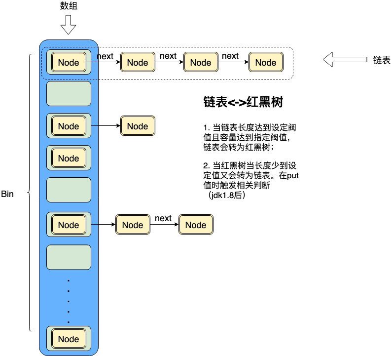

# 1. hashmap简介
hashmap实现了map接口，存储了key-value的数据形式。内部使用的数据、链表、红黑树的数据结构。

# 2. 重要概念
* Bin 桶（用来存储元素的数组）
* Capacity  桶的个数（数组的大小）
* Size hashmap元素个数，
* LoadFactor 加载因子,用来表示桶使用占比多少时进行扩容。加载因子越大，内存利用率越高，但是由于hash冲突问题，会降低查询效率，所以这个值是折衷默认是0.75
* TreeifyThreshold 桶中的数据进行树化的个数阀值,默认是8.
* UntreeifyThreshold 桶中的数据由树形结构调整为链表结构的个数阀值，默认是6.

# 3. 重要过程
一切尽在put函数，以下为put的大致逻辑过程。

* resize（扩容）
hashmap的扩容发生在容器第一次put值和容量使用比大于加载因子设定的阀值时。resize过程涉及了rehash的动作。扩容大小为原来的两倍，另外resize只能扩容，不能缩容。

* 红黑树与链表转换
    链表转换红黑树是通过判断链表大小是否达到设定的阀值TREEIFY_THRESHOLD来确定是否转换的，这个值是8；另外转换红黑树还有最小容量限制，最小容量为64。
    > static final int TREEIFY_THRESHOLD = 8;
    > static final int MIN_TREEIFY_CAPACITY = 64;

    二叉树转换链表是通过判断红黑树节点数是否达到设定的阀值UNTREEIFY_THRESHOLD来确定是否需要转换的，这个值是6

    > static final int UNTREEIFY_THRESHOLD = 6;

# 4. 重要函数
## 4.1. 构造器
hashmap提供了四个构造器：
1. 空构造（默认的容量是16，加载因子0.75，容量一般设定为2的幂次）
2. 指定容量的构造
3. 指定容量和加载因子的构造
4. 使用已有的map构造。

