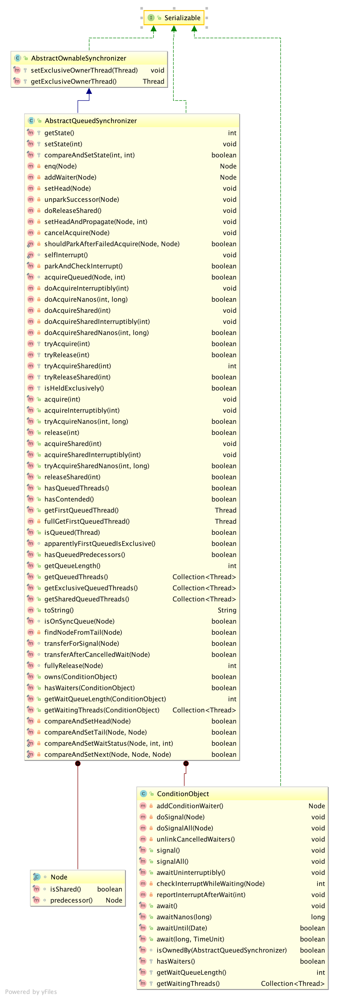

# 1. AbstractQueuedSynchronizer简介
* AQS是jdk提供的一个用于实现阻塞锁和相关同步的框架，其基于先进先出的等待队列。这个类提供了大部分的同步器（依靠一个原子int值来呈现状态）的基础。

# 2. AQS实现

AQS核心思想是，如果被请求的共享资源空闲，则将当前请求资源的线程设置为有效的工作线程，并且将共享资源设置为锁定状态。如果被请求的共享资源被占用，那么就需要一套线程阻塞等待以及被唤醒时锁分配的机制，这个机制AQS是用CLH队列锁实现的，即将暂时获取不到锁的线程加入到队列中。 AQS使用一个voliate int成员变量来表示同步状态，通过内置的FIFO队列来完成获取资源线程的排队工作。AQS使用CAS对该同步状态进行原子操作实现对其值的修改。

AQS定义了两种资源获取方式：独占（只有一个线程能访问执行，又根据是否按队列的顺序分为公平锁和非公平锁，如ReentrantLock） 和共享（多个线程可同时访问执行，如Semaphore/CountDownLatch，Semaphore、CountDownLatCh、 CyclicBarrier ）。ReentrantReadWriteLock 可以看成是组合式，允许多个线程同时对某一资源进行读。

AQS底层使用了模板方法模式， 自定义同步器在实现时只需要实现共享资源 state 的获取与释放方式即可，至于具体线程等待队列的维护（如获取资源失败入队/唤醒出队等），AQS已经在上层已经实现好了。

## 2.1. 数据结构及实现
* AQS内部基于CLH变种实现的等待队列，队列中维护着各包含Thread对象信息的Node元素
* 核心技术：
    * 大量使用volatile，保证了内存可见性，比如状态state,头节点，尾节点
    * 自旋锁
    * CAS 实现乐观锁

## 2.2. 特点
* CondictionObject实现的条件队列，可用来与锁绑定实现锁的条件等待及唤醒。关键方法：
    * await() 调用该方法后，方法内会把当前线程的节点信息加到条件队列并调用aqs的方法释放锁定。还有其他比如超时及
    * signal() 调用该方法后，会从等待队列中唤醒等待线程
    * signalAll() 调用该方法后，会从等待队列中唤醒所有等待线程
* 线程中断支持
    
* 线程获取锁超时支持

# 3. AQS子类实现方法

tryAcquire(int)
tryRelease(int)
tryAcquireShared(int)
tryReleaseShared(int)
isHeldExclusively()

# 4. 相关技术文档
[官方AbstractQueuedSynchronizer说明文档](https://docs.oracle.com/javase/7/docs/api/java/util/concurrent/locks/AbstractQueuedSynchronizer.html)
[AQS原理及基于AQS实现的锁](https://github.com/Snailclimb/JavaGuide/blob/master/docs/java/Multithread/AQS.md)
[AQS原理分析](https://www.cnblogs.com/NathanYang/p/9944632.html)