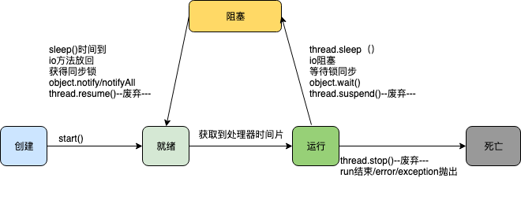

## 1. 线程生命周期

1. 创建态
    当线程通过new关键字创建一个线程之后该线程即为创建状态。
2. 就绪态
    当调用线程的start方法之后进入就绪态。要注意如果调用run方法后会以主线程方式运行。
3. 运行态
    当线程进入就绪态后的会等待处理器时间片，一旦获取到处理器的时间片便进入运行态开始运行其相关逻辑。
4. 死亡态
    当程序(正常/异常)运行结束，或者调用了stop则为死亡态
5. 阻塞态
    这是线程生命周期中的一个特殊状态，这个状态为某些事件触发导致，如线程的sleep方法，对象的wait方法，线程进入阻塞态之后线程会让出cpu，当导致阻塞对应的接触事件发生后重新进入就绪状态。

## 2. 线程中的重要方法

1. start 启动线程，使线程进入就绪态
2. stop 结束线程，该方法容易导致死锁，已弃用⚠⚠。
3. interrupt 中断线程
4. run，与start区别开，调用run方法会以主线程的方式运行即只有run方法里面的代码运行结束才会执行run方法后面的代码。
5. yield 方法使线程放弃处理器资源，进入就绪态
6. sleep 方法将会使线程放弃处理器资源，进入阻塞态（但是并不释放锁），sleep指定的时间到达后进入就绪态
7. suspend 方法将挂起线程进入阻塞态,通过调用线程的resume方法重新进入就绪态已弃用⚠⚠。
8. resume 方法将通过suspend方法掉用进入阻塞态的线程恢复进入就绪态,已弃用⚠⚠。

## 3. 相关类Object方法(锁范畴)
1. wait 调用该方法后，获取到该对象锁的线程将放弃对象锁进入此对象的等待锁定池，同时执行线程进入阻塞态。
2. notify 调用该方法后，原来等待该对象锁的某个线程将获得对象锁，具体哪个线程获取到由jvm决定
3. notifyAll 调用该方法后，原来等待对象锁的1个或多个线程将竞争该锁。

**思考：为什么wait方法是定义在对象上？**
线程同步基于共享资源的锁，而锁的实现基于对象，某些线程需要等待锁，那么调用锁对象的wait就有意义了。

## 4. 相关技术文档
[猿码道啃碎并发(一)：Java线程总述与概念](https://juejin.im/post/5a701c246fb9a01cb8100489)
[猿码道啃碎并发(二)：java线程生命周期](https://juejin.im/post/5a72d4bd518825735300f37b)
[猿码道啃碎并发（三）：Java线程上下文切换](https://juejin.im/post/5b10e53b6fb9a01e5b10e9be)