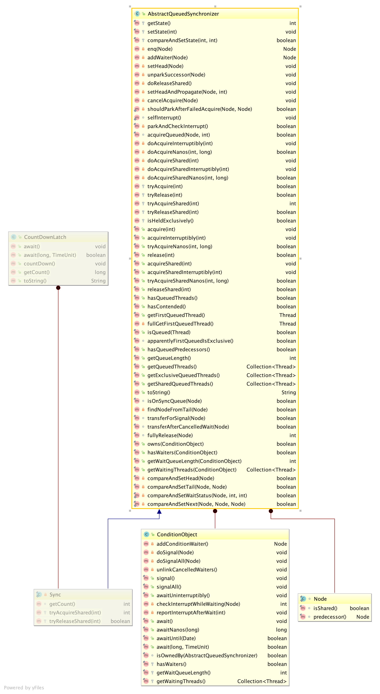

# 1. CountDownLatch简介
这是一个同步实现，旨在将一个或多个线程阻塞等待直到其他线程中一些列操作被执行结束。也是基于AQS的实现，提供的方法比较简单。

# 2. CountDownLatch使用

CountDownLatch维持一个计数器，在需要等待其他执行结束的方法A中调用await方法阻塞，在被等待的执行方法B（B1,B2,B3...）恰当位置（具体视技术/业务场景来看）调用countDown()，当计数器被减到0时表示等待结束，方法A被唤醒继续往下执行。

# 3. CountDownLatch经典使用场景
* 驱动/环境准备场景
    假设系统的启动运行的功能依赖于一些驱动准备工作，需要在所有驱动准备好之后才能开始工作。
* 一个大任务执行拆分成若干个小任务，所有小任务执行完成后汇总执行结果或处理其他逻辑（比如执行完成后报告）

**使用示例**
```
public class CountDownLatchDemo {
    public static void main(String[] args) throws InterruptedException {
        int workNum = 5;
        CountDownLatch countDownLatch = new CountDownLatch(workNum);
        for (int i=0;i<workNum;i++){
            new Thread(new Worker(countDownLatch),"NO-"+i).start();
            Thread.sleep(1000);
        }
        countDownLatch.await();
        System.out.println("woo, now I know all worker is ready");
    }
}


class Worker implements Runnable {
    private CountDownLatch readyCountDownLatch;

    public Worker(CountDownLatch readyCountDownLatch){
        this.readyCountDownLatch = readyCountDownLatch;
    }

    @Override
    public void run() {
        System.out.println(Thread.currentThread().getName()+":prepare for work start...");
        try {
            Thread.sleep(5000);
        } catch (InterruptedException e) {
            e.printStackTrace();
        }
        System.out.println(Thread.currentThread().getName()+":prepare for work finished...");
        readyCountDownLatch.countDown();
    }
}

```

**可以查看文末链接官网给出到示例**
[Leetcode相关题目](https://leetcode-cn.com/problems/print-in-order/)
# 4. CountDownLatch类图

 
# 5. 相关技术文档

 [官方API CountDownLatch](https://docs.oracle.com/javase/7/docs/api/java/util/concurrent/CountDownLatch.html)