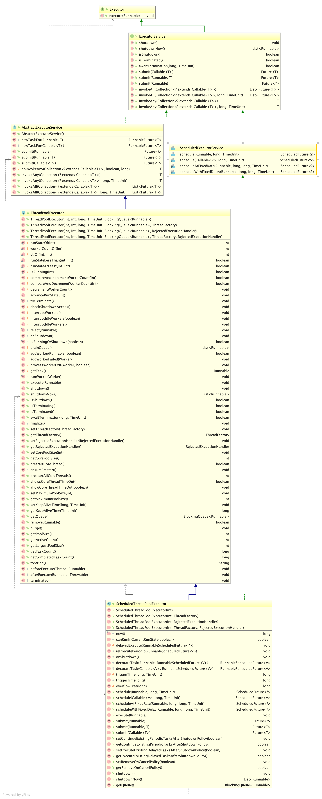
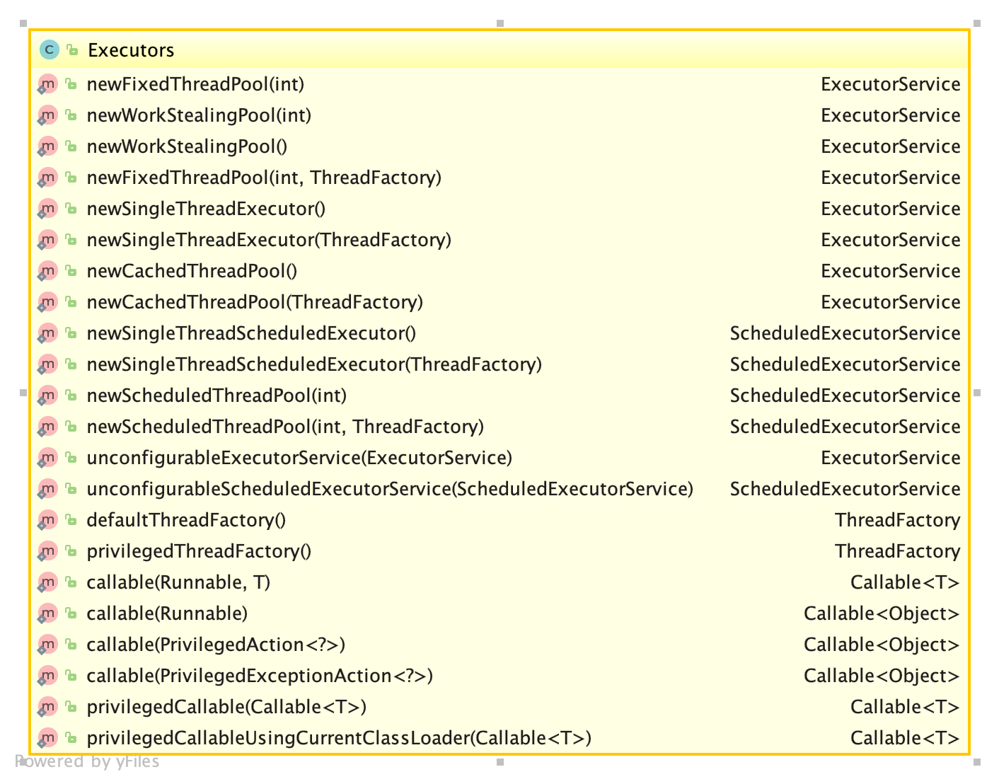

## 1. Executor框架简介
自jdk1.5之后引入Executor框架对多线程执行提供了较强大的支持，包括线程池、定时等支持。其核心接口及类主要包括ExecutorService、ThreadPoolExecutor和Executors，见下图：



## 2. ExecutorService接口
ExecutorService接口继承Executor，该接口的主要作用是对线程任务的观察和控制，如启动，关闭，判断是否关闭，是否结束，提交线程任务等。

## 3. ThreadPoolExecutor类
[ThreadPoolExecutor](./java-thread-pool-executor.md)

## 4. ScheduledThreadPoolExecutor类
该类集成了ThreadPoolExecutor类并实现了ScheduledExecutorService接口，也就具备了线程池和定时执行的特性。

## 5. Executors类
该类可以理解为Executor的一个工厂或者工具类，用于提供常用的ExecutorService。
### 5.1. 常用的几个方法
### 5.1.1. newCachedThreadPool
```
public static ExecutorService newCachedThreadPool() {
        return new ThreadPoolExecutor(0, Integer.MAX_VALUE,
                                      60L, TimeUnit.SECONDS,
                                      new SynchronousQueue<Runnable>());
}
```
这个方法获得的是一个容量弹性超大的线程池执行器，线程空闲时间60s，不需要的时候线程池中的线程数可以为0，需要的时候可以达到int的最大值。

### 5.1.2. newFixedThreadPool
```
public static ExecutorService newFixedThreadPool(int nThreads) {
        return new ThreadPoolExecutor(nThreads, nThreads,
                                      0L, TimeUnit.MILLISECONDS,
                                      new LinkedBlockingQueue<Runnable>());
}
```
这个方法获得的是一个固定线程数的线程池执行器，不关心任务运行量，这个方法使用起来可控性高，比较安全。

### 5.1.3. newScheduledThreadPool
```
public static ScheduledExecutorService newScheduledThreadPool(int corePoolSize) {
        return new ScheduledThreadPoolExecutor(corePoolSize);
}
```
该方法获得一个用于核心线程数，上限为int最大值的调度线程池执行器。

### 5.1.4. newSingleThreadExecutor
```
public static ExecutorService newSingleThreadExecutor() {
        return new FinalizableDelegatedExecutorService
            (new ThreadPoolExecutor(1, 1,
                                    0L, TimeUnit.MILLISECONDS,
                                    new LinkedBlockingQueue<Runnable>()));
}
```
这个方法获得的是一个只有一个线程的线程池执行器，查看FinalizableDelegatedExecutorService源代码可以看出这个线程是一个代理ExecutorService，它仅仅对外暴露量ExecutorServiced的方法，并重写了finalize方法关闭线程池。这也是它与newFixedThreadPool(1)的区别。
