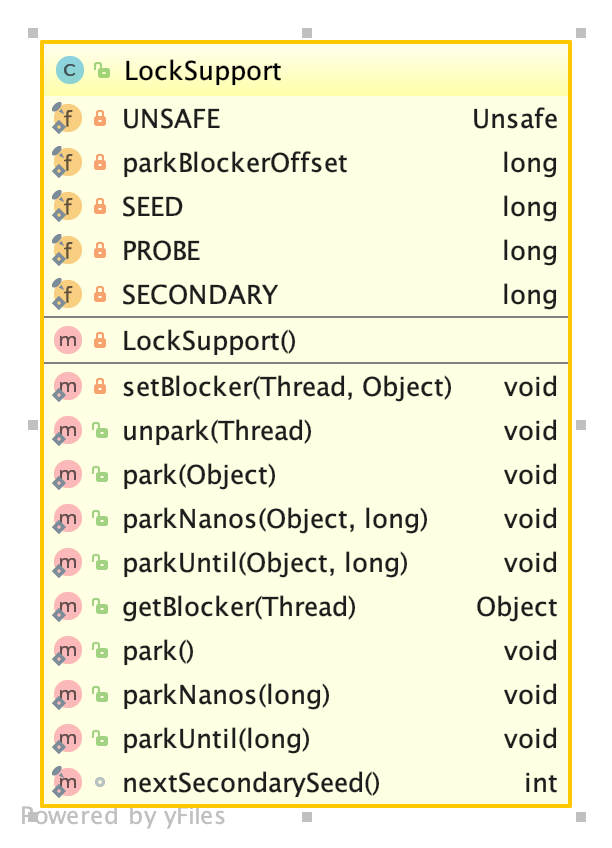

## 1. LockSupport简介
LockSupport是一个为其他类提供的创建锁和同步类的基本阻塞原语，这是官方的说法。简单来说，LockSupport提供了如下功能：
* park方法，当获取到许可时直接返回，否则阻塞。
* unpark方法，释放当前许可，将许可加1，当时许可最大为1.
* park方法支持超时和传入阻塞对象。传入阻塞对象以便用于监视和诊断工具确定线程被阻塞的原因。

## 2. 使用
LockSupport实现的是线程的阻塞和对指定线程的唤醒，并没有实现Lock接口，所以它不是一个锁，不过可以用来实现锁的类。官方文档就给出来一个简单的先进先出的锁，代码如下：
```
class FIFOMutex {
   private final AtomicBoolean locked = new AtomicBoolean(false);
   private final Queue<Thread> waiters
     = new ConcurrentLinkedQueue<Thread>();

   public void lock() {
     boolean wasInterrupted = false;
     Thread current = Thread.currentThread();
     waiters.add(current);

     // Block while not first in queue or cannot acquire lock
     while (waiters.peek() != current ||
            !locked.compareAndSet(false, true)) {
        LockSupport.park(this);
        if (Thread.interrupted()) // ignore interrupts while waiting
          wasInterrupted = true;
     }

     waiters.remove();
     if (wasInterrupted)          // reassert interrupt status on exit
        current.interrupt();
   }

   public void unlock() {
     locked.set(false);
     LockSupport.unpark(waiters.peek());
   }
 }
```

## 3. 类图


## 4. 相关技术文档
[Oracle LockSupport说明](https://docs.oracle.com/javase/7/docs/api/java/util/concurrent/locks/LockSupport.html)