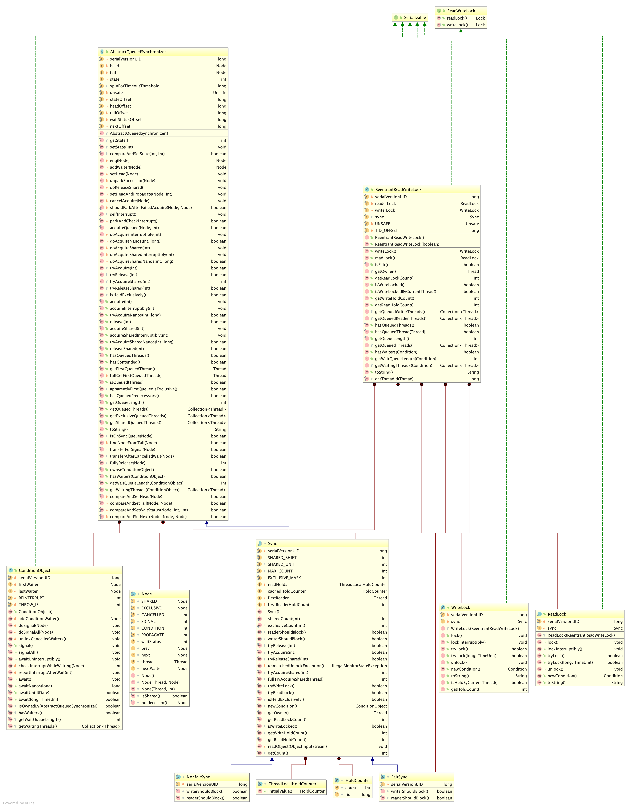

## 1. ReentrantReadWriteLock简介
ReentrantReadWriteLock可重入式读写锁，同样基于AQS框架实现。**ReentrantReadWriteLock特点：**
* 可重入锁
* 共享读锁
* 排他写锁
* 排他锁和共享锁互斥，有线程获得写锁，那么除了拥有写锁的其他线程不能获得读锁。

## 2. ReentrantReadWriteLock类图


## 3. ReentrantReadWriteLock实现
### 3.1. 读写锁的状态实现
读写锁的状态使用AQS的state来控制，高16位代表读锁的数量，低16位代表写锁的数量（只有0或1）。所以读/写锁最大的锁数量为2<<<16=65535个。

### 3.2. 写锁的实现
写锁的实现与ReentrantLock相似，都是独占锁，实现区别在于写锁增加了当前读锁判断，如果当前有读锁或者写锁，获取失败，源代码文档已清晰说明其逻辑。

**源码**
```
protected final boolean tryAcquire(int acquires) {
            /*
             * Walkthrough:
             * 1. If read count nonzero or write count nonzero
             *    and owner is a different thread, fail.
             * 2. If count would saturate, fail. (This can only
             *    happen if count is already nonzero.)
             * 3. Otherwise, this thread is eligible for lock if
             *    it is either a reentrant acquire or
             *    queue policy allows it. If so, update state
             *    and set owner.
             */
            Thread current = Thread.currentThread();
            int c = getState();
            int w = exclusiveCount(c);
            if (c != 0) {
                // (Note: if c != 0 and w == 0 then shared count != 0)
                if (w == 0 || current != getExclusiveOwnerThread())
                    return false;
                if (w + exclusiveCount(acquires) > MAX_COUNT)
                    throw new Error("Maximum lock count exceeded");
                // Reentrant acquire
                setState(c + acquires);
                return true;
            }
            if (writerShouldBlock() ||
                !compareAndSetState(c, c + acquires))
                return false;
            setExclusiveOwnerThread(current);
            return true;
        }
```

### 3.3. 读锁实现
读锁与Semaphore的实现相似，都是使用共享锁。读锁与写锁也类似，不同在于读锁只要没有写锁占用并且不超过最大获取数量都可以尝试获取读锁。

**源码**
```
protected final int tryAcquireShared(int unused) {
            /*
             * Walkthrough:
             * 1. If write lock held by another thread, fail.
             * 2. Otherwise, this thread is eligible for
             *    lock wrt state, so ask if it should block
             *    because of queue policy. If not, try
             *    to grant by CASing state and updating count.
             *    Note that step does not check for reentrant
             *    acquires, which is postponed to full version
             *    to avoid having to check hold count in
             *    the more typical non-reentrant case.
             * 3. If step 2 fails either because thread
             *    apparently not eligible or CAS fails or count
             *    saturated, chain to version with full retry loop.
             */
            Thread current = Thread.currentThread();
            int c = getState();
            if (exclusiveCount(c) != 0 &&
                getExclusiveOwnerThread() != current)
                return -1;
            int r = sharedCount(c);
            if (!readerShouldBlock() &&
                r < MAX_COUNT &&
                compareAndSetState(c, c + SHARED_UNIT)) {
                if (r == 0) {
                    firstReader = current;
                    firstReaderHoldCount = 1;
                } else if (firstReader == current) {
                    firstReaderHoldCount++;
                } else {
                    HoldCounter rh = cachedHoldCounter;
                    if (rh == null || rh.tid != getThreadId(current))
                        cachedHoldCounter = rh = readHolds.get();
                    else if (rh.count == 0)
                        readHolds.set(rh);
                    rh.count++;
                }
                return 1;
            }
            return fullTryAcquireShared(current);
        }
```


## 4. ReentrantReadWriteLock使用场景

## 5. 相关技术文档
[掘金 ReentrantReadWriteLock](https://juejin.im/post/5b9df6015188255c8f06923a)

