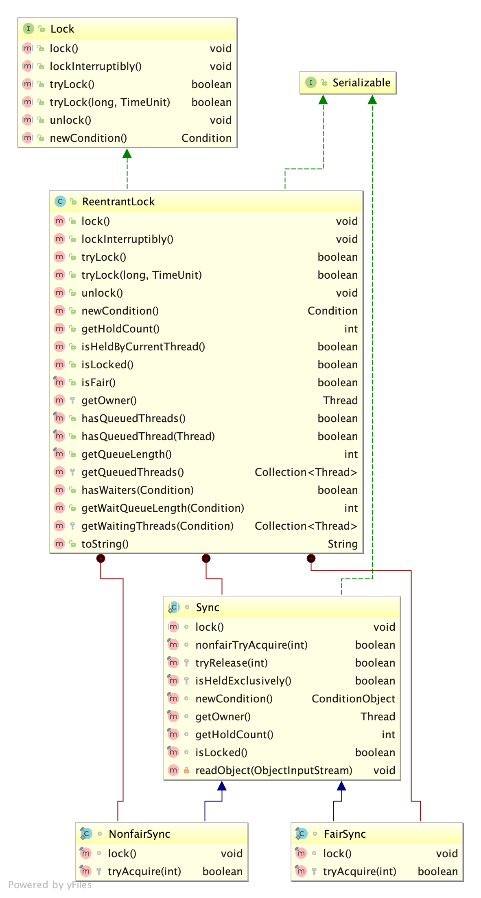
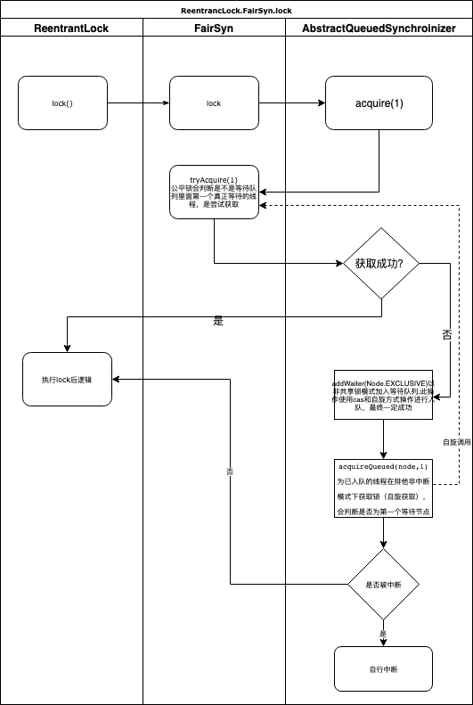
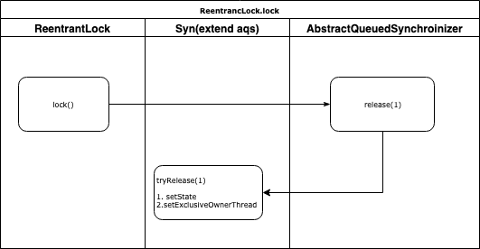
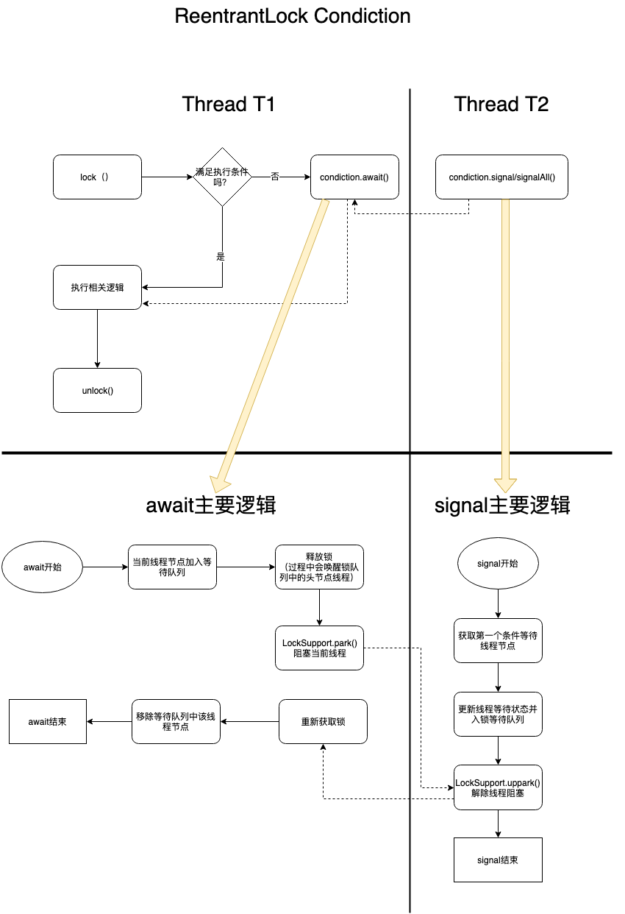

# 1. 经典的锁：ReentrantLock可重入锁
什么是可重入锁？
一个线程不能获取被其他线程拥有的锁，但是线程可以获取一个它已经拥有的锁，这种能力即可重入的，能达到这种效果的锁即可重入锁。
当一个线程执行的方法中触发一个同步代码，同步代码中包含同步代码，且这两个同步代码同步的是同一个资源，那么如果没有可重入锁，线程可能需要注意避免将自己阻塞。

## 1.1. ReentrantLock类图


## 1.2. ReentrantLock特点
* ReentrantLock基于同步容器AQS（AbstractQueuedSynchronizer）实现Lock接口
* **ReentrantLock支持公平锁和非公平锁**
    * 非公平锁，通过CAS方式获取锁
    * 公平锁，AQS的CHL双端队列的头部线程获取到锁
* **独占锁**
* **ReentrantLock支持中断锁**
* **支持Condition**

## 1.3. ReentrantLock的lock及unlock过程

**lock方法调用链：**

ReentrantLock.lock() -> Syn.lock() -> AbstractQueuedSynchronizer.acquire(int arg) -> ReentrantLock.tryAcquire(int acquires)

### 1.3.1. 公平锁获取锁时序图


### 1.3.2. 非公平锁获取锁时序图


### 1.3.3. 总结
* 公平锁的实现完全依赖于CHL双端等待队列
* 非公平锁的实现主要体现在第一次获取锁时不考虑等待队列，直接插队获取。但是获取失败后会插入到等待队列队尾自旋式获取（此时有排队）


## 1.4. ReentrantLock的unlock过程

ReentrantLock的解锁过程对于公平锁和非公平锁都一样，解锁过程比较简单，主要操作有：
* setState
* setExclusiveOwnerThread




## 1.5. 基本使用示例代码
```
public class ReentrantLockDemo {
    private String sharedResource;

    private ReentrantLock sharedResourceLock = new ReentrantLock(true);

    public void op(){
        try {
            sharedResourceLock.lock();
            //code...
        }finally {
            sharedResourceLock.unlock();
        }
    }
}
```

# 2. 关于Condiction
* Condiction是Lock接口提供的一个绑定对象，通过newCondition方法进行绑定，用于条件等待和唤醒，调用await当前线程将阻塞，调用线程signal/signalAll将唤醒所有Condiction等待线程。
* ReentrantLock实现中有两个队列，本类中有一个锁等待队列，用于锁竞争，内部类Condiction有一个条件等待队列，用于存储等待条件的线程。在调用await时线程节点在条件等待队列入队并释放锁，接下来使用LockSuppor的park阻塞线程，在被其他线程调用了该条件对象的signal/signalAll后，阻塞解除重新获取锁执行await后逻辑。




# 3. 相关技术文档
[官方ReentrantLock说明](https://docs.oracle.com/javase/7/docs/api/java/util/concurrent/locks/ReentrantLock.html)
[官方ReentrantLock.Condiction说明](https://docs.oracle.com/cd/E17802_01/j2se/j2se/1.5.0/jcp/beta1/apidiffs/java/util/concurrent/locks/ReentrantLock.ConditionObject.html)
[ReentrantLock可中断锁示例代码参考](https://blog.csdn.net/dongyuxu342719/article/details/94395877)
[synchronized和ReentrantLock区别](https://blog.csdn.net/zheng548/article/details/54426947)
[ReentrantLock Condition使用详解](https://www.cnblogs.com/hongdada/p/6150699.html)
