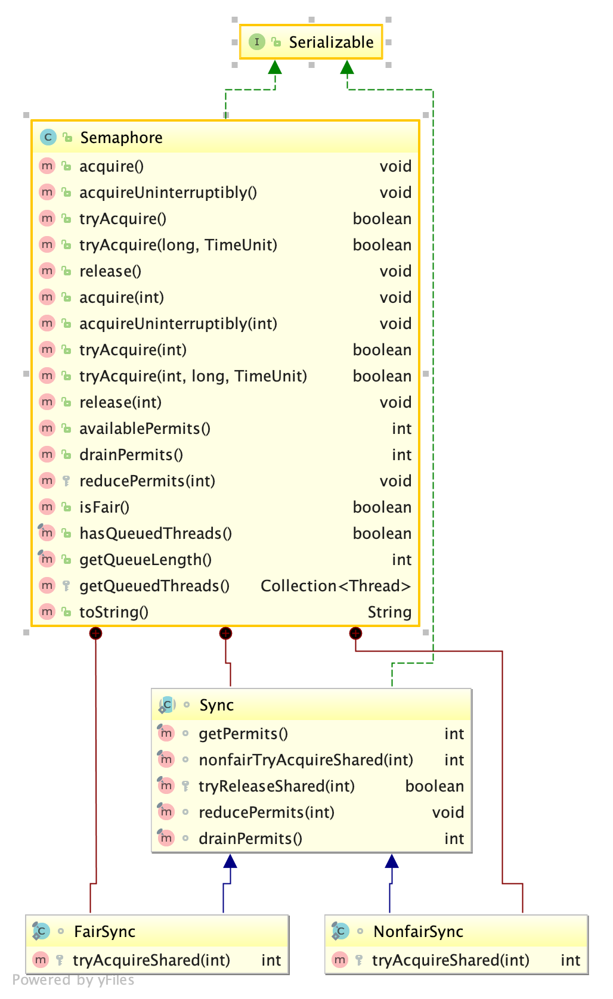

<!-- TOC -->

- [1. 官方对于信号量Semaphore[ˈseməfɔːr]说明](#1-官方对于信号量semaphoreˈseməfɔːr说明)
- [2. 使用场景](#2-使用场景)
- [3. Semaphore类图](#3-semaphore类图)
- [4. Semaphore其他特点](#4-semaphore其他特点)
- [5. SemaphoreApi](#5-semaphoreapi)
- [6. 相关技术文档](#6-相关技术文档)

<!-- /TOC -->
# 1. 官方对于信号量Semaphore[ˈseməfɔːr]说明
 一个计数信号量，一般保持一系列许可。调用require()函数会阻塞直到拿到一个可用的许可或者被中断。每一个release()函数会增加一个许可，会潜在的释放一个阻塞的require。实现中没有真实的许可对象被使用，信号量只是简单的保持计数并采取相应的措施。

# 2. 使用场景
对于数量有限的资源，可以通过信号量来控制允许线程执行的数量。

**示例代码**:假设某公司有5辆车，公司10个部门领导出差需要使用
```
public class SemaphoreDemo {
    public static void main(String[] args) {
        int leaderNum = 10;
        Semaphore carSemaphore = new Semaphore(5);
        for (int i = 0; i < leaderNum; i++) {
            new Thread(new Leader(carSemaphore), "Leader-"+i).start();
        }
    }
}


class Leader implements Runnable {

    private Semaphore carSemaphore;

    public Leader(Semaphore carSemaphore) {
        this.carSemaphore = carSemaphore;
    }

    @Override
    public void run() {
        Random random = new Random();
        while (true) {
            try {
                Thread.currentThread().sleep(random.nextInt(50000));
                System.out.println(Thread.currentThread().getName() + ":come for car ------------");

                carSemaphore.acquire(1);

                System.out.println(Thread.currentThread().getName() + ":got car >>>>>>>>>>>>>>>>>>>>  remain:" + carSemaphore.availablePermits());
                Thread.sleep(random.nextInt(50000) + 1000);

                carSemaphore.release(1);
                System.out.println(Thread.currentThread().getName() + ":return car <<<<<<<<<<<<<<<<<< remain:" + carSemaphore.availablePermits());
            } catch (InterruptedException e) {
                e.printStackTrace();
            }

        }
    }
}

```

# 3. Semaphore类图


# 4. Semaphore其他特点
* 信号量也是基于AQS实现，它没有实现Lock接口，所以并不是一个锁。
* 信号量中许可数指定好后使用期间无法更改。
* 内部实现了公平竞争和非公平竞争获取许可。
* 许可获取采用共享方式，不考虑state。
* 支持中断和非中断获取许可
* 支持许可获取时超时设置

# 5. SemaphoreApi
具体参考文末官方api链接

# 6. 相关技术文档
[Semaphore API 官方说明](https://docs.oracle.com/javase/7/docs/api/java/util/concurrent/Semaphore.html)