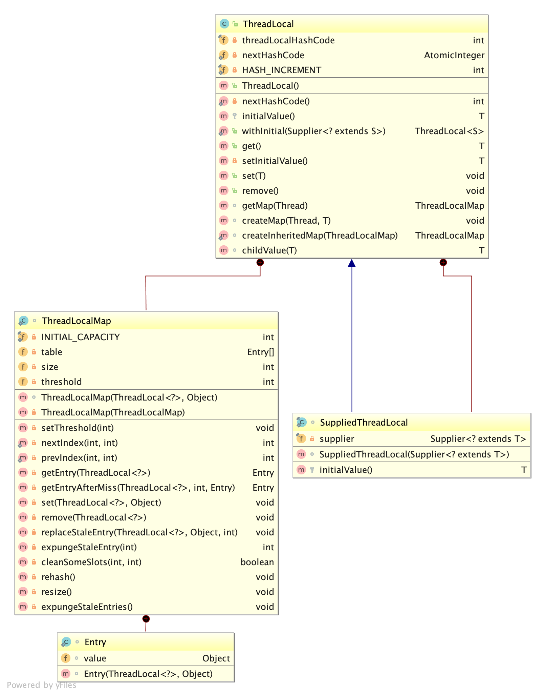

# 1. ThreadLocal简介
官方说：ThreadLocal提供线程级别的变量，这些变量与普通变量不同，每个线程都有独立的初始化的变量副本。简单理解，ThreadLocal提供了一个线程执行中的上下文环境，各自线程拥有与其他线程互不干扰的变量环境。

# 2. 使用说明
* 初始化 ThreadLocal<T>() threadLocal = new ThreadLocal<>().
* 设置值 threadLocal.set(value)
* 获取值 threadLocal.get(value)

**示例代码**
示例展示了各个线程设置和获取自己的线程变量，互不干涉,从执行结果可以看出.
```
public class ThreadLocalDemo {
    ThreadLocal<Integer> threadLocal = new ThreadLocal<>();


    public void setThreadLocalValue(int value) {
        threadLocal.set(value);
        System.out.println(Thread.currentThread().getName() + ":设置线程变量值为：" + value);
    }

    public Integer getThreadLocalValue() {
        Integer value = threadLocal.get();
        System.out.println(Thread.currentThread().getName() + ":获取线程变量值为：" + value);
        return value;
    }

    public static void main(String[] args) {
        ThreadLocalDemo td = new ThreadLocalDemo();
        int threadNum = 30;
        for (int i=0;i<threadNum;i++){
            new Thread(new Runnable() {
                Random random = new Random();
                @Override
                public void run() {
                    td.setThreadLocalValue(random.nextInt(100000));
                    try {
                        //避免线程一口气执行完，让它停一会儿让其他线程执行
                        Thread.currentThread().sleep(random.nextInt(5000));
                    } catch (InterruptedException e) {
                        e.printStackTrace();
                    }
                    td.getThreadLocalValue();
                }
            }, "Thread-" + i).start();
        }
    }

}
```

# 3. 类图


**分析：**
ThreadLocal内部定义了一个静态内部类ThreadLocalMap,ThreadLocalMap（并没有实现map接口，内部使用了一个Entry数组来存储Thread各自线程变量）。每个Thread有一个自己的ThreadLocalMap，当设置值时，key为ThreadLocal。


# 4. 相关技术文档
[Oracle ThreadLocal说明](https://docs.oracle.com/javase/8/docs/api/java/lang/ThreadLocal.html)