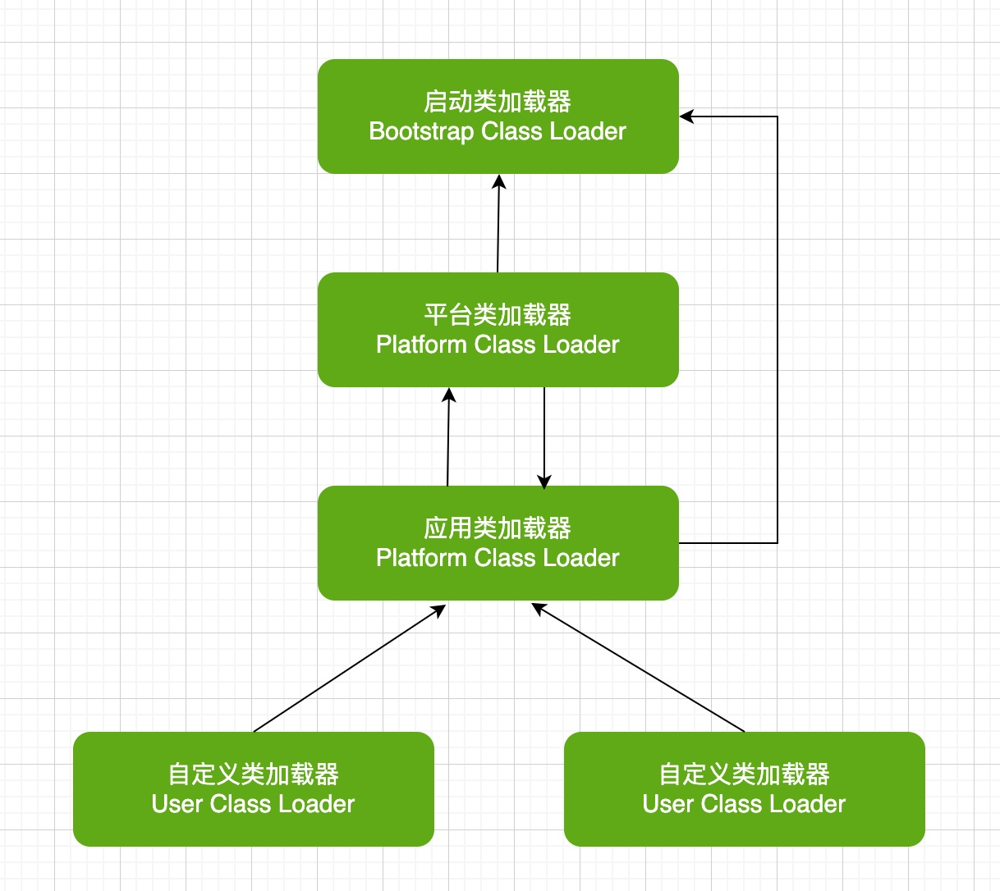

## 1. java类加载策略

以下为jdk1.9之前的类加载图

### 1.1. 核心类加载器

* Bootstrap ClassLoader

  根类（或叫启动、引导类加载器）加载器，用来加载Java的核心类如String，System等。它比较特殊，jdk1.9之前由原生C++代码实现，其并不是`java.lang.ClassLoader`的子类。

* Extension Classloader，扩展类加载器，它负责夹在JRE的扩展目录`%JAVA_HOME%/jre/lib/ext` 中JAR包的类。JDK1.9开始被`Platform Classloader` 替代用来加载jdk中的非核心模块类。

* System/Application Classloader

  系统类加载器,它负责在JVM启动时夹在来自class path环境变量所指定的JAR包和类。

### 1.2 双亲委派机制

* 什么是双亲委派

  当一个类加载器收到了类加载请求，它会把这个请求委派给父（parent）类加载器去完成，依次递归，因此所有的加载请求最终都被传送到顶层的启动类加载器中。只有在父类加载器无法加载该类时子类才尝试从自己类的路径中加载该类。（ps：类加载器中的父子关系并不是类继承上的父子关系，而是类加载器实例之间的关系。）

* 为什么要使用该机制
  * 避免重复加载
  * 安全考虑

## 2. 如何自定义CLassLoader
自定义ClassLoader，重写方法findCLass. 通过自定义ClassLoader会打破双亲委派模式

## 扩展 - 1.9中的类加载器

