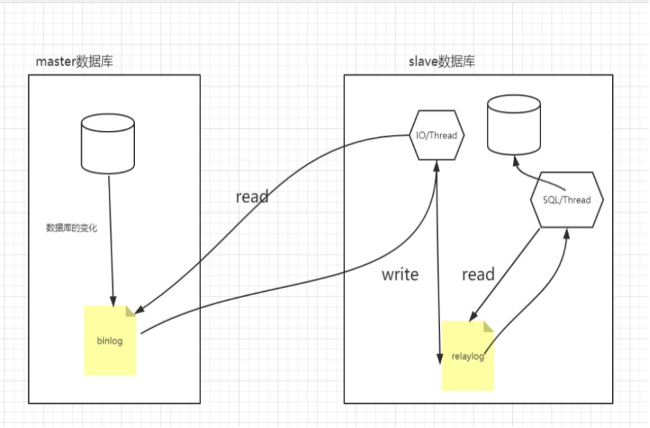

## 1. mysql高可用方案
数据库高可用方案大多异曲同工，一般均为一主多从，双活，以及进行故障自动切换。

## 2. mysql主从方案
### 2.1. master配置核心要点
1. 创建一个用户’repl’,并且允许其他服务器可以通过该用户远程访问master，通过该用户去读取二进制数据，实现数据同步
Create user repl identified by ‘repl； repl用户必须具有REPLICATION SLAVE权限，除此之外其他权限都不需要
GRANT REPLICATION SLAVE ON *.* TO ‘repl’@’%’ IDENTIFIED BY ‘repl’ ; 
2. 修改140 my.cnf配置文件，在[mysqld] 下添加如下配置
    ```
    log-bin=mysql-bin //启用二进制日志文件
    server-id=130 服务器唯一ID 
    ```
3. 重启数据库 systemctl restart mysqld 
4. 登录到数据库，通过show master status  查看master的状态信息

### 2.2. slave核心配置要点
1. 修改142 my.cnf配置文件， 在[mysqld]下增加如下配置
    ```
    server-id=132  服务器id，唯一
    relay-log=slave-relay-bin
    relay-log-index=slave-relay-bin.index
    read_only=1
    ```
2. 重启数据库： systemctl restart mysqld
3. 连接到数据库客户端，通过如下命令建立同步连接
    ```
    change master to master_host=’192.168.11.140’, master_port=3306,master_user=’repl’,master_password=’repl’,master_log_file=’mysql-bin.000001’,master_log_pos=0;
    ```
    master_log_file和master_log_pos从master的show master status可以找到对应的值，不能随便写。
4. 执行 start slave
5. show slave status\G;查看slave服务器状态，当如下两个线程状态为yes，表示主从复制配置成功
Slave_IO_Running=Yes
Slave_SQL_Running=Yes

### 2.3. 主从同步原理

1. master记录二进制日志。在每个事务更新数据完成之前，master在二日志记录这些改变。MySQL将事务串行的写入二进制日志，即使事务中的语句都是交叉执行的。在事件写入二进制日志完成后，master通知存储引擎提交事务
2. slave将master的binary log拷贝到它自己的中继日志。首先，slave开始一个工作线程——I/O线程。I/O线程在master上打开一个普通的连接，然后开始binlog dump process。Binlog dump process从master的二进制日志中读取事件，如果已经跟上master，它会睡眠并等待master产生新的事件。I/O线程将这些事件写入中继日志
3. SQL线程从中继日志读取事件，并重放其中的事件而更新slave的数据，使其与master中的数据一致

### 2.4. binlog
binlog用来记录mysql的数据更新或者潜在更新.
#### 2.4.1. binglog格式


### 2.5. 中从同步延时问题及解决方案
* 同步延迟产生原因：
1.  当master库tps比较高的时候，产生的DDL数量超过slave一个sql线程所能承受的范围，或者slave的大型query语句产生锁等待
2.  网络传输： bin文件的传输延迟
3.  磁盘的读写耗时：文件通知更新、磁盘读取延迟、磁盘写入延迟

* 解决方案
1.  在数据库和应用层增加缓存处理，优先从缓存中读取数据
2.  减少slave同步延迟，可以修改slave库sync_binlog属性； 
sync_binlog=0  文件系统来调度把binlog_cache刷新到磁盘
sync_binlog=n  
3.  增加延时监控
Nagios做网络监控
mk-heartbeat