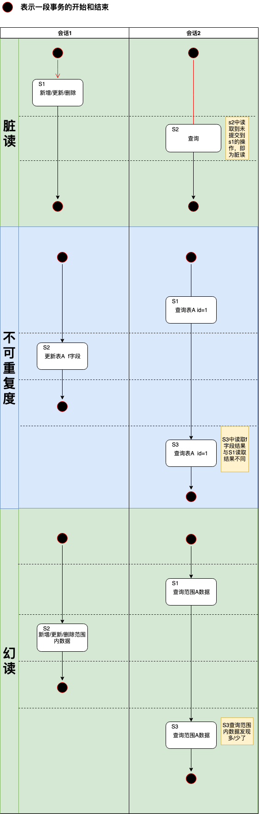

## 1. 事务
事务的ACID特性：
* 原子性 atomicity
* 一致性 consistency
* 隔离性 isolation
* 持久性 durability

## 2. mysql事务隔离级别
* 读未提交 READ UNCOMMITTED
* 读已提交 READ COMMITTED
* 可重复读 REPEATABLE READ （mysql默认隔离级别）
* 串行化 SERIALIZABLE

## 3. 事务不同隔离级别中的问题

|      -_^     | 脏读        | 不可重复读 | 幻读 |
| --------- | :----------:|:---------:|:-----:| 
| 读未提交      | ✓         | ✓        |   ✓    | 
| 读已提交      | x         | ✓        |    ✓   |
| 重复读       | x         | x        |     ✓(?)  |
| 串行化       | x         | x       |    x   |

⚠️⚠️⚠️ **mysql通过MVCC解决重复度隔离级别下的幻读问题**

## 4. 总结
* 事务的四个隔离级别换个角度看其实提供了本会话下对数据库的四个视角，比如读未提交可以看到其他事务没有提交的数据操作，不管其他会话是不是设置读未提交（但是这并不意外着你可以马上操作，这涉及到数据库的另一个主题，锁）。

* 串行化的隔离级别下，对同一张表的串行只针对不同会话中的同一个表有些操作时的串行（有些操作时只有一个事务结束另一个事务的写操作才允许执行），不同表之间不影响。
