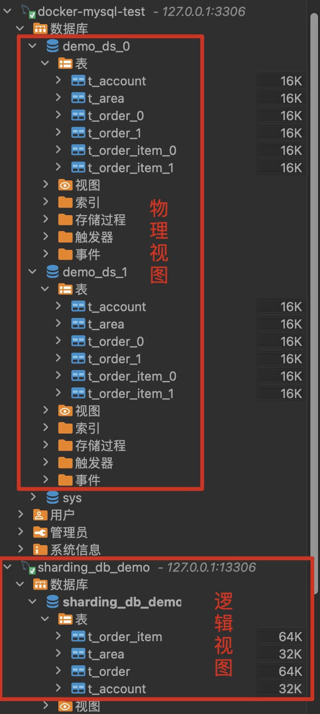

当前示例场景：某订单系统基于用户纬度分库，并对订单表和订单字表同时进行分表。

## Step 1 ：安装启动mysql

mac系统Intel芯片，此处使用Docker方式启动mysql。

拉取mysql镜像

> docker pull mysql:5.7

创建本地存储卷

> docker volume create mysql-docker-volume

查看创建结果

> docker volume ls

将mysql数据库数据关联到本地卷

> docker run -d --name mysql-test -p 3306:3306 -v mysql-docker-volume:/var/lib/mysql -e MYSQL_ROOT_PASSWORD=1qaz2wsx mysql:latest


## Step 2 ：初始化mysql数据库

* 创建两个数据库 demo_ds_0和demo_ds_1
* 分别在两个数据库初始化表

```sql
CREATE DATABASE `demo_ds_0` DEFAULT CHARACTER SET utf8mb4 COLLATE utf8mb4_general_ci;

USE demo_ds_0;

-- demo_ds_0.t_account definition

CREATE TABLE `t_account` (
  `account_id` varchar(100) CHARACTER SET utf8mb4 COLLATE utf8mb4_general_ci NOT NULL,
  `user_code` varchar(100) CHARACTER SET utf8mb4 COLLATE utf8mb4_general_ci NOT NULL,
  `name` varchar(100) CHARACTER SET utf8mb4 COLLATE utf8mb4_general_ci NOT NULL,
  `phone` varchar(20) CHARACTER SET utf8mb4 COLLATE utf8mb4_general_ci DEFAULT NULL,
  `pwd` varchar(100) CHARACTER SET utf8mb4 COLLATE utf8mb4_general_ci NOT NULL,
  PRIMARY KEY (`account_id`)
) ENGINE=InnoDB DEFAULT CHARSET=utf8mb4 COLLATE=utf8mb4_general_ci;


-- demo_ds_0.t_area definition

CREATE TABLE `t_area` (
  `id` bigint NOT NULL,
  `code` varchar(8) CHARACTER SET utf8mb4 COLLATE utf8mb4_general_ci NOT NULL,
  `name` varchar(200) COLLATE utf8mb4_general_ci NOT NULL,
  PRIMARY KEY (`id`)
) ENGINE=InnoDB DEFAULT CHARSET=utf8mb4 COLLATE=utf8mb4_general_ci;

-- demo_ds_0.t_order_0 definition
CREATE TABLE `t_order_0` (
  `order_id` varchar(100) CHARACTER SET utf8mb4 COLLATE utf8mb4_general_ci NOT NULL,
  `account_id` varchar(100) COLLATE utf8mb4_general_ci NOT NULL,
  `description` varchar(300) COLLATE utf8mb4_general_ci DEFAULT NULL,
  `create_at` datetime NOT NULL,
  PRIMARY KEY (`order_id`)
) ENGINE=InnoDB DEFAULT CHARSET=utf8mb4 COLLATE=utf8mb4_general_ci;

-- demo_ds_0.t_order_1 definition
CREATE TABLE `t_order_1` (
  `order_id` varchar(100) CHARACTER SET utf8mb4 COLLATE utf8mb4_general_ci NOT NULL,
  `account_id` varchar(100) COLLATE utf8mb4_general_ci NOT NULL,
  `description` varchar(300) COLLATE utf8mb4_general_ci DEFAULT NULL,
  `create_at` datetime NOT NULL,
  PRIMARY KEY (`order_id`)
) ENGINE=InnoDB DEFAULT CHARSET=utf8mb4 COLLATE=utf8mb4_general_ci;


-- demo_ds_0.t_order_item_0 definition

CREATE TABLE `t_order_item_0` (
  `order_item_id` varchar(100) COLLATE utf8mb4_general_ci NOT NULL,
  `account_id` varchar(100) COLLATE utf8mb4_general_ci NOT NULL,
  `order_id` varchar(100) COLLATE utf8mb4_general_ci NOT NULL,
  `product_code` varchar(100) COLLATE utf8mb4_general_ci NOT NULL,
  `number` int NOT NULL,
  PRIMARY KEY (`order_item_id`)
) ENGINE=InnoDB DEFAULT CHARSET=utf8mb4 COLLATE=utf8mb4_general_ci;

-- demo_ds_0.t_order_item_1 definition

CREATE TABLE `t_order_item_1` (
  `order_item_id` varchar(100) COLLATE utf8mb4_general_ci NOT NULL,
  `account_id` varchar(100) COLLATE utf8mb4_general_ci NOT NULL,
  `order_id` varchar(100) COLLATE utf8mb4_general_ci NOT NULL,
  `product_code` varchar(100) COLLATE utf8mb4_general_ci NOT NULL,
  `number` int NOT NULL,
  PRIMARY KEY (`order_item_id`)
) ENGINE=InnoDB DEFAULT CHARSET=utf8mb4 COLLATE=utf8mb4_general_ci;


CREATE DATABASE `demo_ds_1` DEFAULT CHARACTER SET utf8mb4 COLLATE utf8mb4_general_ci;
USE demo_ds_1;

-- demo_ds_1.t_account definition
CREATE TABLE `t_account` (
  `account_id` varchar(100) CHARACTER SET utf8mb4 COLLATE utf8mb4_general_ci NOT NULL,
  `user_code` varchar(100) CHARACTER SET utf8mb4 COLLATE utf8mb4_general_ci NOT NULL,
  `name` varchar(100) CHARACTER SET utf8mb4 COLLATE utf8mb4_general_ci NOT NULL,
  `phone` varchar(20) CHARACTER SET utf8mb4 COLLATE utf8mb4_general_ci DEFAULT NULL,
  `pwd` varchar(100) CHARACTER SET utf8mb4 COLLATE utf8mb4_general_ci NOT NULL,
  PRIMARY KEY (`account_id`)
) ENGINE=InnoDB DEFAULT CHARSET=utf8mb4 COLLATE=utf8mb4_general_ci;


-- demo_ds_1.t_area definition

CREATE TABLE `t_area` (
  `id` bigint NOT NULL,
  `code` varchar(8) CHARACTER SET utf8mb4 COLLATE utf8mb4_general_ci NOT NULL,
  `name` varchar(200) COLLATE utf8mb4_general_ci NOT NULL,
  PRIMARY KEY (`id`)
) ENGINE=InnoDB DEFAULT CHARSET=utf8mb4 COLLATE=utf8mb4_general_ci;


-- demo_ds_1.t_order_0 definition
CREATE TABLE `t_order_0` (
  `order_id` varchar(100) CHARACTER SET utf8mb4 COLLATE utf8mb4_general_ci NOT NULL,
  `account_id` varchar(100) COLLATE utf8mb4_general_ci NOT NULL,
  `description` varchar(300) COLLATE utf8mb4_general_ci DEFAULT NULL,
  `create_at` datetime NOT NULL,
  PRIMARY KEY (`order_id`)
) ENGINE=InnoDB DEFAULT CHARSET=utf8mb4 COLLATE=utf8mb4_general_ci;


-- demo_ds_1.t_order_1 definition
CREATE TABLE `t_order_1` (
  `order_id` varchar(100) CHARACTER SET utf8mb4 COLLATE utf8mb4_general_ci NOT NULL,
  `account_id` varchar(100) COLLATE utf8mb4_general_ci NOT NULL,
  `description` varchar(300) COLLATE utf8mb4_general_ci DEFAULT NULL,
  `create_at` datetime NOT NULL,
  PRIMARY KEY (`order_id`)
) ENGINE=InnoDB DEFAULT CHARSET=utf8mb4 COLLATE=utf8mb4_general_ci;


-- demo_ds_1.t_order_item_0 definition

CREATE TABLE `t_order_item_0` (
  `order_item_id` varchar(100) COLLATE utf8mb4_general_ci NOT NULL,
  `account_id` varchar(100) COLLATE utf8mb4_general_ci NOT NULL,
  `order_id` varchar(100) COLLATE utf8mb4_general_ci NOT NULL,
  `product_code` varchar(100) COLLATE utf8mb4_general_ci NOT NULL,
  `number` int COLLATE utf8mb4_general_ci NOT NULL,
  PRIMARY KEY (`order_item_id`)
) ENGINE=InnoDB DEFAULT CHARSET=utf8mb4 COLLATE=utf8mb4_general_ci;

-- demo_ds_1.t_order_item_1 definition

CREATE TABLE `t_order_item_1` (
  `order_item_id` varchar(100) COLLATE utf8mb4_general_ci NOT NULL,
  `account_id` varchar(100) COLLATE utf8mb4_general_ci NOT NULL,
  `order_id` varchar(100) COLLATE utf8mb4_general_ci NOT NULL,
  `product_code` varchar(100) COLLATE utf8mb4_general_ci NOT NULL,
  `number` int COLLATE utf8mb4_general_ci NOT NULL,
  PRIMARY KEY (`order_item_id`)
) ENGINE=InnoDB DEFAULT CHARSET=utf8mb4 COLLATE=utf8mb4_general_ci;
```


## Step 3 : 启动Shardingsphere-Proxy 

这里可以使用本地启动或者Docker方式，如果只是演示，本地方式更简单一点。当前shardingsphere-proxy最新脚本为5.4.1，二进制方式需要本地有java 8 以上环境。

### 二进制启动

1. [下载](https://shardingsphere.apache.org/document/current/en/downloads/)二进制包并解压缩 https://dlcdn.apache.org/shardingsphere/5.4.1/apache-shardingsphere-5.4.1-shardingsphere-proxy-bin.tar.gz

   > tar -zxvf apache-shardingsphere-5.4.1-shardingsphere-proxy-bin.tar.gz

   目录说明：

   * conf ｜配置文件包，shardingsphere相关的配置均在这里，如服务器链接配置，分片配置，加密配置等
   * bin | 服务启停脚本

2. 修改配置文件(这仅仅是一个测试demo配置，生产环境需要更严谨，比如安全连接以及分片策略是否使用一致性hash确保未来扩展等。[👉详细配置说明官方参考文档](https://shardingsphere.apache.org/document/current/cn/user-manual/shardingsphere-proxy/yaml-config/))

   * 数据库服务器连接配置 server.yaml

     ```yaml
     mode:
       type: Standalone
       repository:
         type: JDBC
     authority:
      users:
        - user: root@%
          password: root
        - user: sharding
          password: sharding
      privilege:
        type: ALL_PERMITTED
        
        
     props:
       sql-show: true
       proxy-hint-enabled: true
     ```

   * 分片配置 config-sharding.yaml

     ```yaml
     databaseName: sharding_db_demo
     dataSources:
       ds_0:
         url: jdbc:mysql://127.0.0.1:3306/demo_ds_0?serverTimezone=UTC&useSSL=false&useUnicode=true&characterEncoding=UTF-8
         username: root
         password: 1qaz2wsx
       ds_1:
         url: jdbc:mysql://127.0.0.1:3306/demo_ds_1?serverTimezone=UTC&useSSL=false&useUnicode=true&characterEncoding=UTF-8
         username: root
         password: 1qaz2wsx
     
     rules:
     - !SHARDING
       tables:
         t_order: 
           actualDataNodes: ds_${0..1}.t_order_${0..1}
           tableStrategy: 
             standard:
               shardingColumn: order_id
               shardingAlgorithmName: t_order_inline
           keyGenerateStrategy:
             column: order_id
             keyGeneratorName: snowflake
           auditStrategy:
             auditorNames:
               - sharding_key_required_auditor
             allowHintDisable: true
         t_order_item:
           actualDataNodes: ds_${0..1}.t_order_item_${0..1}
           tableStrategy:
             standard:
               shardingColumn: order_id
               shardingAlgorithmName: t_order_item_inline
           keyGenerateStrategy:
             column: order_item_id
             keyGeneratorName: snowflake
         t_account:
           actualDataNodes: ds_${0..1}.t_account
           tableStrategy:
             standard:
               shardingAlgorithmName: t_account_inline
           keyGenerateStrategy:
             column: account_id
             keyGeneratorName: snowflake
       defaultShardingColumn: order_id
       bindingTables:
         - t_account,t_order,t_order_item
       defaultDatabaseStrategy:
         standard:
           shardingColumn: account_id
           shardingAlgorithmName: database_inline
       defaultTableStrategy:
         none:
       
       shardingAlgorithms:
         database_inline:
           type: INLINE
           props:
             algorithm-expression: ds_${account_id % 2}
             allow-range-query-with-inline-sharding: true
         t_order_inline:
           type: INLINE
           props:
             algorithm-expression: t_order_${order_id % 2}
         t_order_item_inline:
           type: INLINE
           props:
             algorithm-expression: t_order_item_${order_id % 2}
         t_account_inline:
           type: INLINE
           props:
             algorithm-expression: t_account_${account_id % 2}
       keyGenerators:
         snowflake:
           type: SNOWFLAKE
       auditors:
         sharding_key_required_auditor:
           type: DML_SHARDING_CONDITIONS
     
     - !BROADCAST
       tables:
         - t_area
     ```

     

3. 启动服务

   > ./start.sh -p 13306

   启动过程可能出现端口被占用的错误信息，可以根据实际需要进行端口调整。ps：日志默认在压缩包的logs目录下

4. 连接shardingsphere

   1. 可以使用数据库客户端如mysql workbench  / dbeaver / navicat等，不过shardingsphere支持性一般，比如你可以进行正常的查询插入操作，但是对于系统表相关信息查询不能支持。

   2. 通过mysql client进行操作

      > mysql -h127.0.0.1 -P13306 -u sharding -p --comments

      --comments参数的添加为了解决Not allow DML operation without sharding conditions报错问题，在查询过程中如果没有分片条件可能不允许查询，通过在连接时增加该参数并在执行sql时添加注释跳过该检查

      > /* ShardingSphere hint: disableAuditNames=sharding_key_required_auditor*/

      或

      > /* SHARDINGSPHERE_HINT: disableAuditNames=sharding_key_required_auditor */ 


### Docker方式启动参考 [官方文档](https://shardingsphere.apache.org/document/current/cn/quick-start/shardingsphere-proxy-quick-start/)


## Step 4 : 连接shardingsphere-proxy并操作



#### 👉 连接

```
 ~  mysql -h127.0.0.1 -P13306 -u sharding -p --comments
Enter password:
Welcome to the MySQL monitor.  Commands end with ; or \g.
Your MySQL connection id is 4
Server version: 5.7.22-ShardingSphere-Proxy 5.4.1 Source distribution

Copyright (c) 2000, 2021, Oracle and/or its affiliates.

Oracle is a registered trademark of Oracle Corporation and/or its
affiliates. Other names may be trademarks of their respective
owners.

Type 'help;' or '\h' for help. Type '\c' to clear the current input statement.

mysql> use sharding_db_demo
Reading table information for completion of table and column names
You can turn off this feature to get a quicker startup with -A

Database changed
```

#### 👉 广播表测试

* 数据插入

```
mysql> insert into t_area(code, name) values('200120','上海市浦东新区');
ERROR 1364 (HY000): Field 'id' doesn't have a default value
mysql> insert into t_area(id, code, name) values('1','200120','上海市浦东新区');
Query OK, 1 row affected (0.06 sec)
```

Shardingsphere 日志(在各个库中插入该数据)：

```
[INFO ] 2024-01-11 21:43:15.563 [ShardingSphere-Command-4] ShardingSphere-SQL - Logic SQL: insert into t_area(id, code, name) values('1','200120','上海市浦东新区')
[INFO ] 2024-01-11 21:43:15.566 [ShardingSphere-Command-4] ShardingSphere-SQL - Actual SQL: ds_0 ::: insert into t_area(id, code, name) values('1', '200120', '上海市浦东新区')
[INFO ] 2024-01-11 21:43:15.567 [ShardingSphere-Command-4] ShardingSphere-SQL - Actual SQL: ds_1 ::: insert into t_area(id, code, name) values('1', '200120', '上海市浦东新区')
```

* 数据查询

```
mysql> select * from t_area;
+----+--------+-----------------------+
| id | code   | name                  |
+----+--------+-----------------------+
|  1 | 200120 | 上海市浦东新区        |
+----+--------+-----------------------+
1 row in set (0.08 sec)
```

shardingsphere日志(选择其中一个数据库查询并返回数据) :

```
[INFO ] 2024-01-11 21:50:06.436 [ShardingSphere-Command-5] ShardingSphere-SQL - Logic SQL: select * from t_area
[INFO ] 2024-01-11 21:50:06.439 [ShardingSphere-Command-5] ShardingSphere-SQL - Actual SQL: ds_1 ::: select * from t_area
```

#### 👉 用户表(仅分库的表)测试

* 用户数据插入

```
mysql> insert into t_account(user_code,name,phone,pwd) values ('leon', '王先森', '131xxxxxxxx', 'pwd');
Query OK, 1 row affected (0.43 sec)

mysql> insert into t_account(user_code,name,phone,pwd) values ('leon2', '王先森', '131xxxxxxxx', 'pwd');
Query OK, 1 row affected (0.08 sec)
```

shardingsphere日志(根据account_id进行分片)

```
[INFO ] 2024-01-11 22:00:06.331 [ShardingSphere-Command-7] ShardingSphere-SQL - Logic SQL: insert into t_account(user_code,name,phone,pwd) values ('leon', '王先森', '131xxxxxxxx', 'pwd')
[INFO ] 2024-01-11 22:00:06.333 [ShardingSphere-Command-7] ShardingSphere-SQL - Actual SQL: ds_0 ::: insert into t_account(user_code,name,phone,pwd, account_id) values ('leon', '王先森', '131xxxxxxxx', 'pwd', 952325136957046784)
[INFO ] 2024-01-11 22:01:43.567 [ShardingSphere-Command-8] ShardingSphere-SQL - Logic SQL: insert into t_account(user_code,name,phone,pwd) values ('leon2', '王先森', '131xxxxxxxx', 'pwd')
[INFO ] 2024-01-11 22:01:43.577 [ShardingSphere-Command-8] ShardingSphere-SQL - Actual SQL: ds_1 ::: insert into t_account(user_code,name,phone,pwd, account_id) values ('leon2', '王先森', '131xxxxxxxx', 'pwd', 952325546170122241)
```

* 用户数据查询

```
mysql> select * from t_account where account_id=952325136957046784;
+--------------------+-----------+-----------+-------------+-----+
| account_id         | user_code | name      | phone       | pwd |
+--------------------+-----------+-----------+-------------+-----+
| 952325136957046784 | leon      | 王先森    | 131xxxxxxxx | pwd |
+--------------------+-----------+-----------+-------------+-----+
1 row in set (0.10 sec)

mysql> select * from t_account where account_id >= 952325136957046784;
+--------------------+-----------+-----------+-------------+-----+
| account_id         | user_code | name      | phone       | pwd |
+--------------------+-----------+-----------+-------------+-----+
| 952325136957046784 | leon      | 王先森    | 131xxxxxxxx | pwd |
| 952325546170122241 | leon2     | 王先森    | 131xxxxxxxx | pwd |
+--------------------+-----------+-----------+-------------+-----+
2 rows in set (0.23 sec)
```

shardingsphere日志(根据account_id所在分片进行查询)

```
[INFO ] 2024-01-11 22:06:49.590 [ShardingSphere-Command-10] ShardingSphere-SQL - Logic SQL: select * from t_account where account_id=952325136957046784
[INFO ] 2024-01-11 22:06:49.600 [ShardingSphere-Command-10] ShardingSphere-SQL - Actual SQL: ds_0 ::: select * from t_account where account_id=952325136957046784


[INFO ] 2024-01-11 22:09:01.092 [ShardingSphere-Command-11] ShardingSphere-SQL - Logic SQL: select * from t_account where account_id >= 952325136957046784
[INFO ] 2024-01-11 22:09:01.107 [ShardingSphere-Command-11] ShardingSphere-SQL - Actual SQL: ds_0 ::: select * from t_account where account_id >= 952325136957046784
[INFO ] 2024-01-11 22:09:01.108 [ShardingSphere-Command-11] ShardingSphere-SQL - Actual SQL: ds_1 ::: select * from t_account where account_id >= 952325136957046784
```

🔥 注意：如果查询条件没有分片键值使用字符串会报错

```
mysql> select * from t_account where account_id='952325136957046784';
ERROR 20082 (44000): Inline sharding algorithms expression `ds_${account_id % 2}` and sharding column `account_id` do not match.
```

#### 👉 订单表(分库且分表)测试

* 订单数据插入

```
mysql> insert into t_order(account_id, description, create_at) values (952325136957046784, '描述', now());
Query OK, 1 row affected (0.57 sec)

mysql> insert into t_order(account_id, description, create_at) values (952325546170122241, '描述-952325546170122241', now());
Query OK, 1 row affected (0.03 sec)

mysql> insert into t_order(account_id, description, create_at) values (952325546170122241, '描述-952325546170122241-2', now());
Query OK, 1 row affected (0.02 sec)

mysql> insert into t_order(account_id, description, create_at) values (952325546170122241, '描述-952325546170122241-3', now());
Query OK, 1 row affected (0.07 sec)
```

shardingsphere日志(根据account_id和order_id所在分片进行分片插入)

```
[INFO ] 2024-01-11 22:17:19.215 [ShardingSphere-Command-12] ShardingSphere-SQL - Logic SQL: insert into t_order(account_id, description, create_at) values (952325136957046784, '描述', now())
[INFO ] 2024-01-11 22:17:19.226 [ShardingSphere-Command-12] ShardingSphere-SQL - Actual SQL: ds_0 ::: insert into t_order_0(account_id, description, create_at, order_id) values (952325136957046784, '描述', now(), 952329469211705344)
[INFO ] 2024-01-11 22:18:25.028 [ShardingSphere-Command-13] ShardingSphere-SQL - Logic SQL: insert into t_order(account_id, description, create_at) values (952325546170122241, '描述-952325546170122241', now())
[INFO ] 2024-01-11 22:18:25.038 [ShardingSphere-Command-13] ShardingSphere-SQL - Actual SQL: ds_1 ::: insert into t_order_0(account_id, description, create_at, order_id) values (952325546170122241, '描述-952325546170122241', now(), 952329746614583296)
[INFO ] 2024-01-11 22:19:32.380 [ShardingSphere-Command-14] ShardingSphere-SQL - Logic SQL: insert into t_order(account_id, description, create_at) values (952325546170122241, '描述-952325546170122241-2', now())
[INFO ] 2024-01-11 22:19:32.383 [ShardingSphere-Command-14] ShardingSphere-SQL - Actual SQL: ds_1 ::: insert into t_order_0(account_id, description, create_at, order_id) values (952325546170122241, '描述-952325546170122241-2', now(), 952330029121929216)
[INFO ] 2024-01-11 22:19:54.512 [ShardingSphere-Command-14] ShardingSphere-SQL - Logic SQL: insert into t_order(account_id, description, create_at) values (952325546170122241, '描述-952325546170122241-3', now())
[INFO ] 2024-01-11 22:19:54.512 [ShardingSphere-Command-14] ShardingSphere-SQL - Actual SQL: ds_1 ::: insert into t_order_1(account_id, description, create_at, order_id) values (952325546170122241, '描述-952325546170122241-3', now(), 952330121950265345)
```

* 订单数据表查询

一个分片键查询

```
mysql> select * from t_order where account_id=952325546170122241;
+--------------------+--------------------+-----------------------------+---------------------+
| order_id           | account_id         | description                 | create_at           |
+--------------------+--------------------+-----------------------------+---------------------+
| 952329746614583296 | 952325546170122241 | 描述-952325546170122241     | 2024-01-11 22:18:25 |
| 952330029121929216 | 952325546170122241 | 描述-952325546170122241-2   | 2024-01-11 22:19:32 |
| 952330121950265345 | 952325546170122241 | 描述-952325546170122241-3   | 2024-01-11 22:19:54 |
+--------------------+--------------------+-----------------------------+---------------------+
3 rows in set (0.04 sec)
```

shardingsphere日志

```
[INFO ] 2024-01-11 22:23:16.422 [ShardingSphere-Command-15] ShardingSphere-SQL - Logic SQL: select * from t_order where account_id=952325546170122241
[INFO ] 2024-01-11 22:23:16.423 [ShardingSphere-Command-15] ShardingSphere-SQL - Actual SQL: ds_1 ::: select * from t_order_0 where account_id=952325546170122241 UNION ALL select * from t_order_1 where account_id=952325546170122241
```

两个分片键查询

```
mysql> select * from t_order where account_id=952325546170122241 and order_id=952329746614583296;
+--------------------+--------------------+---------------------------+---------------------+
| order_id           | account_id         | description               | create_at           |
+--------------------+--------------------+---------------------------+---------------------+
| 952329746614583296 | 952325546170122241 | 描述-952325546170122241   | 2024-01-11 22:18:25 |
+--------------------+--------------------+---------------------------+---------------------+
1 row in set (0.02 sec)
```

shardingsphere日志

```
[INFO ] 2024-01-11 22:24:46.329 [ShardingSphere-Command-16] ShardingSphere-SQL - Logic SQL: select * from t_order where account_id=952325546170122241 and order_id=952329746614583296
[INFO ] 2024-01-11 22:24:46.331 [ShardingSphere-Command-16] ShardingSphere-SQL - Actual SQL: ds_1 ::: select * from t_order_0 where account_id=952325546170122241 and order_id=952329746614583296
```


## demo总结

* 数据库与表需要手动创建

* 支持仅分库/仅分表/分库+分表

* 参与分库和分表的表需要包含全部分片键。比如该示例中如果t_order_item表中不包含account_id在插入数据时将出现如下错误信息：

  ```
  mysql> insert into t_order_item(order_id, product_code, number) values (952329746614583296, 'PCODE-001', 1);
  ERROR 20087 (44000): Please check your sharding conditions `ShardingConditions(conditions=[ShardingCondition(values=[t_order_item.order_id = 952329746614583296], startIndex=0)], sqlStatementContext=org.apache.shardingsphere.infra.binder.context.statement.dml.InsertStatementContext@55f8f25f, rule=org.apache.shardingsphere.sharding.rule.ShardingRule@342e690b, subqueryContainsShardingCondition=true)` to avoid same record in table `t_order_item` routing to multiple data nodes.
  ```

## 可能碰到的问题

* 在查询时如果where条件中没有分片键报错：Not allow DML operation without sharding conditions解决，参考https://tech.hiofd.com/not-allow-dml-operation-without-sharding-conditions-solved/ , 示例配置中已经调整，仅需要在查询时通过注释方式修改限制(参考连接shardingsphere部分)
