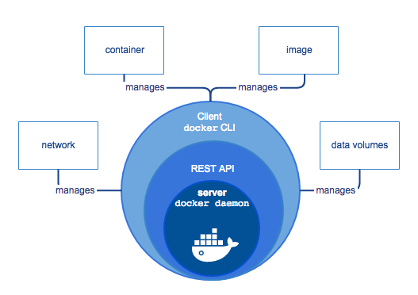

## 1. docker是什么
docker是一个用于开发、交付、运行应用的开放平台。docker允许用户将基础设施中的应用单独分割开来，形成更小的颗粒（容器），从而提高交付软件地速度。

## 2. docker有什么能力
* 快速便捷的交付你的应用

    docker提供了在标准化环境中工作的应用程序和服务的本地容器，简化了开发生命周期，容器非常适合持续集成和持续（CI/CD）交付工作流程.

* 响应式部署和扩展

* 在同一硬件上运行更多工作负载

## 3. docker容器
docker容器与虚拟机类似，但原理上容器是将操作系统层虚拟化，虚拟机则是虚拟化硬件。因此容器更具有便携性、高效地利用服务器。 容器更多的用于表示软件的一个标准化单元。由于容器的标准化，因此它可以无视基础设施（Infrastructure）的差异，部署到任何一个地方。另外，Docker也为容器提供更强的业界的隔离兼容。

## 4. docker容器优点
相比于虚拟机，满足基本的隔离及安全要求，更轻量，启动更快。

## 5. docker引擎


docker引擎是一个client-server应用，主要包含以下组件：
* 需要一直运行的应用服务，叫daemon进程。该进程可以创建和管理docker objects，比如镜像，容器，网络等。
* rest服务接口，程序可以使用它与daemon进程通信并下达相关指令。
* docker的命令行

## 6. docker架构


### 6.1. docker daemon
docker daemon（dockerd）从docker api接收请求并管理docker objects，比如镜像，容器，网络等，也可以与其他docker daemon通信来管理docker服务。

### 6.2. docker client
docker用户用来与docker交互的工具，调用了rest api。docker client可以与多个docker deamon通信。

### 6.3. docker registries
docker注册中心，用来存储docker镜像。通过docker pull和docker push可以拉取和推送镜像，当运行docker run时如果本地不存在镜像也会去注册中心拉取。

Docker Hub是默认的、免费的docker注册中心，当然用户可以准备自己私有的docker注册中心。

🔥 默认的docker仓库在国内使用有时候会超时，可以通过以下方式更换注册中心（镜像仓库）：

1. `vi /etc/docker/daemon.json`

  文件不存在就新增，文件内容如下：

  ```
  {
        "registry-mirrors": ["https://cr.console.aliyun.com/"]
  }
  ```

  链接即为注册中内心地址

2. 重启docker生效 `systemctl restart docker.service`

3. 查看变更情况`docker info` 可以看到 Registry Mirrors节点为新配置的地址


### 6.4. docker objects

#### 6.4.1. images
关于镜像需要知道：
1. 镜像是一个包含很多指令的只读模版，用来创建docker容器。
2. 镜像通常是基于其他镜像增加额外定制的内容。
3. 镜像需要通过dockerfile创建简单的语法定义来定义步骤，从而完成镜像的构建和运行
4. dockerfile中的每一个指令都会在镜像中创建一个层，当你修改dockerfile时并重建镜像时，只有发生改变的层发生重建，这就是镜像与其他虚拟化技术比轻量且又小又快的原因。

#### 6.4.2. containers
容器是一个可以运行的镜像实例。
1. 可以使用docker api或者命令行创建、启动、移动和删除容器。、
2. 可以将容器连接到一个或多个网络中
3. 可以基于容器当前状态创建一个新的镜像。
4. 容器可以相对比较好的与其他的容器或者主机进行隔离，可以控制隔离其与其他容器或主机的网络、存储或者底层子系统。
5. 容器的相关定义可以在镜像中配置，部分配置选项可以在创建或者启动时指定。当容器被删除时，对容器的状态的任何更改都会消失。

#### 6.4.3. services
services允许通过多个docker daemon来扩展容器，这些docker进程通过多管理者和工作者组成一个集群来提供服务，进程间通过docker api来通信。可以对集群进行相关设置，比如最低可用的节点数。默认情况下，服务在各个节点间有负责均衡策略。这些对于用户都是透明的。

## 7. 底层技术

* [Namespace](https://docs.docker.com/engine/docker-overview/#namespaces)
* [Control groups](https://docs.docker.com/engine/docker-overview/#control-groups)
* [Union file systems](https://docs.docker.com/engine/docker-overview/#union-file-systems)

## 8. 参考
[Docker维基百科](https://zh.wikipedia.org/wiki/Docker)

[Docker官网](https://docs.docker.com/engine/docker-overview/)

## 9. 关联穿插 - 公司内部cicd事件流程示例（开发者角度）


公司内部使用cicd进行开发全流程管理，以上为某次构建的流程。相关大致说明：

1. 项目内创建了deploy.yml文件用来描述项目相关信息及docker构建指令。
2. git提交代码注释增加[ci]触发docker的构建。docker构建过程即上面图示流程。
3. 构建完成后登陆管理平台选择某个环境（SIT/UAT...）对本次构建进行部署