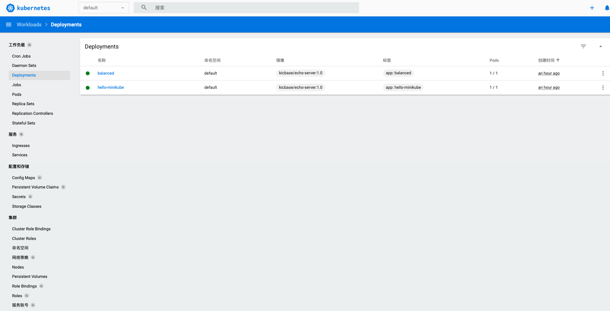
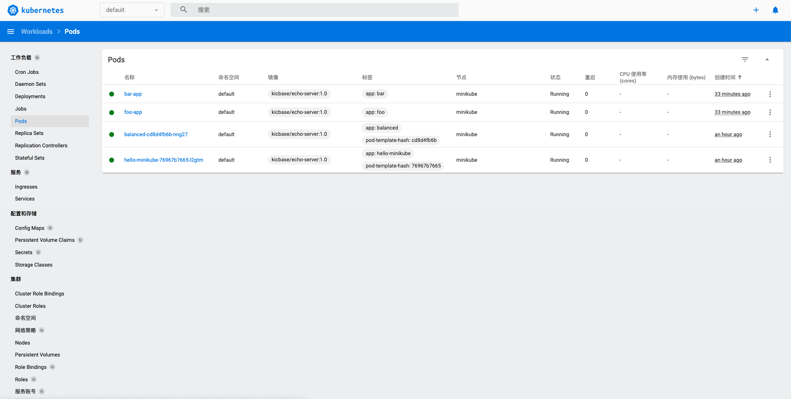
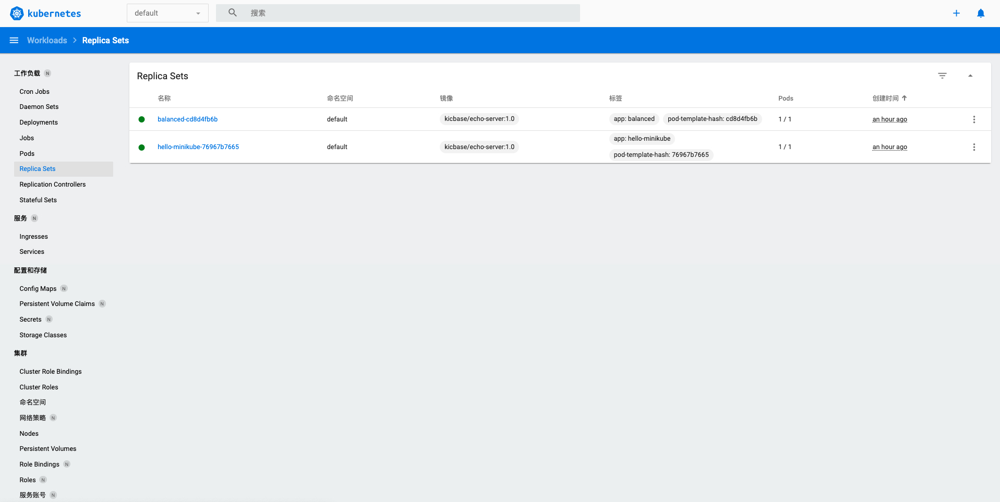
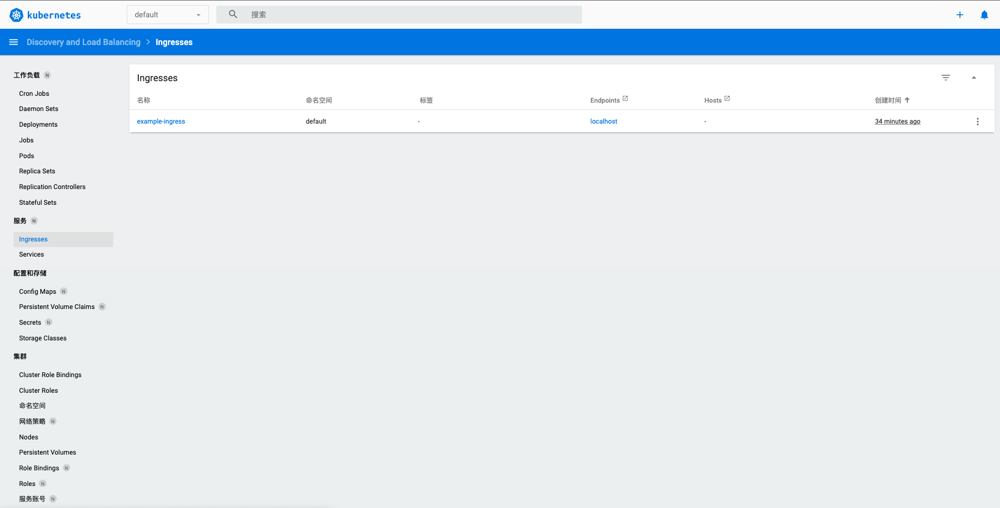
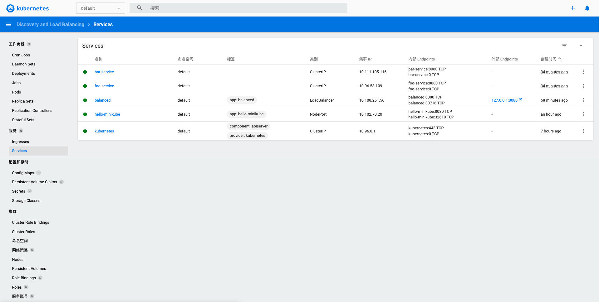

# minikube安装使用

该文档记录了第一次接触minikube并进行相关操作的全过程，便于后期更快回忆相关细节。通过本文档可以快速了解minikube功能及操作细节。

## 关于minikube

* minikube是一个本地kubernates集群（单节点）管理工具，可以运行在Mac， Linux和Windows上， 旨在帮助应用开发者和刚开始使用kubernates的用户。
* 可以用来容器化应用开发和测试环境支持，不适用于生产（单节点，生产环境考虑使用[kubeadm](https://k8s-docs.netlify.app/docs/tasks/administer-cluster/)）

* 更详细的文档可参考[Minikube官网](https://minikube.sigs.k8s.io/docs/start/). 

## 安装

Mac环境信息：

```sh
 ~$ uname -a
Darwin LeonWangs-MacBook-Pro.local 21.6.0 Darwin Kernel Version 21.6.0: Thu Nov  9 00:38:19 PST 2023; root:xnu-8020.240.18.705.10~$1/RELEASE_X86_64 x86_64
```

安装minikube非常简单，执行以下命令即可(不要使用root，brew也不建议)。

> brew install minikube

执行结果

```sh
 ~$ brew install minikube

==> Downloading https://ghcr.io/v2/homebrew/core/kubernetes-cli/manifests/1.22.4
Already downloaded: /Users/leonwang/Library/Caches/Homebrew/downloads/7d83253e6f4da697730d9993ce4ff44a11980e1951426646f8f670375e8f60d0--kubernetes-cli-1.22.4.bottle_manifest.json
==> Downloading https://ghcr.io/v2/homebrew/core/kubernetes-cli/blobs/sha256:4d0ce9724fe4f4056a78b105d3b9bd4479b70a9925a985698cf67fd67332a178
Already downloaded: /Users/leonwang/Library/Caches/Homebrew/downloads/8e89e15245012a72fcbe160086dbf7102abeee248732191d42df28d2ff233a12--kubernetes-cli--1.22.4.monterey.bottle.tar.gz
==> Downloading https://ghcr.io/v2/homebrew/core/minikube/manifests/1.24.0
Already downloaded: /Users/leonwang/Library/Caches/Homebrew/downloads/78d32b154b6ae966179798034dc5869da8f21722d375ee7aa5f8be7d202118ad--minikube-1.24.0.bottle_manifest.json
==> Downloading https://ghcr.io/v2/homebrew/core/minikube/blobs/sha256:0385fcb25a2009995119471d968d4c04925ffb29413ad07e87d94bc99af1d620
==> Downloading from https://pkg-containers.githubusercontent.com/ghcr1/blobs/sha256:0385fcb25a2009995119471d968d4c04925ffb29413ad07e87d94bc9
######################################################################## 100.0%
==> Installing dependencies for minikube: kubernetes-cli
==> Installing minikube dependency: kubernetes-cli
==> Pouring kubernetes-cli--1.22.4.monterey.bottle.tar.gz
Error: The `brew link` step did not complete successfully
The formula built, but is not symlinked into /usr/local
Could not symlink bin/kubectl
Target /usr/local/bin/kubectl
already exists. You may want to remove it:
  rm '/usr/local/bin/kubectl'

To force the link and overwrite all conflicting files:
  brew link --overwrite kubernetes-cli

To list all files that would be deleted:
  brew link --overwrite --dry-run kubernetes-cli

Possible conflicting files are:
/usr/local/bin/kubectl -> /Applications/Docker.app/Contents/Resources/bin/kubectl
==> Summary
🍺  /usr/local/Cellar/kubernetes-cli/1.22.4: 226 files, 57.2MB
==> Installing minikube
==> Pouring minikube--1.24.0.monterey.bottle.tar.gz
Error: The `brew link` step did not complete successfully
The formula built, but is not symlinked into /usr/local
Could not symlink share/fish/vendor_completions.d/minikube.fish
/usr/local/share/fish/vendor_completions.d is not writable.

You can try again using:
  brew link minikube
==> Caveats
zsh completions have been installed to:
  /usr/local/share/zsh/site-functions
==> Summary
🍺  /usr/local/Cellar/minikube/1.24.0: 9 files, 69.3MB
==> Running `brew cleanup minikube`...
Disable this behaviour by setting HOMEBREW_NO_INSTALL_CLEANUP.
Hide these hints with HOMEBREW_NO_ENV_HINTS (see `man brew`).
==> Caveats
==> minikube
zsh completions have been installed to:
  /usr/local/share/zsh/site-functions
```

正常情况下minikube会顺利安装完成，也可能碰上上面的警告/错误：

* 警告信息：已经安装了kuberctl以及kubernetes-cli, 该信息可暂不处理，兼容即可。
* 错误信息`brew link`步骤失败需要处理下，提示给自动补全fish组件的minikube脚本不能连接过去，因为没有写权限。这个需要处理一下，否则minikube自动补全肯定是无法使用的。处理比较简单，修改目标文件的写权限，执行link，执行完之后再回复目标文件权限。

```sh
 ~$ sudo chmod 777 /usr/local/share/fish/vendor_completions.d
 ~$ brew link minikube
Linking /usr/local/Cellar/minikube/1.24.0... 4 symlinks created.
 ~$ sudo chmod 755 /usr/local/share/fish/vendor_completions.d
```

查看安装版本

```sh
 ~$ minikube version
minikube version: v1.24.0
commit: 76b94fb3c4e8ac5062daf70d60cf03ddcc0a741b
```


## 运行

> minikube start

**minikube运行本地需要安装docker(mac环境可以使用docker desktop)并启动， 否则会报类似如下错误信息：**

```sh
 ~$ minikube start
😄  Darwin 12.7.2 上的 minikube v1.24.0
🎉  minikube 1.32.0 is available! Download it: https://github.com/kubernetes/minikube/releases/tag/v1.32.0
💡  To disable this notice, run: 'minikube config set WantUpdateNotification false'

👎  Unable to pick a default driver. Here is what was considered, in preference order:
    ▪ docker: Not healthy: "docker version --format {{.Server.Os}}-{{.Server.Version}}" exit status 1: Cannot connect to the Docker daemon at unix:///Users/leonwang/.docker/run/docker.sock. Is the docker daemon running?
    ▪ docker: Suggestion: Start the Docker service <https://minikube.sigs.k8s.io/docs/drivers/docker/>
    ▪ hyperkit: Not installed: exec: "hyperkit": executable file not found in $PATH
    ▪ parallels: Not installed: exec: "prlctl": executable file not found in $PATH
    ▪ vmware: Not installed: exec: "docker-machine-driver-vmware": executable file not found in $PATH
    ▪ virtualbox: Not installed: unable to find VBoxManage in $PATH
    ▪ podman: Not installed: exec: "podman": executable file not found in $PATH

❌  Exiting due to DRV_DOCKER_NOT_RUNNING: Found docker, but the docker service isn't running. Try restarting the docker service.
```

**启动本地docker desktop应用再次尝试启动minikube，启动成功**

```sh
~$ minikube start
😄  Darwin 12.7.2 上的 minikube v1.24.0
✨  自动选择 docker 驱动
👍  Starting control plane node minikube in cluster minikube
🚜  Pulling base image ...
💾  Downloading Kubernetes v1.22.3 preload ...
    > preloaded-images-k8s-v13-v1...: 501.73 MiB / 501.73 MiB  100.00% 4.78 MiB
    > gcr.io/k8s-minikube/kicbase: 355.78 MiB / 355.78 MiB  100.00% 2.89 MiB p/
🔥  Creating docker container (CPUs=2, Memory=2200MB) ...
❗  Local proxy ignored: not passing HTTP_PROXY=http://127.0.0.1:33210 to docker env.
❗  Local proxy ignored: not passing HTTPS_PROXY=http://127.0.0.1:33210 to docker env.
🌐  找到的网络选项：
    ▪ http_proxy=http://127.0.0.1:33210
❗  You appear to be using a proxy, but your NO_PROXY environment does not include the minikube IP (192.168.49.2).
📘  Please see https://minikube.sigs.k8s.io/docs/handbook/vpn_and_proxy/ for more details
    ▪ https_proxy=http://127.0.0.1:33210
🐳  正在 Docker 20.10.8 中准备 Kubernetes v1.22.3…
    ▪ Generating certificates and keys ...
    ▪ Booting up control plane ...
    ▪ Configuring RBAC rules ...
🔎  Verifying Kubernetes components...
    ▪ Using image gcr.io/k8s-minikube/storage-provisioner:v5
🌟  Enabled addons: default-storageclass, storage-provisioner

❗  /usr/local/bin/kubectl is version 1.28.2, which may have incompatibilites with Kubernetes 1.22.3.
    ▪ Want kubectl v1.22.3? Try 'minikube kubectl -- get pods -A'
🏄  Done! kubectl is now configured to use "minikube" cluster and "default" namespace by defaul
```

**查看当前运行节点和运行的pods：**

```sh
 ~$ kubectl get no -A
NAME       STATUS   ROLES                  AGE     VERSION
minikube   Ready    control-plane,master   4h27m   v1.22.3

 ~$ kubectl get po -A
NAMESPACE              NAME                                         READY   STATUS    RESTARTS      AGE
kube-system            coredns-78fcd69978-wr558                     1/1     Running   2 (14m ago)   4h28m
kube-system            etcd-minikube                                1/1     Running   2 (14m ago)   4h28m
kube-system            kube-apiserver-minikube                      1/1     Running   2 (14m ago)   4h28m
kube-system            kube-controller-manager-minikube             1/1     Running   2 (11m ago)   4h28m
kube-system            kube-proxy-zmpk8                             1/1     Running   2 (14m ago)   4h28m
kube-system            kube-scheduler-minikube                      1/1     Running   2 (14m ago)   4h28m
kube-system            storage-provisioner                          1/1     Running   5 (14m ago)   4h28m
kubernetes-dashboard   dashboard-metrics-scraper-5594458c94-k77f6   1/1     Running   1 (11m ago)   3h39m
kubernetes-dashboard   kubernetes-dashboard-654cf69797-2vqjs        1/1     Running   1 (11m ago)   3h39m

```

**通过以下方式minikube可以自动下载合适的kubectl版本**

> minikube kubectl -- get po -A

**通过在shell配置文件中配置别名(alias) 简化以上命令**

当前主机使用的是zsh shell，修改的配置文件为~$/.zshrc， 添加如下配置

> alias mkubectl="minikube kubectl --"

执行source命令，此处为`source ~$/.zshrc`使配置生效，配置后可以使用`mkubectl get po -A` 来代替以上命令

**启动dashboard**

```sh
 ~$ minikube dashboard
🔌  正在开启 dashboard ...
    ▪ Using image kubernetesui/dashboard:v2.3.1
    ▪ Using image kubernetesui/metrics-scraper:v1.0.7
🤔  正在验证 dashboard 运行情况 ...
🚀  Launching proxy ...
🤔  正在验证 proxy 运行状况 ...
🎉  Opening http://127.0.0.1:57073/api/v1/namespaces/kubernetes-dashboard/services/http:kubernetes-dashboard:/proxy/ in your default browser...
```


## 部署

### 部署一个服务示例

* 创建一个发布并暴露端口

```sh
 ~$ mkubectl create deployment hello-minikube --image=kicbase/echo-server:1.0
deployment.apps/hello-minikube created
 ~$ kubectl expose deployment hello-minikube --type=NodePort --port=8080
service/hello-minikube exposed
```

查看发布情况，hello-minikube已被部署

```sh
 ~$ kubectl get po -A
NAMESPACE              NAME                                         READY   STATUS    RESTARTS      AGE
default                hello-minikube-76967b7665-m82w7              1/1     Running   0             5m7s
kube-system            coredns-78fcd69978-wr558                     1/1     Running   2 (42m ago)   4h56m
kube-system            etcd-minikube                                1/1     Running   2 (43m ago)   4h56m
kube-system            kube-apiserver-minikube                      1/1     Running   2 (42m ago)   4h56m
kube-system            kube-controller-manager-minikube             1/1     Running   2 (39m ago)   4h56m
kube-system            kube-proxy-zmpk8                             1/1     Running   2 (43m ago)   4h56m
kube-system            kube-scheduler-minikube                      1/1     Running   2 (42m ago)   4h56m
kube-system            storage-provisioner                          1/1     Running   5 (43m ago)   4h56m
kubernetes-dashboard   dashboard-metrics-scraper-5594458c94-k77f6   1/1     Running   1 (39m ago)   4h7m
kubernetes-dashboard   kubernetes-dashboard-654cf69797-2vqjs        1/1     Running   1 (39m ago)   4h7m
```

该部署可能需要一点时间，通过以下命令可以查看到该部署

```sh
 ~$ kubectl get services hello-minikube

NAME             TYPE       CLUSTER-IP     EXTERNAL-IP   PORT(S)          AGE
hello-minikube   NodePort   10.102.70.20   <none>        8080:32610/TCP   7s
```

<font color = green>create deployment之后可以在dashboard的Deployments / Pods / Replica Sets视图中看到对应的记录，expose deployment之后可以在services视图中看到对应的记录</font>

* 服务访问

方式一： 让minikube提供一个web服务来访问这个服务

```sh
 ~$ minikube service hello-minikube

|-----------|----------------|-------------|---------------------------|
| NAMESPACE |      NAME      | TARGET PORT |            URL            |
|-----------|----------------|-------------|---------------------------|
| default   | hello-minikube |        8080 | http://192.168.49.2:32610 |
|-----------|----------------|-------------|---------------------------|
🏃  Starting tunnel for service hello-minikube.
|-----------|----------------|-------------|------------------------|
| NAMESPACE |      NAME      | TARGET PORT |          URL           |
|-----------|----------------|-------------|------------------------|
| default   | hello-minikube |             | http://127.0.0.1:60967 |
|-----------|----------------|-------------|------------------------|
🎉  正通过默认浏览器打开服务 default/hello-minikube...
❗  Because you are using a Docker driver on darwin, the terminal needs to be open to run it.
```

方式二：将本地与pods服务的端口映射，映射之后可以通过对应端口进行访问

```sh
 ~$ kubectl port-forward service/hello-minikube 7080:8080
Forwarding from 127.0.0.1:7080 -> 8080
Forwarding from [::1]:7080 -> 8080
Handling connection for 7080
```

访问地址 http://localhost:7080/

### 使用minikube tunnel访问一个Load balanced

tunnel是minikube为load balanced服务创建路由IP的组件，使用该组件可以根据kubernetes的load balanced服务提供对外的路由。

* 创建一个Load balanced服务

```sh
 ~$ kubectl create deployment balanced --image=kicbase/echo-server:1.0
deployment.apps/balanced created

 ~$ kubectl expose deployment balanced --type=LoadBalancer --port=8080
service/balanced exposed
```

* 在另一个Terminal运行命令

```sh
 ~$ minikube tunnel
🏃  Starting tunnel for service balanced.

....
```

* 查看路由表， 使用EXTERNAL-IP:8080即可访问服务 (此处为http://127.0.0.1:8080)

```sh
 ~$ kubectl get services balanced

NAME       TYPE           CLUSTER-IP      EXTERNAL-IP   PORT(S)          AGE
balanced   LoadBalancer   10.108.251.56   127.0.0.1     8080:30716/TCP   117s
```

### 使用Ingress

ingress在kubernetes中定义为一个API对象，用于管理外部到集群中的服务请求，经典如http。Ingress可以提供负载均衡，SSL和基于名称的虚拟主机能力

* 启用ingress插件

```sh
 ~$ minikube addons enable ingress
💡  After the addon is enabled, please run "minikube tunnel" and your ingress resources would be available at "127.0.0.1"
    ▪ Using image k8s.gcr.io/ingress-nginx/controller:v1.0.4
    ▪ Using image k8s.gcr.io/ingress-nginx/kube-webhook-certgen:v1.1.1
    ▪ Using image k8s.gcr.io/ingress-nginx/kube-webhook-certgen:v1.1.1
🔎  Verifying ingress addon...
🌟  启动 'ingress' 插件
```

* 编写自己的ingress yaml文件，此处使用minikube示例文件

```yaml
kind: Pod
apiVersion: v1
metadata:
  name: foo-app
  labels:
    app: foo
spec:
  containers:
    - name: foo-app
      image: 'kicbase/echo-server:1.0'
---
kind: Service
apiVersion: v1
metadata:
  name: foo-service
spec:
  selector:
    app: foo
  ports:
    - port: 8080
---
kind: Pod
apiVersion: v1
metadata:
  name: bar-app
  labels:
    app: bar
spec:
  containers:
    - name: bar-app
      image: 'kicbase/echo-server:1.0'
---
kind: Service
apiVersion: v1
metadata:
  name: bar-service
spec:
  selector:
    app: bar
  ports:
    - port: 8080
---
apiVersion: networking.k8s.io/v1
kind: Ingress
metadata:
  name: example-ingress
spec:
  rules:
    - http:
        paths:
          - pathType: Prefix
            path: /foo
            backend:
              service:
                name: foo-service
                port:
                  number: 8080
          - pathType: Prefix
            path: /bar
            backend:
              service:
                name: bar-service
                port:
                  number: 8080
---

```

该配置文件配置了两个Pod(foo-app, bar-app)以及两个对应的服务(foo-service, bar-service) , 并配置了Ingress路由，根据请求前缀将对应的请求转发到对应的服务

* 应用ingress配置文件

```sh
 ~$ kubectl apply -f https://storage.googleapis.com/minikube-site-examples/ingress-example.yaml
pod/foo-app created
service/foo-service created
pod/bar-app created
service/bar-service created
ingress.networking.k8s.io/example-ingress created
```

* 查看ingress应用状态

```sh
 ~$ kubectl get ingress
NAME              CLASS   HOSTS   ADDRESS     PORTS   AGE
example-ingress   nginx   *       localhost   80      57s
```

* 启动minikube tunnel

```sh
 ~$ minikube tunnel
🏃  Starting tunnel for service balanced.
❗  The service/ingress example-ingress requires privileged ports to be exposed: [80 443]
🔑  sudo permission will be asked for it.
🏃  Starting tunnel for service example-ingress.
Password:

```

* 访问验证

当访问的请求匹配到foo时转发到foo-app, 匹配到bar时转发到bar-app

```sh
 ~$ curl http://localhost/foo
Request served by foo-app

HTTP/1.1 GET /foo

Host: localhost
Accept: */*
User-Agent: curl/8.1.2
X-Forwarded-For: 172.17.0.1
X-Forwarded-Host: localhost
X-Forwarded-Port: 80
X-Forwarded-Proto: http
X-Forwarded-Scheme: http
X-Real-Ip: 172.17.0.1
X-Request-Id: 76c4617e7efaa30090b165ae6d14da1e
X-Scheme: http


 ~$ curl http://localhost/bar
Request served by bar-app

HTTP/1.1 GET /bar

Host: localhost
Accept: */*
User-Agent: curl/8.1.2
X-Forwarded-For: 172.17.0.1
X-Forwarded-Host: localhost
X-Forwarded-Port: 80
X-Forwarded-Proto: http
X-Forwarded-Scheme: http
X-Real-Ip: 172.17.0.1
X-Request-Id: a71ef72e968c495afbfb562bfb41378a
X-Scheme: http
```

### 部署后dashboard相关视图

以上操作结束后相关试图如下：

* Deployments视图



* Pods视图



* replica sets视图



* ingresses视图



* services视图



## 常用命令

* 使用minikube启动一个kubernetes集群

  > minikube start 

* 停止

  > minikube stop

* 暂停(对已发布的应用无影响)

  > minikube pause

* 暂停恢复

  > minikube unpause

* 启动并打开kubernates dashboard, 如果想关闭dashboard只要停止以下命令运行即可（ctrl + c）

  > minikube dashboard

* 删除所有minikube clusters

  > minikube delete --all


## 其他命令概览

```sh
 ~$ minikube --help
minikube provisions and manages local Kubernetes clusters optimized for development workflows.

Basic Commands:
  start          Starts a local Kubernetes cluster
  status         Gets the status of a local Kubernetes cluster
  stop           Stops a running local Kubernetes cluster
  delete         Deletes a local Kubernetes cluster
  dashboard      访问在 minikube 集群中运行的 kubernetes dashboard
  pause          pause Kubernetes
  unpause        恢复 Kubernetes

Images Commands:
  docker-env     配置环境以使用 minikube's Docker daemon
  podman-env     配置环境以使用 minikube's Podman service
  cache          Add, delete, or push a local image into minikube
  image          Manage images

Configuration and Management Commands:
  addons         Enable or disable a minikube addon
  config         Modify persistent configuration values
  profile        Get or list the current profiles (clusters)
  update-context Update kubeconfig in case of an IP or port change

Networking and Connectivity Commands:
  service        Returns a URL to connect to a service
  tunnel         连接到 LoadBalancer 服务

Advanced Commands:
  mount          将指定的目录挂载到 minikube
  ssh            Log into the minikube environment (for debugging)
  kubectl        Run a kubectl binary matching the cluster version
  node           Add, remove, or list additional nodes
  cp             Copy the specified file into minikube

Troubleshooting Commands:
  ssh-key        Retrieve the ssh identity key path of the specified node
  ssh-host       Retrieve the ssh host key of the specified node
  ip             Retrieves the IP address of the specified node
  logs           Returns logs to debug a local Kubernetes cluster
  update-check   打印当前和最新版本版本
  version        打印 minikube 版本
  options        显示全局命令行选项列表 (应用于所有命令)。

Other Commands:
  completion     Generate command completion for a shell
```

