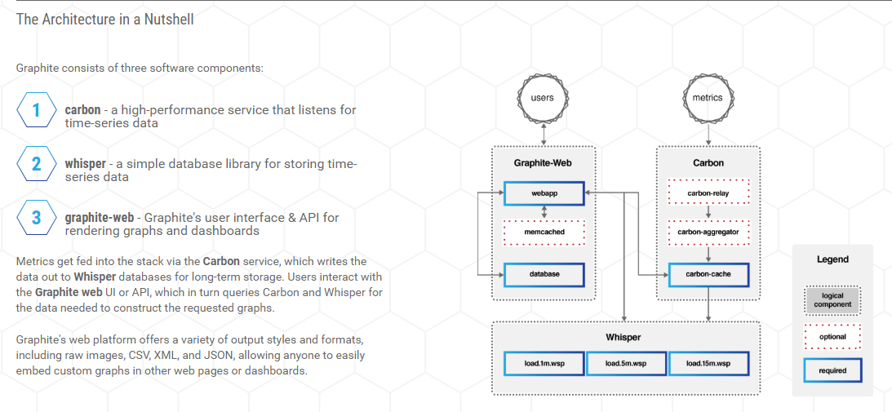

# graphite简介

## 1. graphite是什么？
graphite是一个企业应用监控工具，可以在廉价的硬件或者云设施上运行良好。可以使用它跟踪网站、应用及业务服务、网络服务性能。其包含了一套存储、取回、共享和可视化时序数据的组件。
graphite主要做以下两件事：
* 存储时序化的数字数据
* 按需渲染数据的图形

## 2. graphite三个重要组件

* carbon 监听时序化的数据
* whisper 一个简单的存储时序化数据的的数据库（设计上类似于RRD）
* graphite webapp 将数据渲染成图形

## 3. 架构



## 4. 最简单的配置使用

* 存储配置

    ```txt
    [stats]
    pattern = ^stats.*
    retentions = 10s:6h,1min:6d,10min:1800d
    ```
* 聚合配置
    ```txt
    [min]
    pattern = \.lower$
    xFilesFactor = 0.1
    aggregationMethod = min
    ```
* 数据发送
   * 支持协议：明文协议、pickle协议、AMQP协议
   * 信息格式：metric_path value timestamp

   最简单发送示例：
   > echo "test.bash.stats 42 `date +%s`" | nc graphite.example.com 2003