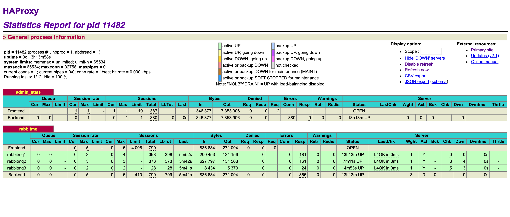

# HAProxy安装

说明：本篇内容简要记录haproxy的安装、配置及启用过程，系统环境： ubantu

## 1. 下载HAPROXY

[HAProxy下载地址传送门](http://www.haproxy.org/)

## 2. 解压

> tar -zxvf haproxy-2.1.0.tar.gz

## 3. 编译可执行文件

> make TARGET=generic PREFIX=/usr/local/haproxy

## 4. 安装

> make install PREFIX=/usr/local/haproxy

## 5. 配置

配置文件路径/usr/local/haproxy/haproxy.cfg,以下为rabbitmq负载示例（TCP）

```
###########全局配置#########
global
daemon
nbproc 1
pidfile /var/run/haproxy.pid

########默认配置############
defaults
mode http #默认的模式mode { tcp|http|health }，tcp是4层，http是7层，health只会返回OK
retries 2 #两次连接失败就认为是服务器不可用，也可以通过后面设置
option redispatch #当serverId对应的服务器挂掉后，强制定向到其他健康的服务器
option abortonclose #当服务器负载很高的时候，自动结束掉当前队列处理比较久的链接
maxconn 4096 #默认的最大连接数
timeout connect 5000ms #连接超时
timeout client 30000ms #客户端超时
timeout server 30000ms #服务器超时
#timeout check 2000 #=心跳检测超时
log 127.0.0.1 local0 err #[err warning info debug]

########统计页面配置########
listen admin_stats
bind 0.0.0.0:1080 #监听端口
mode http #http的7层模式
option httplog #采用http日志格式
#log 127.0.0.1 local0 err
maxconn 10
stats refresh 30s #统计页面自动刷新时间
stats uri /stats #统计页面url
stats realm XingCloud\ Haproxy #统计页面密码框上提示文本
stats auth admin:admin #统计页面用户名和密码设置
stats hide-version #隐藏统计页面上HAProxy的版本信息

########test配置#################
listen rabbitmq
bind 0.0.0.0:8080 #注意端口号要不低于1024
mode tcp
#maxconn 4086
#log 127.0.0.1 local0 debug
server rabbitmq1 127.0.0.1:5672 check rise 1 fall 2
server rabbitmq2 127.0.0.1:5673 check rise 1 fall 2
server rabbitmq3 127.0.0.1:5674 check rise 1 fall 2
```

## 6. 启动

在配置文件目录运行如下命令：
> ./sbin/haproxy -f haproxy.cfg

浏览器打开管理平台, http://hostname:1080/stats




[参考](https://blog.csdn.net/wyqlxy/article/details/51861329)