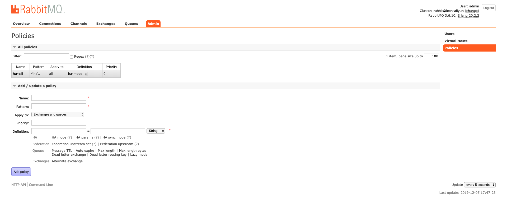

[官网集群](https://www.rabbitmq.com/clustering.html)

[集群搭建参考1](https://www.jianshu.com/p/6376936845ff)

[集群搭建参考2](https://juejin.im/post/5b586b125188257bcb59005e)
# 一、集群创建过程[rabbitmq v3.6]
当前演示操作过程使用三个rabbitmq节点创建集群，具体节点个数可以依据业务需要来具体设置。

## 独立启动rabbitmq

* 启动rabbitmq服务
> rabbitmq-service

* 启动第一个节点
> RABBITMQ_NODE_PORT=5672 RABBITMQ_NODENAME=rabbit@leon-aliyun rabbitmq-server -detached

* 启动第二个节点
> RABBITMQ_NODE_PORT=5673 RABBITMQ_SERVER_START_ARGS="-rabbitmq_management listener [{port,15673}] -rabbitmq_stomp tcp_listeners [61614] -rabbitmq_mqtt  tcp_listeners [1884]" RABBITMQ_NODENAME=rabbit2@leon-aliyun rabbitmq-server -detached

* 启动第三个节点
> RABBITMQ_NODE_PORT=5674 RABBITMQ_SERVER_START_ARGS="-rabbitmq_management listener [{port,15674}] -rabbitmq_stomp tcp_listeners [61615] -rabbitmq_mqtt tcp_listeners [1885]" RABBITMQ_NODENAME=rabbit3@leon-aliyun rabbitmq-server -detached

## 重置并加入集群

* 节点2

```
rabbitmqctl -n rabbit2@leon-aliyun stop_app
rabbitmqctl -n rabbit2@leon-aliyun reset
rabbitmqctl -n rabbit2@leon-aliyun join_cluster rabbit@leon-aliyun
rabbitmqctl -n rabbit2@leon-aliyun start_app
```

* 节点3

```
rabbitmqctl -n rabbit3@leon-aliyun stop_app
rabbitmqctl -n rabbit3@leon-aliyun reset
rabbitmqctl -n rabbit3@leon-aliyun join_cluster rabbit@leon-aliyun
rabbitmqctl -n rabbit3@leon-aliyun start_app
```


## 镜像队列配置
以上集群模式只是体现了架构的扩展性，当业务量增加时可以横向扩展其子节点即可。但是每个节点上的队列数据仅队列所属节点拥有，当该节点宕机时，队列出现不可用，即可用性不高。镜像队列模式可以设置各个队列属主节点有1个或多个备份，当主节点宕机后，根据策略1个从节点将升级为主节点继续提供服务，以此来满足高可用性。
[官网参考](https://www.rabbitmq.com/ha.html#ways-to-configure)

## 镜像策略设置
* 镜像队列通过创建策略（policy）来激活，策略的设置可以通过rabbitmqctl命令、http接口或者管理平台来创建，策略的具体参数项主要包括一下几项：
    * 策略名
    * 匹配模式（正则表达式），用于与exchange/queue名进行匹配
    * 策略应用于exchange/queue或者两者
    * 优先级
    * 具体定义，如HA模式 HA参数 HA同步模式(自动或手动)


* 对于镜像个数的选择参考
策略支持所有节点作为镜像节点，指定节点作为镜像节点，指定镜像个数三种策略，增加镜像会带来额外开销，影像集群性能，指定节点作为镜像操作繁琐，同时考虑不周可能出现部分过载，所以生产通常情况下建议指定个数的节点作为镜像。

* rabbitmqctl设置示例
以two.打头命名的exchange和队列使用镜像模式，镜像节点两个，节点自动同步
    ```
    rabbitmqctl set_policy ha-two "^two\." \
    '{"ha-mode":"exactly","ha-params":2,"ha-sync-mode":"automatic"}'
    ```
## 镜像主节点策略配置
镜像模式下，节点会有主从之分，主节点如何选择，需要设置期策略
* 配置方式
    * 客户单声明队列时配置
    * policy配置中设置
    * 配置文件中配置
* 策略
    * min-masters 拥有最少主节点的节点
    * client-local 客户端链接的节点
    * random 随机

## 节点策略
当出现节点策略调整时，可能导致主节点移除，为了避免数据丢失，rabbitmq会保持原主节点直到新策略中的同步节点完成同步。如果主节点移除，消费者将断开与其的链接并需要重新链接至主节点。

## 排他队列与镜像队列
排他队列仅允许声明该队列的客户端链接，链接断开后队列删除，所以排他队列没有必要设置镜像队列。排他队列非持久且为自动删除的。

## 非镜像队列在集群中的表现
当一个队列的主节点不可用，该节点上的其他非镜像队列的表现取决于该队列是否持久化的，如果非持久化该队列将被删除，如果时持久化的该队列只有等节点回复才重新变为可用。

# 二、注意

* 当rabbitmq启动用户和rabbitmqctl操作用户不同时，rabbitmqctl的操作可能会因为cookie不同造成授权失败。只要将操作用户的[.erlang.cookie]使用启动用户的覆盖就可以了。

* 为了提供性能可以设置部分节点为内存节点，另外仅启动部分节点的管理平台

* 为了提供系统的高可用性，集群中至少要有两个磁盘节点，可以在客户单设置启用镜像队列
