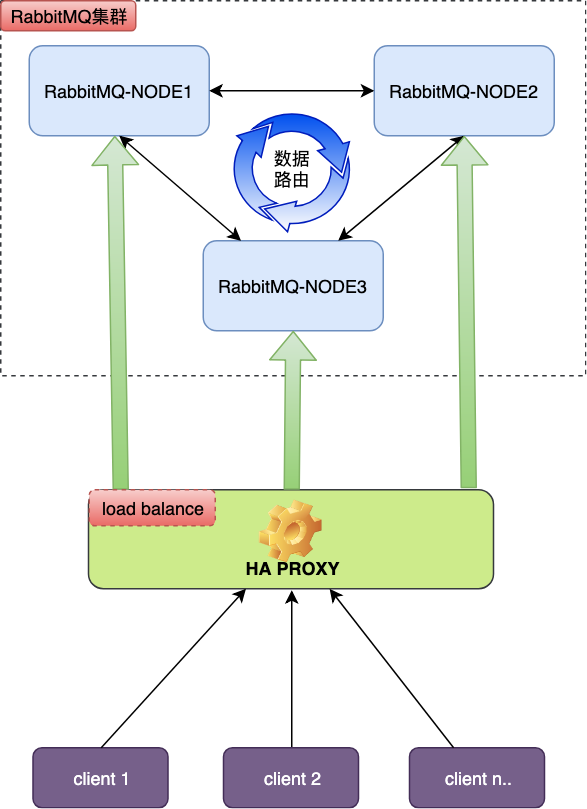
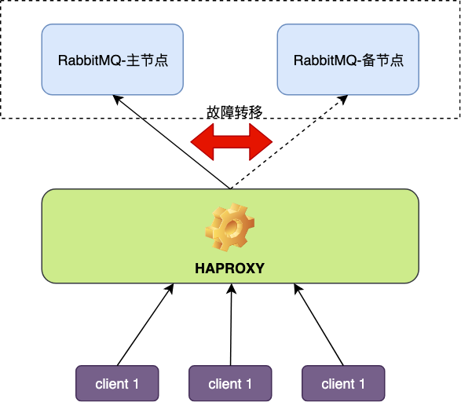

## 1. rabbitmq高可用说明
本文旨在说明从客户端到rabbitmq服务端如何达到高可用，已经分析节点故障后的内部处理过程。高可用示例中的节点数也仅作为示例，具体视实际业务情况来决定。

## 2. 高可用架构方案一：集群模式

### 2.1. 方案描述

* rabbitmq根据业务进行选择若干节点组成集群
* 使用负载均衡（如HAProxy）对各个节点进行负载，客户端链接负载均衡链接，由负载均衡器根据转发策略转发至rabbitmq集群节点。
* 创建队列时指明相关高可用策略
    * 持久化
    * 增加镜像策略配置参数（最好全节点备份或仅指定备份个数，使用指定具体节点备份的方案不易于扩展）

### 2.2. 使用场景

该模式兼顾扩展性和高可用性，在业务量比较高，或者业务快速发展的情况下可以考虑该架构。

### 2.3. 故障转移

当节点故障后，镜像节点进行故障转移，节点回复后重新加入集群。镜像模式下一般不会发生丢失，可能会出现数据重新入队当情况（消费者已消费未进行确认当消息可能被重新加入新的主节点中被消费），客户端需要支持幂等性。

## 3. 高可用架构方案二：主备模式

### 3.1. 方案描述

两个rabbitmq节点，一个作为主节点使用，一台作为备用节点（运行中），通过负载均衡将请求转到主节点，当主节点故障时，流量转至备用节点。

### 3.2. 使用场景

该方案可用于业务量较小的情况下的一种架构模式。架构简单，当节点故障时，可用节点转移，原节点中的消息也可在节点恢复后重新被客户端消费。需要注意的事，该方案仅能保证服务的可用性，无法保证数据完全不丢失，比如故障节点磁盘损坏，那么存储的数据将可能无法恢复，所以依据场景谨慎使用。
