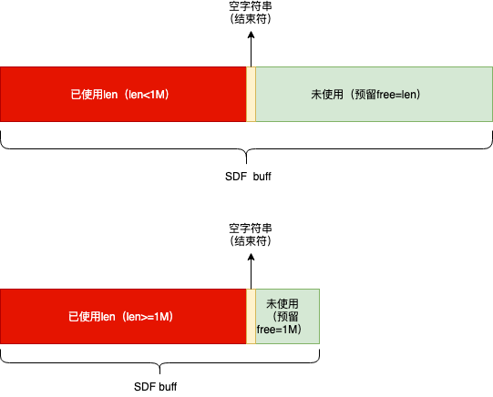
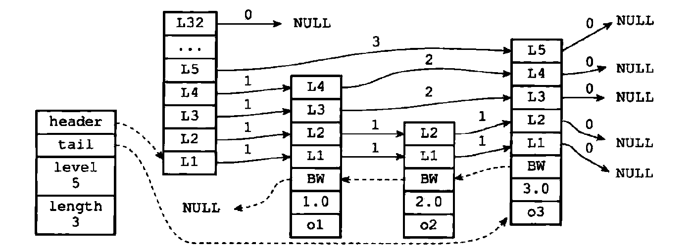

redis数据库是由键值对组成，键总是字符串对象，值可以是字符串、集合、列表等多种类型的对象

## 1. 字符串

* 在redis中字符串用字符串对象（StringObject）存储

* 当redis存储的字符串对象包含字符串时字符串对象中包含一个sds（simple dynamic String）简单动态字符串存储值，否则包含一个long类型当值。

* sds 数据结构

    

    * int len 字符串长度（已使用空间）
    * int free 字符串未使用大小
    * char[] buf 字节数组（非字符数组，二进制，可以支持包含空字符以及其他特殊字符）

* sds空间预分配策略

    * 字符串长度小于1M时预留与使用相同的空间
    * 字符串长度大于等于1M时预留1M空间

* sds 与c字符串对比优缺

    * 高效执行长度计算（O(1)时间复杂度）和追加操作（预分配空间，减少修改字符串时带来的内存重分配次数）
    * 二进制安全
    * 不会造成缓冲区溢出
    * 缺点：多占用空间而且多占的空间不会被主动释放

## 2. 列表结构-双端链表

* reids列表使用两种数据结构作为底层实现
    * 压缩列表（有限使用压缩列表作为底层实现，超过指定元素个数或单个元素超过指定大小转换为双端链表）
    * 双端链表
        * 由list和各个listNode组成
        
    **redis 2.9?之后整合了双端链表和压缩列表的新数据结构quicklist**

## 3. 字典

* 实现数据库键空间
* 用作hash类型键的其中一种底层实现
* 具体底层实现哈希表

    * 字典中包含两个哈希表
        * h[0] table空间分配将在第一次往字典添加键值对时进行
        * h[1] table空间分配将在对h[0]rehash开始时进行.
    * redis哈希表通过链地址法来处理hash碰撞
    * 关于rehash
        * rehash是解决哈希冲突过多造成性能退化的方案，也是进行字典收缩的方案（元素减少，回收空间）
        * rehash过程表迁移是分多次渐进式进行的
        * rehash之后，h[1] 会成为 h[0],原h[0]成为h[1]并置空

## 4. 跳跃表

跳跃表经典图示：


* 有序集合类型键的底层数据结构之一,如果有序集合包含的元素数量比较多或者元素成员是比较长的字符串时会使用跳表作为底层实现。
* 集群节点中用作内部数据结构
* 支持平均O(logN)，最坏O(n)复杂度的操作(查找、插入、删除等)

### 4.1. 内部实现

两个结构zskiplistNode和zskiplist

* zskiplist 保存跳跃表节点相关信息，如节点数量，表头、表尾指针。详细如下：
  * header 头节点指针
  * tail 尾节点指针
  * level 所有节点中的最高层
  * length 跳跃表长度
* zskiplistNode
  * 层数组。记录了改成员达到的所有层及层信息，数据大小即为层高（redis随机生成介于1-32之间的一个值）level结构的结构如下：
    * 前进指针，指向当前层的下一个zskiplistNode，用于从表头向表尾方向访问节点
    * 跨度，记录两个节点之间的距离，**用来计算排位**🔥🔥
  * 后退指针。用于从表尾方向访问节点，每个节点只有一个后退指针。
  * 分值，double类型，跳跃表按照分值从小到大排序
  * 成员对象指针。

**跳跃表保存到成员对象必须是唯一的，但是多个节点的分值可以是相同的，分值相同的节点按照成员对象在字典序中的大小来排序，较小的排在前面。** ⚠️⚠️

**redis跳表的直观示意图，左边第一个为zskiplist, 后面的为zskiplistNode**




## 5. 整数集合

* 集合键的底层实现之一，当一个集合只包含整数值元素且元素数量不多时，使用该实现。
* 整数集合底层实现为数组，这个数组以有序、无重复的方式保存集合元素，在有需要时程序会根据添加的元素类型改变数组的类型（int16_t/int32_t/int64_t）。
* 升级操作为整数集合带来操作上的灵活性，并尽可能的节约内存
* 整数集合只支持升级操作不支持降级

**整数集合结构**

```
typedef struct inset {
		//编码方式
		uint32_t encoding;
		
		//集合包含的元素数量
		unit32_t length;
		
		//保存元素的数组
		int8_t contents[];
}
```

## 6. 压缩列表

* 压缩列表时列表键和哈希键的底层实现之一。当一个列表键只包含少量列表项并且每个列表项要么就是小整数值或者长度比较短的字符串，redis将使用压缩列表来作为其底层实现，哈希键同理。
* 为节约内存而开发，由一些列特殊编码的连续内存块组成的顺序型数据结构。
* 一个压缩列表可以包含任意多个节点（entry），每个节点可以保存一个字节数组或者一个整数值。

## 7. redis对象

### 7.1. redis编码

|         编码常量          |         编码所对应的底层数据结构         |
| ------------------------- | ---------------------------------------- |
| REDIS_ENCODING_INT        | long 类型的整数                          |
| REDIS_ENCODING_EMBSTR     | embstr 编码的简单动态字符串，用于存储长度小于指定值的字符串              |
| REDIS_ENCODING_RAW        | 简单动态字符串，用于存储长度小于指定值的字符串（与embstr使用同一个临界值）                          |
| REDIS_ENCODING_HT         | 字典                                     |
| REDIS_ENCODING_LINKEDLIST | 双端链表                                 |
| **REDIS_ENCODING_ZIPLIST**    | 压缩列表                                 |
| **REDIS_ENCODING_QUICKLIST**  | 双端链表和压缩列表，ziplist组成的双向链表（redis3.2之后的版本） |
| REDIS_ENCODING_INTSET     | 整数集合                                 |
| REDIS_ENCODING_SKIPLIST   | 跳跃表和字典                             |

### 7.2. 不同类型和编码的对象

|     类型     |           编码            |                                 对象                                  |
| ------------ | ------------------------- | --------------------------------------------------------------------- |
| REDIS_STRING | REDIS_ENCODING_INT        | 使用整数值实现的字符串对象。                                          |
| REDIS_STRING | REDIS_ENCODING_EMBSTR     | 使用 embstr 编码的简单动态字符串实现的字符串对象。                    |
| REDIS_STRING | REDIS_ENCODING_RAW        | 使用简单动态字符串实现的字符串对象。                                  |
| REDIS_LIST   | REDIS_ENCODING_ZIPLIST    | 使用压缩列表实现的列表对象。                                          |
| REDIS_LIST   | REDIS_ENCODING_LINKEDLIST | 使用双端链表实现的列表对象。                                          |
| REDIS_LIST   | REDIS_ENCODING_QUICKLIST  | 使用压缩列表和双端链表实现的列表对象。 redis3.2之后列表使用的唯一实现 |
| REDIS_HASH   | REDIS_ENCODING_ZIPLIST    | 使用压缩列表实现的哈希对象。                                          |
| REDIS_HASH   | REDIS_ENCODING_HT         | 使用字典实现的哈希对象。                                              |
| REDIS_SET    | REDIS_ENCODING_INTSET     | 使用整数集合实现的集合对象。                                          |
| REDIS_SET    | REDIS_ENCODING_HT         | 使用字典实现的集合对象。                                              |
| REDIS_ZSET   | REDIS_ENCODING_ZIPLIST    | 使用压缩列表实现的有序集合对象。                                      |
| REDIS_ZSET   | REDIS_ENCODING_SKIPLIST   | 使用跳跃表和字典实现的有序集合对象。                                  |

**查看存储对象使用的编码**

> OBJECT ENCODING key

### 7.3. redisObject内存释放

* redisObject内存释放是使用引用技术策略的，每个redisObject包含一个refcount记录被引用次数，当为0时将被释放。

### 7.4. 对象共享

* 一种空间节约策略。如果某个命令的输入值是一个小于REDIS_SHARED_INTEGERS 的整数对象，那么当这个对象要被保存进数据
库时，Redis 就会释放原来的值，并将值的指针指向共享对象。
       


