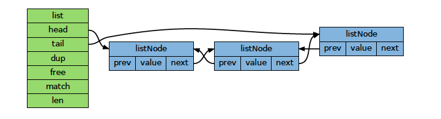
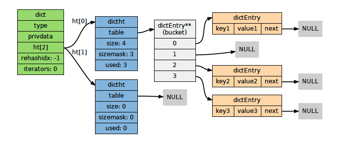
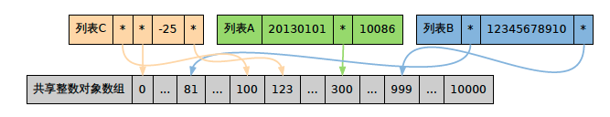

redis数据库是由键值对组成，键总是字符串对象，值可以是字符串、集合、列表等多种类型的对象

# 一、字符串
* 在redis中字符串用字符串对象（StringObject）存储
* 当redis存储的字符串对象包含字符串时字符串对象中包含一个sds（simple dynamic String）简单动态字符串存储值，否则包含一个long类型当值。
* sds 数据结构
    * int len
    * int free
    * char[] buf
* sds 优缺
    * 高效执行长度计算和追加操作（预分配空间）
    * 二进制安全
    * 多占用空间而且多占当空间不会被主动释放

# 二、列表结构-双端链表
* reids列表使用两种数据结构作为底层实现
    * 压缩列表（有限使用压缩列表作为底层实现，超过指定元素个数或单个元素超过指定大小转换为双端链表）
    * 双端链表
        * 由list和各个listNode组成
        
    **redis 2.9?之后整合了双端链表和压缩列表的新数据结构quicklist**

# 三、字典
* 实现数据库键空间
* 用作hash类型键的其中一种底层实现
* 具体底层实现哈希表

    * 字典中包含两个哈希表
        * h[0] table空间分配将在第一次往字典添加键值对时进行
        * h[1] table空间分配将在对h[0]rehash开始时进行.
    * redis哈希表通过链地址法来处理hash碰撞
    * 关于rehash
        * rehash是解决哈希冲突过多造成性能退化的方案，也是进行字典收缩的方案（元素减少，回收空间）
        * rehash过程表迁移是分多次渐进式进行的
        * rehash之后，h[1] 会成为 h[0],原h[0]成为h[1]并置空

# 四、跳表
* 有序集类型的底层数据结构之一

# 五、redis数据类型

## redis编码

|         编码常量          |         编码所对应的底层数据结构         |
| ------------------------- | ---------------------------------------- |
| REDIS_ENCODING_INT        | long 类型的整数                          |
| REDIS_ENCODING_EMBSTR     | embstr 编码的简单动态字符串，用于存储长度小于指定值的字符串              |
| REDIS_ENCODING_RAW        | 简单动态字符串，用于存储长度小于指定值的字符串（与embstr使用同一个临界值）                          |
| REDIS_ENCODING_HT         | 字典                                     |
| REDIS_ENCODING_LINKEDLIST | 双端链表                                 |
| **REDIS_ENCODING_ZIPLIST**    | 压缩列表                                 |
| **REDIS_ENCODING_QUICKLIST**  | 双端链表和压缩列表，ziplist组成的双向链表（redis3.2之后的版本） |
| REDIS_ENCODING_INTSET     | 整数集合                                 |
| REDIS_ENCODING_SKIPLIST   | 跳跃表和字典                             |

## 不同类型和编码的对象

|     类型     |           编码            |                                 对象                                  |
| ------------ | ------------------------- | --------------------------------------------------------------------- |
| REDIS_STRING | REDIS_ENCODING_INT        | 使用整数值实现的字符串对象。                                          |
| REDIS_STRING | REDIS_ENCODING_EMBSTR     | 使用 embstr 编码的简单动态字符串实现的字符串对象。                    |
| REDIS_STRING | REDIS_ENCODING_RAW        | 使用简单动态字符串实现的字符串对象。                                  |
| REDIS_LIST   | REDIS_ENCODING_ZIPLIST    | 使用压缩列表实现的列表对象。                                          |
| REDIS_LIST   | REDIS_ENCODING_LINKEDLIST | 使用双端链表实现的列表对象。                                          |
| REDIS_LIST   | REDIS_ENCODING_QUICKLIST  | 使用压缩列表和双端链表实现的列表对象。 redis3.2之后列表使用的唯一实现 |
| REDIS_HASH   | REDIS_ENCODING_ZIPLIST    | 使用压缩列表实现的哈希对象。                                          |
| REDIS_HASH   | REDIS_ENCODING_HT         | 使用字典实现的哈希对象。                                              |
| REDIS_SET    | REDIS_ENCODING_INTSET     | 使用整数集合实现的集合对象。                                          |
| REDIS_SET    | REDIS_ENCODING_HT         | 使用字典实现的集合对象。                                              |
| REDIS_ZSET   | REDIS_ENCODING_ZIPLIST    | 使用压缩列表实现的有序集合对象。                                      |
| REDIS_ZSET   | REDIS_ENCODING_SKIPLIST   | 使用跳跃表和字典实现的有序集合对象。                                  |

## redisObject内存释放

* redisObject内存释放是使用引用技术策略的，每个redisObject包含一个refcount记录被引用次数，当为0时将被释放。

## 对象共享
* 一种空间节约策略。如果某个命令的输入值是一个小于REDIS_SHARED_INTEGERS 的整数对象，那么当这个对象要被保存进数据
库时，Redis 就会释放原来的值，并将值的指针指向共享对象。
       

