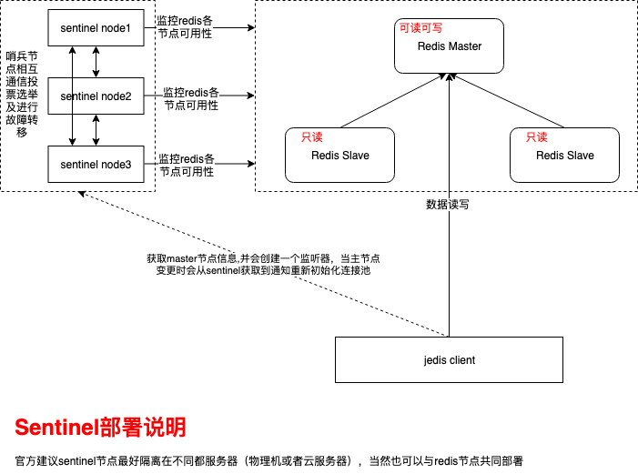
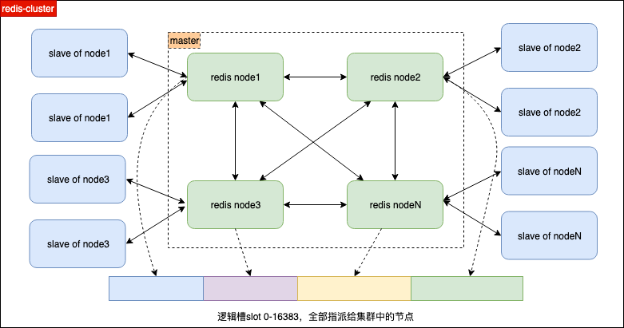
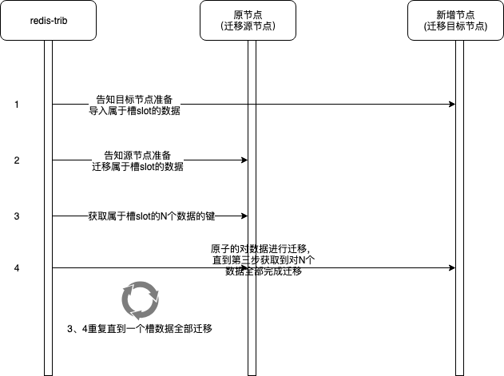
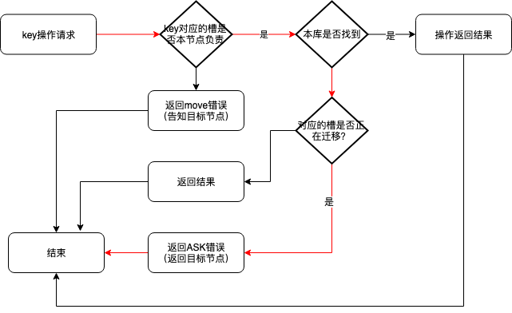

## 1. redis复制集模式(主从节点,可以一主多从)

[官方文档](https://redis.io/topics/replication)

* redis主从节点设置方式
    * 配置文件方式

      ```
      slaveof host port 
      masterauth <password>   --主节点密码
      ```

    * 命令方式 

      ```
      SLAVEOF host port
      config set masterauth <password>  --主节点密码
      ```
* 节点数据复制方式
    * 同步信号由从节点发出，发出后从节点根据配置选择使用旧数据或者拒绝客户端请求
    * 主节点接收到请求后开始执行BGSAVE，并使用缓冲区记录BGSAVE之后执行的所有写命令
    * 主节点BGSAVE执行完成之后发送从节点快照数据，这期间仍然使用缓冲区记录写命令。
    * 发送完成之后从节点丢弃老数据解析并载入新数据，主节点发送缓冲区的命令到从节点
    * 缓冲区的命令同步完成之后的新写入实时同步至从节点
* 关于主从节点须知
    * 从节点可以作为其他节点的主节点
    * 从服务器在同步主节点数据时会清空自身原有数据！！！⚠️⚠️⚠️
    * 主从节点设置时需注意单个节点不要过多从节点，会对服务性能造成较大影响，根据业务情况每个节点设置三个从节点之内，组成树状主从链
    * 从节点不需要设置过期策略，它会从主节点同步。
    * 主服务器的内存使用设置50%～65%，其他用于执行BGSAVE和创建记录写命令的缓冲区
    * 当主节点故障后，需要手动将从节点晋升为主节点，无法自动故障转移，其故障转移需依赖于哨兵机制（redis2.8之后支持）来解决⚠️⚠️⚠️

## 2. 哨兵模式

哨兵模式是基于复制集进行故障转移，将从节点升级为主节点，正常对外提供服务，从节点可以有一个或多个，而要做好一个强壮的哨兵部署哨兵节点最少有三个。[官方文档](https://redis.io/topics/sentinel)

### 2.1. 部署图示


1. 主从复制逻辑参考redis复制集模式
2. 关于sentinel节点
   * sentinel提供的功能
     * 对redis节点的监控，监控主从节点是否正常工作。
     * 通知。可以通过api告知管理元或者其他应用程序监控到redis实例发生故障
     * 故障转移。当主节点不能正常工作时，sentinel会发起一个故障转移程序将合适的slave节点提升为主节点，并将其他slave节点重新配置新的主节点，并且通知客户端新的master节点去链接。
     * 配置提供者。sentinel为客户端提供了服务发现的能力，客户端可以通过链接sentinel获取当前的redis主节点。如果发生故障转移，sentinel将反馈一个最新的主节点地址。
3. sentinel的内部通信逻辑
   * sentine配置监控的redis节点仅需要master节点，启动后会从master获取其他从节点的信息
     * sentinel启动后会与主节点通信获取相关信息，包括从主从节点信息并更新到自己的数据字典中。
     * sentinel通过redis主节点获取到从节点信息后会与各子节点通信获取节点信息并更新到自己的数据字典中。
   * sentinel通过向监控的redis节点发送信息并进行订阅达到获取所有除自己之外的所有sentinel节点信息。
4. 关于sentinel故障转移
   * sentinel需要配置投票节点数，达到这个数量的故障确认投票数会进行故障转移，即使有其他更多的sentinel节点认为没有故障。
   * 故障转移的大致逻辑：某sentinel节点主节点不可达 -> 与内部其他sentinel节点通信投票 -> 达到法定节点数则选举执行故障转移leader节点 -> leader节点执行故障转移
   * 故障转移后，老的master节点会被持续监控，监控恢复上线后会被作为从节点加入新的主节点。
   * 当发生故障转移时，连接在老的master节点都客户端可能还在读写，而且可以正常写入，这部分数据会发生丢失（由于重新恢复连接到复制集群时会从新master进行同步）⚠️⚠️⚠️
     * 解决方案：集群参数配置，以下两个任意一个条件达不到都会写入失败（故障转移后以下条件将达不到）。
       * min-replicas-to-write  主节点最小连接到主节点的活跃的从节点个数，默认为3
       *  min-replicas-max-lag 最大主节点通信延迟秒数，默认为10

### 2.2. 配置及说明

* sentinel启动的两种方式
    > redis-sentinel /path/to/sentinel.conf

    > redis-server /path/to/sentinel.conf --sentinel

* sentinel强制必须指定配置文件，且配置文件必须具有读写权限。
* sentinel部署必知
    * 强壮的生产部署必须至少要有三个sentinel实例
    * 三个sentinel实例应该放在三个独立的物理机或虚拟机中
    * sentinel + redis分布式系统不保证确认的信息在故障中仍被保留，因为redis使用的是异步复制。但是有办法可以使丢失的数据写入确定的时刻范围。
    * sentinel方案需要客户端的支持（大部分redis客户端都做了支持，比如jedis） 
    * 没有在测试环境进行实时测试，sentinle的高可用方案并不一定安全，最好在生产环境进行测试是不是正常工作。因为你可能发现有些错误配置出现的时候已经晚了，比如晚上三点主节点停止工作。
    * Sentinel，Docker或其他形式的网络地址转换或端口映射应谨慎混合。Docker执行端口重新映射，破坏了其他Sentinel进程的Sentinel自动发现以及主数据库的副本列表。
* sentinel配置

    * 基本配置示例
    ```
    sentinel monitor mymaster 127.0.0.1 6379 2
    sentinel auth-pass mymaster password
    sentinel down-after-milliseconds mymaster 60000
    sentinel failover-timeout mymaster 180000
sentinel parallel-syncs mymaster 1
    ```
    * 关于配置关键说明
        * 配置仅需要配置监控的主节点，服务会在启动或在故障转移时在主节点获取从节点信息并更新到配置中。
        * 配置包括两部分，一部分为主节点实例，另一组为未定义数量的从节点。
        
    * 配置说明
    
        * 配置监控节点
            > sentinel monitor \<master-group-name> \<ip> \<port> \<quorum>
    
            quorum 表示发生故障转移需要几个sentinel节点确认主节点不可达，这个配置主要用来标记确认失败的sentinel节点个数，正真的故障转移处理需要检测到失败的一个sentinel节点发起故障转移投票从各个sentinel节点选举出执行故障转移的sentinel节点，如果大多数sentinel进程无法通讯，故障转移也得不到执行。
            
* 监控节点其他参数配置
        
            * 格式：
        > sentinel <option_name> <master_name> <option_value>
        
                down-after-milliseconds 多少毫秒连接不到标记为down掉
            
                parallel-syncs 指定当故障转移时允许有几个从节点从新主节点复制数据。数字越小故障转移需要掉时间越长；另外虽然从节点复制数据是非阻塞的，但是在从主库批量同步数据时也有那么一瞬间停止提供服务，也就是数字越大不能持续对外提供服务的从节点数越大。
            
        * 可以通过 SENTINEL SET 命令事实调整sentinel的配置。
        
    * 验证
    
        * 启动哨兵模式后使用info或roles命令查看复制集信息是否正确，哨兵监控节点是否正常在线，哨兵节点数是否与启动一致。
        * 故障恢复验证，停止主节点查看是否将从节点升级为主节点并能继续进行数据操作。
        * 查看日志告警项

## 3. 集群模式
当数据量较少时，使用一个redis主从+sentinel可以满足其基本高可用需求，当redis数据量比较大时需要考虑使用redis集群模式满足redis的扩展性，同时redis集群本身支持主从高可用模式，在集群主节点故障时可以实现故障转移。

### 3.1. 部署图示




1. 集群由N多个主节点相互联通组成一个redis集群，每个节点负责0-16384中互不重复的若干个逻辑槽。当逻辑槽全部分配，集群进入可运行状态。
2. 每个主节点配置若干个从节点，用于故障时进行切换。


### 3.2. 关于逻辑槽

逻辑槽是用来进行数据分片的关键部分。在集群模式下对数据进行操作时redis节点首先会对操作的key进行运算（CRC16(Key) & 16383）得到数据对应的槽号，从而找到存储改数据的节点。


### 3.3. redis集群相关数据结构

1. clusterNode 记录节点的槽指派信息，重点如下：
   * slots使用16384位表示当前节点负责哪些槽，负责的槽位值为1，不负责的则为0
   * numslot 存储总共负责槽总数
   * 其他
2. clusterState 记录集群信息，重点如下：
   * 所有槽点指派信息，使用一个长度为16384的指针数组存储了每个槽负责的节点的信息。
   * 至少负责1个槽的节点数据字典
   * 其他


### 3.4. 主节点组成集群过程

1. CLUSTER MEET

   > cluster meet ip port

   这个过程主要完成节点的握手（联通验证）和信息交换及传播。

2. CLUSTER ADDSLOTS

   > cluster addslots 0 1 2..N

   如果需要一次分配一个范围需要使用(目前只能这样⚠️⚠️)

   > redis-cli -h host -p port -a password cluster addslots {start..end}

   这个过程主要完成槽的指派（各自进行申请，当部分槽已经被分配则报错）和指派后信息的同步。当将0-16383槽全部分配完成集群进入上线状态。
   
3. 集群信息查看

   > cluster info 集群信息查看,以下为三主三从某个节点执行后的信息

   ```
   cluster_state:ok
   cluster_slots_assigned:16384
   cluster_slots_ok:16384
   cluster_slots_pfail:0
   cluster_slots_fail:0
   cluster_known_nodes:6
   cluster_size:3
   cluster_current_epoch:6
   cluster_my_epoch:6
   cluster_stats_messages_ping_sent:331413
   cluster_stats_messages_pong_sent:348114
   cluster_stats_messages_sent:679527
   cluster_stats_messages_ping_received:348114
   cluster_stats_messages_pong_received:331413
   cluster_stats_messages_received:679527
   ```
   
   
   
   > cluster nodes 集群节点信息查看,以下为三主三从某个节点执行后的信息
   
   ```
   c7f03feee36c8ec84c4dd8362e1cdc007570d192 127.0.0.1:6679@16679 master - 0 1589631677000 2 connected 10001-16383
   40ad23edd2fab9f2a403a49f4885521b8da7a106 127.0.0.1:6689@16689 slave c7f03feee36c8ec84c4dd8362e1cdc007570d192 0 1589631679013 5 connected
   0c4d00b291fdee8feaafa7b5e3e85278ce9616fc 127.0.0.1:6479@16479 master - 0 1589631680015 1 connected 0-5000
   abbdd2c08a0c935f857d37ba33df11d44631ef08 127.0.0.1:6489@16489 slave 0c4d00b291fdee8feaafa7b5e3e85278ce9616fc 0 1589631678011 3 connected
   ec3b07129d4e748a8ea84d4831dbbe7b85c0e7c9 127.0.0.1:6589@16589 slave e1335e18a50777ec671326377ec837a01ed3a863 0 1589631677000 6 connected
   e1335e18a50777ec671326377ec837a01ed3a863 127.0.0.1:6579@16579 myself,master - 0 1589631678000 6 connected 5001-10000
   ```
   
4. 验证

   * 验证各从节点是否正常，cluster nodes 显示各节点都是connected则正常
   * 验证故障转移
   * 查看日志告警项

[参考 redis集群命令](./redis集群命令)

## 4. 集群中的命令执行

集群中命令的执行与单机模式的区别在于redis节点首先会计算key对应的数据槽并判断该槽是否自己负责的，如果是则执行并返回执行结果，如果不是则返回一个**MOVED**错误，该错误指引客户端转向至正确的节点再次执行这个命令。

使用redis-cli操作集群数据登录方式需要加参数 -c 这样当操作的数据不在当前节点呢时会自动跳转到目标节点。示例：

> redis-cli -c -p 6379 -a password

## 5. 重新分片

### 5.1. 场景

当数据量增大当前数据节点无法很好的处理数据时可能需要新增集群节点，而集群节点的增加就涉及重新分片。


### 5.2. 过程

重新分片操作是由集群管理软件redis-trib负责执行。其操作步骤主要如下：



以上是基于源节点存在槽slot的数据，如果不存在的话将直接指派槽节点到目标节点


### 5.3. 分片过程中的redis客户端数据操作逻辑

在数据迁移期间如果redis节点收到一个key的操作，那么它将进行如下流程：



核心点：

1. 先看是不是自己负责，在看自己有没有，最后在看是不是在迁移
2. MOVED错误和ASK错误。
   * MOVED错误表示该key不是本节点负责，并告知负责的节点
   * ASK错误表示该key对应的槽数据由本节点负责正在迁移，该数据不在本节点。

### 5.4 复制与故障转移

#### 从节点的添加

从节点也是集群的一部分，其操作步骤如下：

1. 集群握手(非官方说法)

   >  CLUSTER MEET

2. 从节点添加

   > CLUSTER REPLICATE <master-nodeid>

   将当前节点作为master-nodeid的从节点


## 6. 避坑

1. 当主从节点无法或者哨兵节点之间无法打通时要注意是否有密码要求（日志不会提示密码问题）

