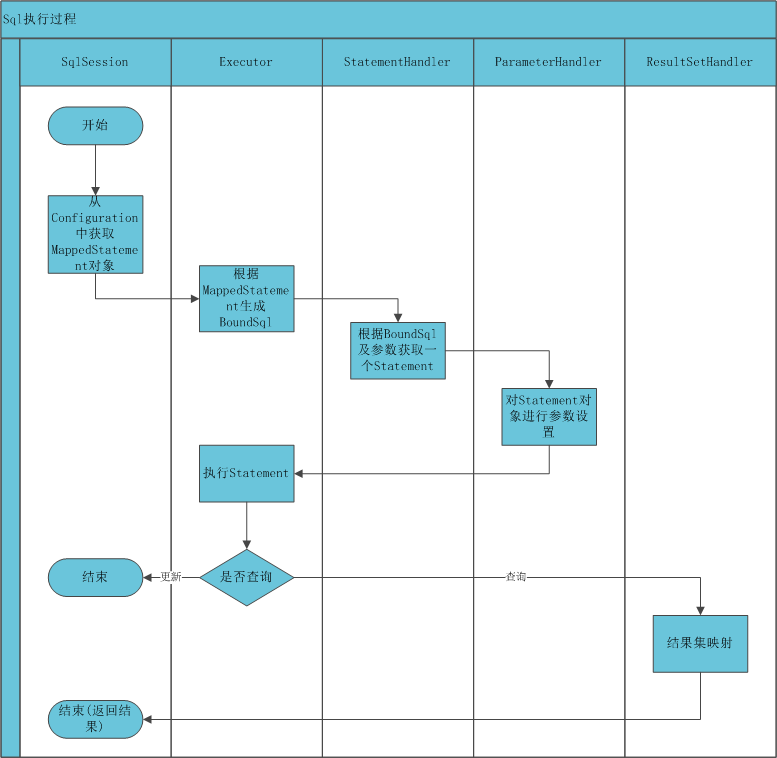
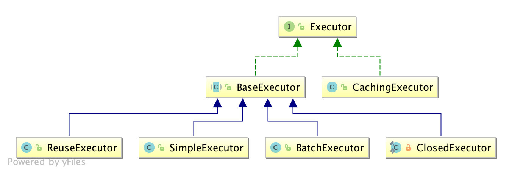

# 1. mybatis入门
[官方清晰入门教程 传送门](https://mybatis.org/mybatis-3/zh/index.html)
## 1.1. mybatis执行过程

## 1.2. mybatis核心类
* SqlSessionFactoryBuilder
用来创建会话工厂，最佳作用域：使用完就丢弃。
* SqlSessionFactory
用来创建会话，最佳作用域：应用级别，单列最好。
* SqlSession
数据库链接会话，提供给用户执行sql，最佳作用域：请求或作用方法，非线程安全。
* Executor
SqlSession持有，真正用于执行sql.其有多个实现类如下：

    * CachingExecutor用于二级缓存,代理模式，内部持有一个实现了缓存的Executor类。
    * SimpleExecutor
    最简单的执行器，根据对应的sql直接执行，每执行一次update或select，就开启一个Statement对象，用完立刻关闭Statement对象。（可以是Statement或PrepareStatement对象）
    * ReuseExecutor
    ReuseExecutor与其它SimpleExecutor的区别是重用jdbc的Statement，该类内部维护了一个sql与Statement对映射集合。
    * BatchExecutor
    批处理执行器，用于将多个SQL一次性输出到数据库。
* StatementHandler
    用来根据MappedStatement获取Statement
* ParameterHandler
    用来处理参数绑定，将用户传入的参数半丁到sql上
* ResultSetHandler
    用来处理结果绑定，将查询结果数据列转换为对象列表
* TypeHandler
    负责java数据类型和jdbc数据类型之间的映射和转换

## 1.3. mybatis Executor的指定
mybatis默认使用对Executor为SimpleExecutor，如果需要指定，在配置文件Setting节点设置defaultExecutorType参数对值。
[参数设定传送门](https://mybatis.org/mybatis-3/zh/configuration.html#settings)

# 2. 高级使用
## 拦截器
