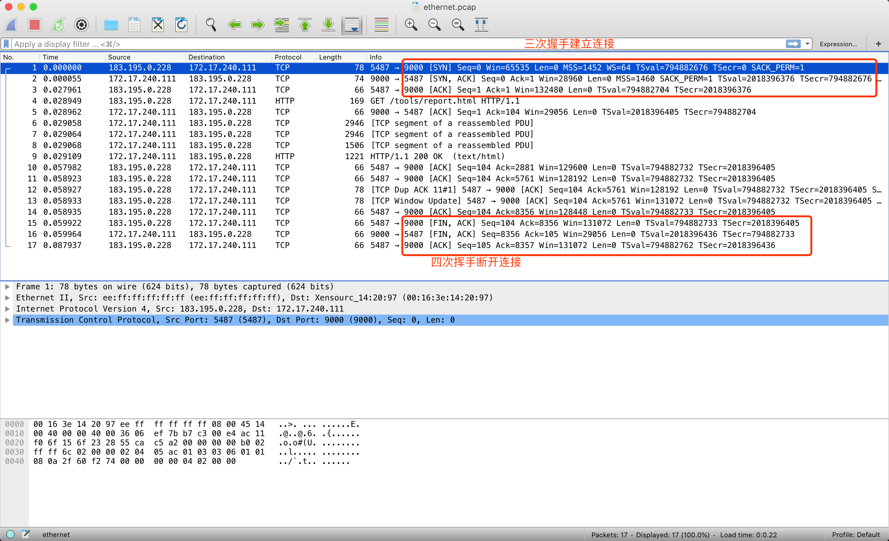

# 工具
linux抓包工具工具：tcpdump

# 实操
## 实时查看抓取到网络信息
示例：
> tcpdump -n -i eth0 port 9000

抓取监听启动后在另一台机器运行一个网络请求http网络请求，网络实时抓取展示示例：
```
tcpdump: verbose output suppressed, use -v or -vv for full protocol decode
listening on eth0, link-type EN10MB (Ethernet), capture size 262144 bytes
23:09:39.736192 IP 183.195.0.228.5764 > 172.17.240.111.9000: Flags [S], seq 903675732, win 65535, options [mss 1452,nop,wscale 6,nop,nop,TS val 795958242 ecr 0,sackOK,eol], length 0
23:09:39.736252 IP 172.17.240.111.9000 > 183.195.0.228.5764: Flags [S.], seq 618127871, ack 903675733, win 28960, options [mss 1460,sackOK,TS val 2019473824 ecr 795958242,nop,wscale 7], length 0
23:09:39.765149 IP 183.195.0.228.5764 > 172.17.240.111.9000: Flags [.], ack 1, win 2070, options [nop,nop,TS val 795958270 ecr 2019473824], length 0
23:09:39.765206 IP 183.195.0.228.5764 > 172.17.240.111.9000: Flags [P.], seq 1:104, ack 1, win 2070, options [nop,nop,TS val 795958270 ecr 2019473824], length 103
23:09:39.765217 IP 172.17.240.111.9000 > 183.195.0.228.5764: Flags [.], ack 104, win 227, options [nop,nop,TS val 2019473853 ecr 795958270], length 0
23:09:39.765486 IP 172.17.240.111.9000 > 183.195.0.228.5764: Flags [.], seq 1:2881, ack 104, win 227, options [nop,nop,TS val 2019473853 ecr 795958270], length 2880
23:09:39.765500 IP 172.17.240.111.9000 > 183.195.0.228.5764: Flags [.], seq 2881:5761, ack 104, win 227, options [nop,nop,TS val 2019473853 ecr 795958270], length 2880
23:09:39.765505 IP 172.17.240.111.9000 > 183.195.0.228.5764: Flags [.], seq 5761:7201, ack 104, win 227, options [nop,nop,TS val 2019473853 ecr 795958270], length 1440
23:09:39.765579 IP 172.17.240.111.9000 > 183.195.0.228.5764: Flags [P.], seq 7201:8356, ack 104, win 227, options [nop,nop,TS val 2019473854 ecr 795958270], length 1155
23:09:39.795209 IP 183.195.0.228.5764 > 172.17.240.111.9000: Flags [.], ack 2881, win 2025, options [nop,nop,TS val 795958298 ecr 2019473853], length 0
23:09:39.795227 IP 183.195.0.228.5764 > 172.17.240.111.9000: Flags [.], ack 4321, win 2048, options [nop,nop,TS val 795958298 ecr 2019473853], length 0
23:09:39.795230 IP 183.195.0.228.5764 > 172.17.240.111.9000: Flags [.], ack 5761, win 2025, options [nop,nop,TS val 795958299 ecr 2019473853,nop,nop,sack 1 {7201:8356}], length 0
23:09:39.796170 IP 183.195.0.228.5764 > 172.17.240.111.9000: Flags [.], ack 8356, win 1984, options [nop,nop,TS val 795958299 ecr 2019473853], length 0
23:09:39.796177 IP 183.195.0.228.5764 > 172.17.240.111.9000: Flags [.], ack 8356, win 2048, options [nop,nop,TS val 795958299 ecr 2019473853], length 0
23:09:39.797137 IP 183.195.0.228.5764 > 172.17.240.111.9000: Flags [F.], seq 104, ack 8356, win 2048, options [nop,nop,TS val 795958300 ecr 2019473853], length 0
23:09:39.797196 IP 172.17.240.111.9000 > 183.195.0.228.5764: Flags [F.], seq 8356, ack 105, win 227, options [nop,nop,TS val 2019473885 ecr 795958300], length 0
23:09:39.826162 IP 183.195.0.228.5764 > 172.17.240.111.9000: Flags [.], ack 8357, win 2048, options [nop,nop,TS val 795958329 ecr 2019473885], length 0
```
**数据说明**
[S]： SYN（开始连接）
[.]: 没有 Flag
[P]: PSH（推送数据）
[F]: FIN （结束连接）
[R]: RST（重置连接）
[S.] SYN-ACK 报文的ying

以上示例展示了一个http请求从tcp三次握手建立连接，传输数据再到四次挥手断开连接到过程。

## 抓包分析
**抓取服务器上9000端口上的数据包，并保存到用户目录下ethernet.pcap文件中。**
示例：
> tcpdump -X -i eth0 -s 0 port 9000 -w ~/ethernet.pcap

**使用wireshark将文件导入查看分析数据**

TODO 四次挥手只看到三次？？？？？


# 参考
[tcpdump说明及常用抓取场景命令](https://amits-notes.readthedocs.io/en/latest/networking/tcpdump.html)