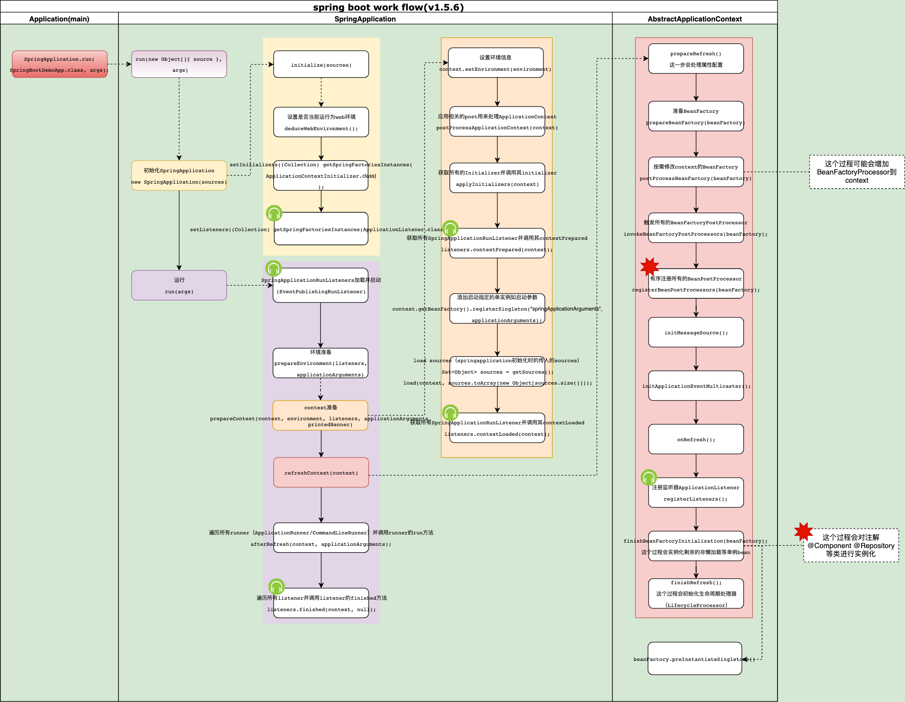
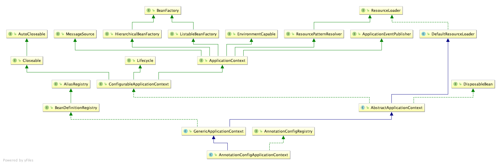
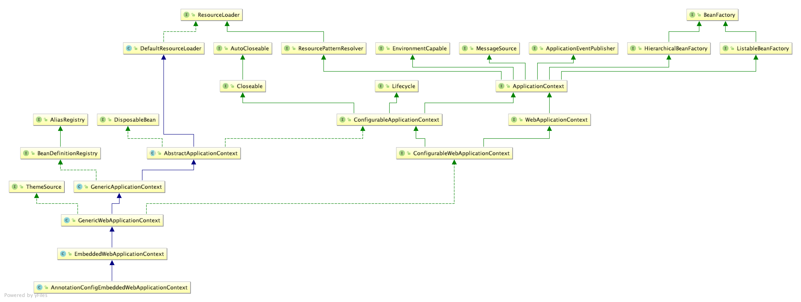

**springboot version:** v1.5.6

## 1. spring boot 流程及关键类梳理


[springboot-workflow.svg](../../picture/springboot-workflow.svg)

## 2. 重点流程梳理

## 3. 关键接口及类
### 3.1. BeanFactory
用于创建spring容器管理等实例的工厂顶级接口

### 3.2. ApplicationContext
SpringApplication的应用上下文接口，继承了众多应用重量级接口，如BeanFactory的子类
* AnnotationConfigApplicationContext 

    SpringApplication默认的context类

    

* AnnotationConfigEmbeddedWebApplicationContext
    
    SpringApplication默认的web环境等context类

    

### 3.3. SpringApplicationRunListener
SpringApplication的run方法的监听器，spring应用级别的监听器，对run的各个阶段（比如环境准备结束阶段、上下文准备结束阶段等等）进行监听。该监听器在run方法内的开始被启动。spring内部只有一个实现：
* EventPublishingRunListener
SpringApplicationRunListener实现类，用于监听run的相关事件并发布到各个ApplicationListener监听器。

### 3.4. ApplicationListener
Spring的事件监听器，用来监听指定的ApplicationEvent事件。
* ScheduledAnnotationBeanProcessor

    用于对注解@Scheduled对方法进行调度处理
* ConfigurationPropertiesbindingPostProcessor

    用于对注解ConfigurationProperties对bean进行属性绑定
* ConfigFileApplicationListener

    用于加载配置（aplication.properties/application.yml等文件）并设置context环境信息。


* LoggingApplicationListener

    用于配置LoggingSystem

* DelegatingApplicationListener

   用于对从spring环境变量配置的ApplicationListener类进行实例化并代理的监听器

### 3.5. BeanFactoryPostProcessor
用于二次处理application context的内部初始化后对bean factory

```
public interface BeanFactoryPostProcessor {
	void postProcessBeanFactory(ConfigurableListableBeanFactory beanFactory) throws BeansException;
}
```

### 3.6. BeanPostProcessor
用于对springbean进行二次处理，内部维护两个方法分别用来在初始化前和初始化后两个阶段,这两个方法在BeanFactory的getBean()内被调用。

```
public interface BeanPostProcessor {

	Object postProcessBeforeInitialization(Object bean, String beanName) throws BeansException;

	Object postProcessAfterInitialization(Object bean, String beanName) throws BeansException;

}
```

#### 3.6.1. ApplicationContextAwareProcessor
众多核心Aware接口触发的中心类，详见postProcessBeforeInitialization(final Object bean, String beanName)->invokeAwareInterfaces(bean)方法,

```
private void invokeAwareInterfaces(Object bean) {
		if (bean instanceof Aware) {
			if (bean instanceof EnvironmentAware) {
				((EnvironmentAware) bean).setEnvironment(this.applicationContext.getEnvironment());
			}
			if (bean instanceof EmbeddedValueResolverAware) {
				((EmbeddedValueResolverAware) bean).setEmbeddedValueResolver(this.embeddedValueResolver);
			}
			if (bean instanceof ResourceLoaderAware) {
				((ResourceLoaderAware) bean).setResourceLoader(this.applicationContext);
			}
			if (bean instanceof ApplicationEventPublisherAware) {
				((ApplicationEventPublisherAware) bean).setApplicationEventPublisher(this.applicationContext);
			}
			if (bean instanceof MessageSourceAware) {
				((MessageSourceAware) bean).setMessageSource(this.applicationContext);
			}
			if (bean instanceof ApplicationContextAware) {
				((ApplicationContextAware) bean).setApplicationContext(this.applicationContext);
			}
		}
	}
```


### 3.7. Aware
Aware没有任何抽象方法，是一个超级标记接口。用于标识一个bean有资格被spring容器的框架对象通过回调方法通知。Aware没有定义任务方法，任何处理对给中类型的示例的处理逻辑应该在BeanPostProcessor明确定义好。
#### 3.7.1. ApplicationContextAware

实现该接口的类可以持有ApplicationContext,ApplicationContextAware对应的逻辑处理类为ApplicationContextAwareProcessor，

```
public interface ApplicationContextAware extends Aware {
    void setApplicationContext(ApplicationContext applicationContext) throws BeansException;
}
```

#### 3.7.2. BeanFactoryAware

实现该接口的类可以获取到当前应用使用的bean factory
```
public interface BeanFactoryAware extends Aware {
    void setBeanFactory(BeanFactory beanFactory) throws BeansException;
}
```
#### 其他
以下Aware与上面的两个Aware类似，基本都是用于使子类持有其Aware中方法指定的实例
* ApplicationEventPublisherAware
* BeanNameAware
* BeanClassLoaderAware
* ServletConfigAware
* EnvironmentAware
* ImportAware
* MessageSourceAware