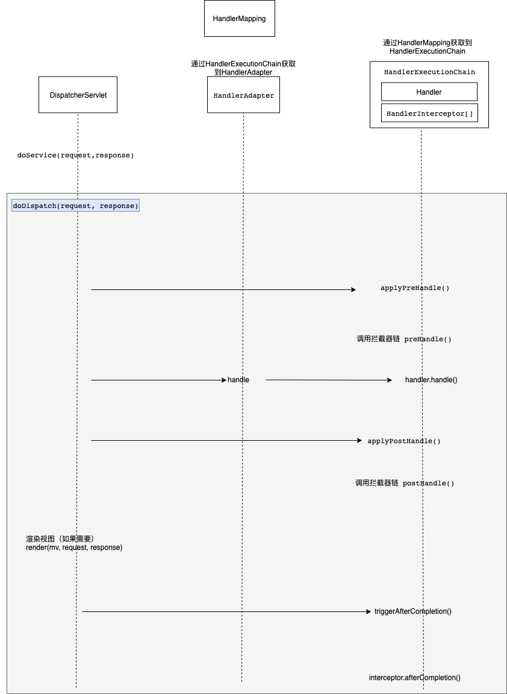

# 1. 来自官方的架构图

# 2. 个人梳理核心请求流程

## 2.1. 核心类
* DispatcherServlet
该类为spring mvc最核心的类，本质上为servlet，配置在web容器中，拦截所有的请求。请求进入后调用父类Servlet的service方法，最终会调用到DispatcherServlet到doDispatch方法。

* HandlerMapping
该类中中维护了请求和处理器链（HandlerExecutionChain）之间映射关系，通过请求路径可以找到对应到处理器链。

* HandlerExecutionChain
该类中维护类了一个处理器和一系列拦截器，是真正处理请求到类。

* HandlerAdapter
该类是处理器的代理类。

