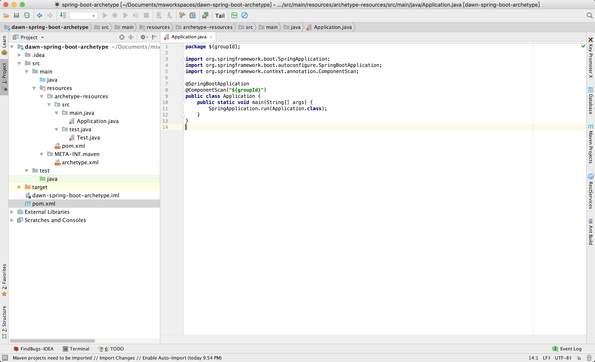
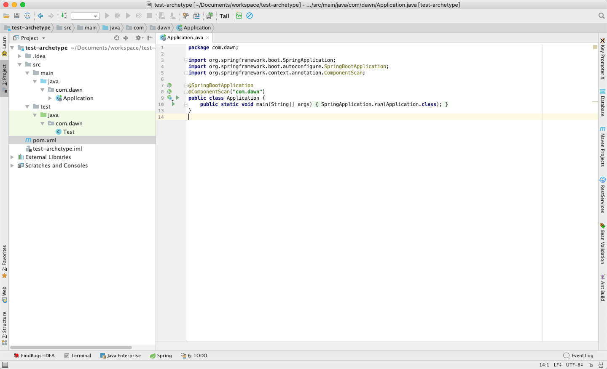

# maven archetype创建及使用

## 1. maven archetype？

maven archetype是一个脚手架，可用于快速生成maven项目骨架。archetype就像一个模版，根据个人/组织需要创建好模版，再通过maven很快的生成项目骨架，在项目规范及规避重复工作上面起到很好的作用。


## 2. 如何创建一个 archetype?

1. 使用传统方法创建一个普通maven项目(如示例dawn-spring-boot-archetype)

   ```
   dawn-spring-boot-archetype
   	--src
   		--main
   			--java
   			--resources
   ```

   

2. 基于该项目增加archetype模版及定义说明。

   * 将archetype模版的目录结构定义在项目的resources中，如下：

     ```
     				--archetype-resources
     					--src
     						--main
     							--java
     								--Application.java
     						--test
     							--java
     								--Test.java
     				--META-INF
     					--maven
     						--archetype.xml
     ```

   * 增加模版中的java类和pom文件，用于在项目生成时按照模版生成相应的类文件，按需来创建。

     **示例Application.java文件(test文件同理)：**

     ```
     package ${groupId};
     
     import org.springframework.boot.SpringApplication;
     import org.springframework.boot.autoconfigure.SpringBootApplication;
     import org.springframework.context.annotation.ComponentScan;
     
     @SpringBootApplication
     @ComponentScan("${groupId}")
     public class Application {
         public static void main(String[] args) {
             SpringApplication.run(Application.class);
         }
     }
     ```

     ${groupId} 表示从pom文件获取对应的groupId

     

     **示例pom文件：**

     ```
     
     <project xmlns="http://maven.apache.org/POM/4.0.0" xmlns:xsi="http://www.w3.org/2001/XMLSchema-instance"
              xsi:schemaLocation="http://maven.apache.org/POM/4.0.0 http://maven.apache.org/xsd/maven-4.0.0.xsd">
         <modelVersion>4.0.0</modelVersion>
         <groupId>${groupId}</groupId>
         <artifactId>${artifactId}</artifactId>
         <version>${version}</version>
         <packaging>jar</packaging>
         <name>Custom Archetype</name>
         <url>http://javaonfly.blogspot.in/</url>
     
         <parent>
             <!-- Your own application should inherit from spring-boot-starter-parent -->
             <groupId>org.springframework.boot</groupId>
             <artifactId>spring-boot-starter-parent</artifactId>
             <version>1.5.6.RELEASE</version>
         </parent>
     
         <dependencies>
             <dependency>
                 <groupId>org.springframework.boot</groupId>
                 <artifactId>spring-boot-starter-web</artifactId>
                 <version>1.5.6.RELEASE</version>
             </dependency>
     
             <dependency>
                 <groupId>org.springframework.boot</groupId>
                 <artifactId>spring-boot-starter-test</artifactId>
                 <version>1.5.6.RELEASE</version>
                 <scope>test</scope>
             </dependency>
     
             <dependency>
                 <groupId>org.springframework.boot</groupId>
                 <artifactId>spring-boot-starter-jdbc</artifactId>
                 <version>1.5.6.RELEASE</version>
             </dependency>
     
             <dependency>
                 <groupId>org.projectlombok</groupId>
                 <artifactId>lombok</artifactId>
                 <version>1.18.2</version>
                 <scope>provided</scope>
             </dependency>
     
             <dependency>
                 <groupId>org.springframework.boot</groupId>
                 <artifactId>spring-boot-starter-data-jpa</artifactId>
                 <version>1.5.6.RELEASE</version>
             </dependency>
     
             <!-- https://mvnrepository.com/artifact/com.alibaba/druid-spring-boot-starter -->
             <dependency>
                 <groupId>com.alibaba</groupId>
                 <artifactId>druid-spring-boot-starter</artifactId>
                 <version>1.1.10</version>
             </dependency>
     
             <dependency>
                 <groupId>mysql</groupId>
                 <artifactId>mysql-connector-java</artifactId>
                 <version>6.0.6</version>
             </dependency>
         </dependencies>
     </project>
     ```

   * 定义archetype.xml文件

     该文件用于说明相关资源文件，示例：

     ```
     <archetype xmlns="http://maven.apache.org/plugins/maven-archetype-plugin/archetype/1.0.0" xmlns:xsi="http://www.w3.org/2001/XMLSchema-instance"
                xsi:schemaLocation="http://maven.apache.org/plugins/maven-archetype-plugin/archetype/1.0.0 http://maven.apache.org/xsd/archetype-1.0.0.xsd">
         <id>dawn-spring-boot-archetype</id>
         <sources>
             <source>src/main/java/Application.java</source>
         </sources>
         <testSources>
             <source>src/test/java/Test.java</source>
         </testSources>
     </archetype>
     ```
   
   

## 3. archetype安装到本地仓库

archetype安装本地仓库与安装普通项目没什么区别。

> mvn clean install

## 4. archetype使用

```
mvn archetype:generate -X -DarchetypeGroupId=com.dawn \
    -DarchetypeArtifactId=dawn-spring-boot-archetype \
    -DarchetypeVersion=1.0.0-SNAPSHOT \
    -DgroupId=com.dawn \
    -DartifactId=test-archetype \
    -Dversion=1.0.0-SNAPSHOT \
    -DarchetypeCatalog=internal
```

参数说明：

* -X 打印详细日志，便于出错时排查
* -DarchetypeGroupId 使用的archetype的groupId
* -DarchetypeArtifactId 使用的archetype的artifactId
* -DarchetypeVersion 使用的archetype的版本号
* -DgroupId 生成项目的groupId
* -DartifactId 生成项目的artifactId
* -Dversion 生成项目的版本号
* -DarchetypeCatalog=internal 使用本地仓库的archetype，该参数不指定的情况下会使用从远程仓库拉取，如果自定义的archetype没有推送到远程会失败。 ⚠️⚠️


生成效果：

